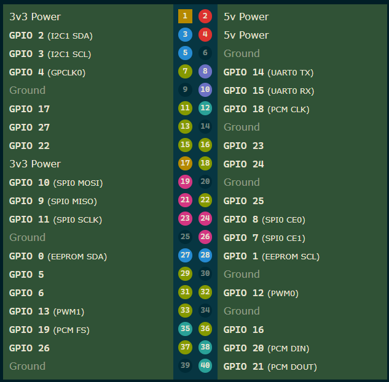

### TX
Pour se connecter à la rpi:
```bash
ssh tb26@rpivtx.local
mdp : tb26
```
#### connexion SPI
Pour interconnecter la Raspberry Pi et le modem de transmission (STM32 / EKH05), le bus SPI 0 de la Raspberry Pi est utilisé en mode Maître, relié aux broches d'extension de l'EKH05 configuré en Esclave. 

Un signal GPIO supplémentaire est requis pour assurer le contrôle de flux matériel (*Handshake*).

### Câblage physique (Pinout) :

| Signal SPI / Fonction | Broche Physique RPi 4B | Port GPIO Linux (RPi) | Broche Connecteur EKH05 | Port STM32U5 |
| :--- | :---: | :---: | :---: | :---: |
| **MOSI** (Données TX) | Pin 19 | GPIO 10 | **D11** | PE15 |
| **MISO** (Données RX) | Pin 21 | GPIO 9 | **D12** | PE14 |
| **SCLK** (Horloge) | Pin 23 | GPIO 11 | **D13** | PE13 |
| **CE0** (Chip Select) | Pin 24 | GPIO 8 | **D10** | PE12 |
| **GND** (Masse Commune) | Pin 25 | Ground | **GND** | GND |
| **Handshake** (Ready) | Pin 18 | **GPIO 24** | **A0** (ou borne libre) | **PD15** |

> **Important :** Ne pas oublier de relier une broche **GND** entre les deux cartes. La ligne de Handshake (PD15 $\rightarrow$ GPIO 24) permet au STM32 de bloquer temporairement les envois de la RPi lorsque la pile LwIP traite le paquet précédent.




#### 1. Figer la fréquence d'horloge (Overclock & Force Turbo)

Pour éviter les micro-saccades induites par les changements de fréquences du CPU de la Raspberry Pi, on va forcer le processeur à tourner à sa fréquence maximale en permanence.

Ouvrir le fichier de configuration de boot de la Pi :

```bash
sudo nano /boot/firmware/config.txt

```
On ajoute les lignes suivantes tout à la fin du fichier :

```text
# Forcer le CPU à sa fréquence maximale sans jamais redescendre
force_turbo=1

# Pour une RPi 4B : 2000 MHz (2.0 GHz) au lieu de 1.5 GHz
arm_freq=2000
over_voltage=6

```

#### 2. Isoler un cœur CPU


```bash
sudo nano /boot/firmware/cmdline.txt

```

*(Sur une seule ligne, ne pas créer de retour à la ligne !)* Ajouter un espace à la toute fin du texte existant et insèrer ceci :
```text
isolcpus=3
```
```bash
sudo reboot
```

#### 3. Exécuter en priorité maximale sur le coeur isolé
```bash
gcc -O3 gateway_spi_noserv.c -o mjpeg_to_spi
./mjpeg_to_spi
```

```bash
sudo taskset -c 3 nice -n -20 ./mjpeg_to_spi
```

### RX
```bash
gst - launch -1.0 -v udpsrc port =1337 do - timestamp = true ! \
jpegparse ! jpegdec ! queue max - size - buffers =1 leaky = downstream ! \
videoconvert ! autovideosink sync = false
```
(Uniquement tester sur Windows...)
