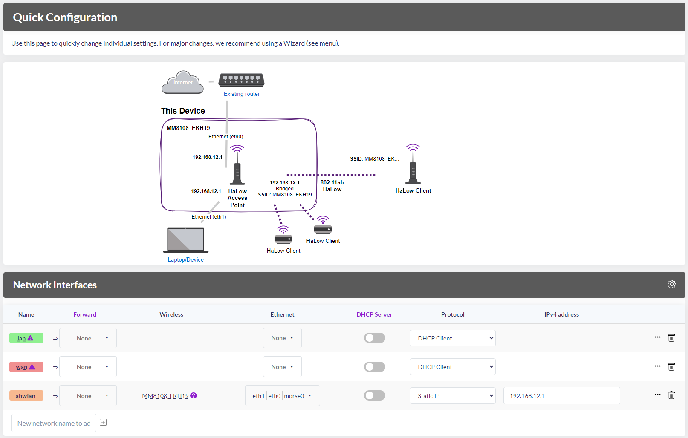
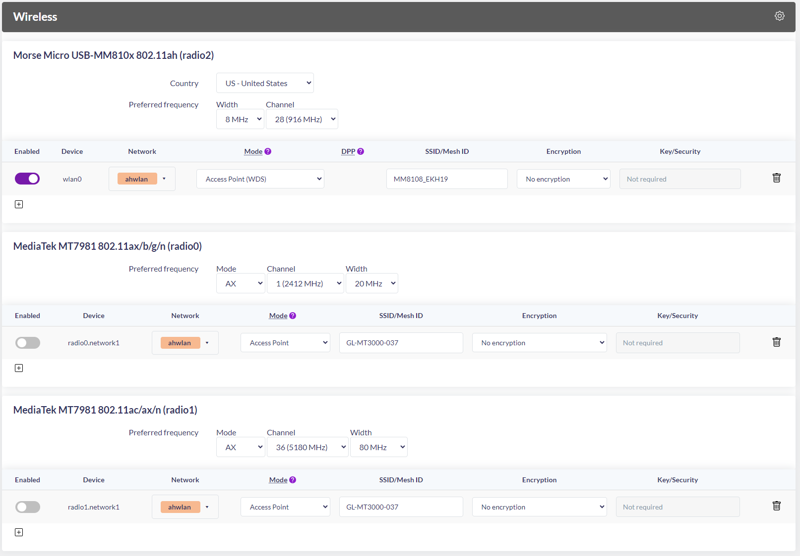

# Configuration du Récepteur au Sol (GL.iNet MT3000 / OpenWrt + EKH19)

### Configuration de l'interfaces du Routeur (GL.iNet MT3000)

* **Interface Sans-fil (ahwlan / wlan0) et administration (LuCI / SSH):** `192.168.12.1` (Masque : `255.255.255.0`).



```bash
root@MM8108_EKH19:~> brctl addif br-ahwlan wlan0

# pour voir le trafic
root@MM8108_EKH19:~> tcpdump -i wlan0 -e -s 0

root@MM8108_EKH19:~> brctl show
bridge name     bridge id               STP enabled     interfaces
br-ahwlan               7fff.9483c470d038       no              eth0
                                                        wlan0
                                                        eth1
```

### Configuration du PC

L'interface Ethernet physique reliée au port LAN du routeur doit être configurée en IP statique sous Windows ou Linux :

* **IP :** `192.168.12.10`
* **Masque :** `255.255.255.0`
* **Passerelle (Gateway) :** `192.168.12.1`
