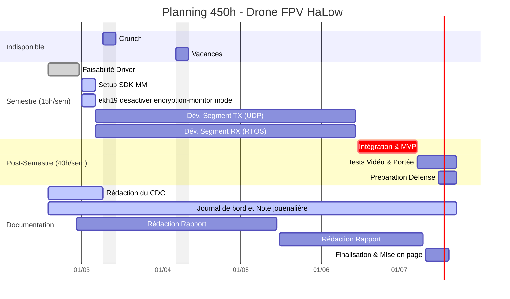

# Journal de travail
Nathan Tschantz, printemps 2026.

## Février
### Vendredi 20.02
- Lancement du travail de bachelor. 
- Première recherche sur la faisabilité de l'utilisation du MM8108-EKH19. 
- recherche d'option possible pour set le MCS et le code correcteur LDPC.

7h30.
### Samedi - Mardi 21.02 - 24.02

- compilation du kernel et du driver
- modification du driver 
- test du driver modifier sur le module wifi
- Les options semble être setter et la fonction voulue

sais plus combien de temps ~10h
### Vendredi 27.02
- clarification de la strucuture du projet
- rédaction de rapport et du cahier des charges
- Lecture de documentation RTOS et EKH05
### Samedi 28.02
- fini la première version du cahier des charges.

#### Gantt
_Note :Le Gantt sera update au fure et a mesure du projets lorsque les tâches se préciserons_ 

## Mars

## Avril

## Mai

### Mecredi 20.05 15h00
**Rendu intermédiaire**

## Juin
## Juillet

### Jeudi 23.07 avant 11h00
**Rendu final du rapport**