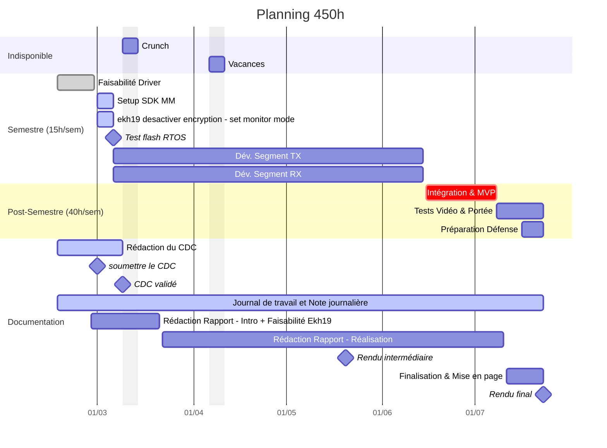
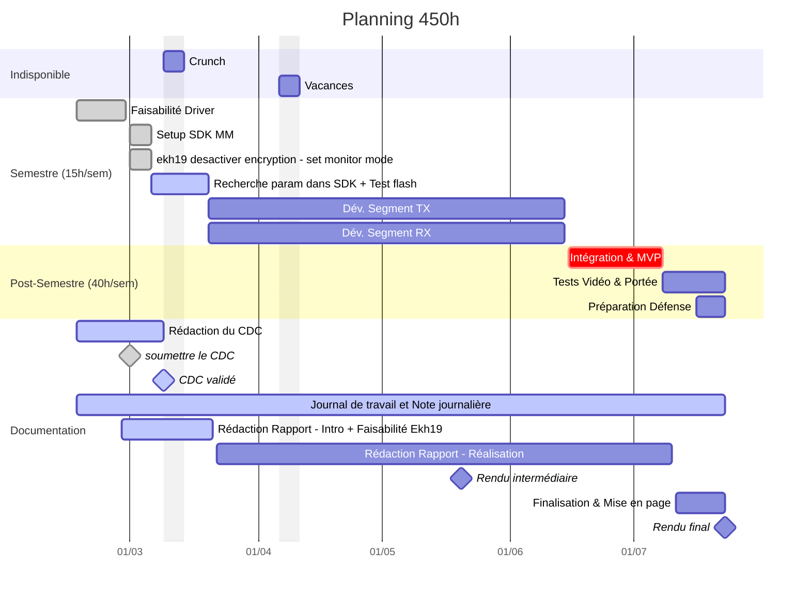
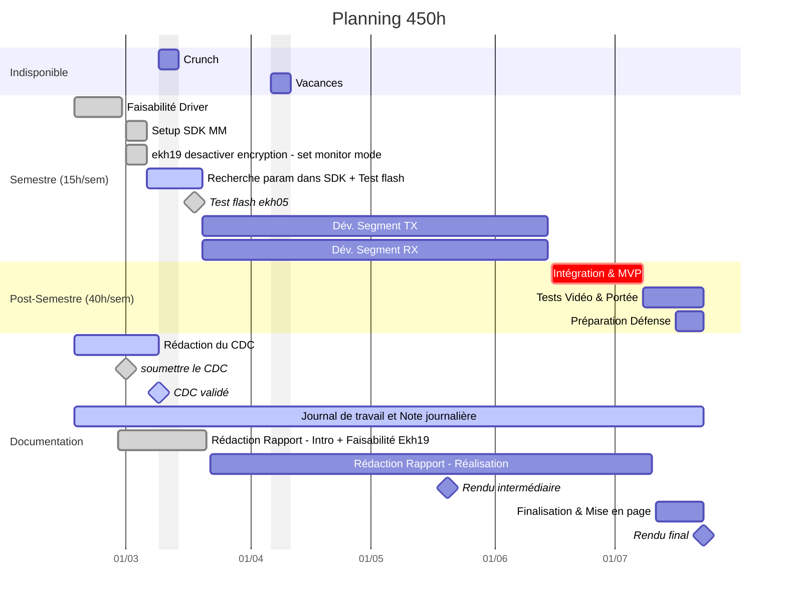

# Journal de travail
Nathan Tschantz, printemps 2026.

## Février
### Vendredi 20.02
- Lancement du travail de bachelor. 
- Première recherche sur la faisabilité de l'utilisation du MM8108-EKH19. 
- recherche d'option possible pour set le MCS et le code correcteur LDPC.

### Samedi - Mardi 21.02 - 24.02

- compilation du kernel et du driver
- modification du driver 
- test du driver modifier sur le module wifi
- Les options semble être setter et la fonction voulue

### Vendredi 27.02
- clarification de la structure du projet
- rédaction de rapport et du cahier des charges
- Lecture de documentation RTOS et EKH05

### Samedi 28.02
- fini la première version du cahier des charges.
- fini la première version du diagramme de Gantt
- setup du mm-iot-sdk avec STM32cubeIDE. (voire note journalière pour le détails)

#### Gantt
_Note :Le Gantt sera update au fur et à mesure du projet lorsque les tâches se préciseront_ 

```mermaid
gantt
    title Planning 450h
    dateFormat  YYYY-MM-DD
    axisFormat  %d/%m

    excludes 2026-03-09,2026-03-10,2026-03-11,2026-03-12,2026-03-13,2026-04-06,2026-04-07,2026-04-08,2026-04-09,2026-04-10
    
    section Indisponible
    Crunch      :2026-03-09, 2026-03-14
    Vacances    :2026-04-06, 2026-04-11

    section Semestre (15h/sem)
    Faisabilité Driver :done, p1, 2026-02-16, 2026-02-28
    Setup SDK MM       :active, p1, 2026-03-01, 2026-03-06
    ekh19 desactiver encryption - set monitor mode :active, p1, 2026-03-1, 2026-03-06
    Test flash RTOS    :milestone ,2026-03-06, 0d

    Dév. Segment TX    : tx1,2026-03-06, 2026-06-14
    Dév. Segment RX   :rx1, 2026-03-06, 2026-06-14

    section Post-Semestre (40h/sem)
    Intégration & MVP        :crit, int1, 2026-06-15, 2026-07-08
    Tests Vidéo & Portée     :int2, 2026-07-08, 2026-07-23
    Préparation Défense      :int3, 2026-07-16, 2026-07-23

    section Documentation
    Rédaction du CDC         :active, doc1, 2026-02-16, 2026-03-09
    soumettre le CDC         :milestone ,2026-03-01, 0d
    CDC validé               :milestone ,2026-03-09, 0d

    Journal de travail et Note journalière :active, doc2, 2026-02-16, 2026-07-23
    Rédaction Rapport - Intro + Faisabilité Ekh19 :doc3, 2026-02-27, 2026-03-21
    Rédaction Rapport - Réalisation :doc4, 2026-03-22, 2026-07-10
    Rendu intermédiaire         :milestone ,2026-05-20, 0d
    Finalisation & Mise en page :doc5, 2026-07-11, 2026-07-23
    Rendu final                 :milestone ,2026-07-23, 0d
```

## Mars
### Dimanche 01.03
- Forcer le monitor mode

### Vendredi 06.03
- rechercher les parametre (MCS,ldpc) dans le SDK.
- recherche de capture des paquets avec tcpdump
- établi la liste de délivrable pour cdc et fait le schémas.
### Samedi 07.03

```mermaid
gantt
    title Planning 450h
    dateFormat  YYYY-MM-DD
    axisFormat  %d/%m

    excludes 2026-03-09,2026-03-10,2026-03-11,2026-03-12,2026-03-13,2026-04-06,2026-04-07,2026-04-08,2026-04-09,2026-04-10
    
    section Indisponible
    Crunch      :2026-03-09, 2026-03-14
    Vacances    :2026-04-06, 2026-04-11

    section Semestre (15h/sem)
    Faisabilité Driver :done, p1, 2026-02-16, 2026-02-28
    Setup SDK MM       :done, p1, 2026-03-01, 2026-03-06
    ekh19 desactiver encryption - set monitor mode :done, p1, 2026-03-1, 2026-03-06
    Recherche param dans SDK + Test flash       :active, p1, 2026-03-06, 2026-03-20
    

    Dév. Segment TX    : tx1,2026-03-20, 2026-06-14
    Dév. Segment RX   :rx1, 2026-03-20, 2026-06-14

    section Post-Semestre (40h/sem)
    Intégration & MVP        :crit, int1, 2026-06-15, 2026-07-08
    Tests Vidéo & Portée     :int2, 2026-07-08, 2026-07-23
    Préparation Défense      :int3, 2026-07-16, 2026-07-23

    section Documentation
    Rédaction du CDC         :active, doc1, 2026-02-16, 2026-03-09
    soumettre le CDC         :done,milestone ,2026-03-01, 0d
    CDC validé               :active,milestone ,2026-03-09, 0d

    Journal de travail et Note journalière :active, doc2, 2026-02-16, 2026-07-23
    Rédaction Rapport - Intro + Faisabilité Ekh19 :active,doc3, 2026-02-27, 2026-03-21
    Rédaction Rapport - Réalisation :doc4, 2026-03-22, 2026-07-10
    Rendu intermédiaire         :milestone ,2026-05-20, 0d
    Finalisation & Mise en page :doc5, 2026-07-11, 2026-07-23
    Rendu final                 :milestone ,2026-07-23, 0d
```
### Mercredi 18.03
- Réception du EKH05
- premier flash du EKH05 
- setup debug et flash config.hjson

```mermaid
gantt
    title Planning 450h
    dateFormat  YYYY-MM-DD
    axisFormat  %d/%m

    excludes 2026-03-09,2026-03-10,2026-03-11,2026-03-12,2026-03-13,2026-04-06,2026-04-07,2026-04-08,2026-04-09,2026-04-10
    
    section Indisponible
    Crunch      :2026-03-09, 2026-03-14
    Vacances    :2026-04-06, 2026-04-11

    section Semestre (15h/sem)
    Faisabilité Driver :done, p1, 2026-02-16, 2026-02-28
    Setup SDK MM       :done, p1, 2026-03-01, 2026-03-06
    ekh19 desactiver encryption - set monitor mode :done, p1, 2026-03-1, 2026-03-06
    Recherche param dans SDK + Test flash       :active, p1, 2026-03-06, 2026-03-20
    Test flash ekh05         :done,milestone ,2026-03-18, 0d
    

    Dév. Segment TX    : tx1,2026-03-20, 2026-06-14
    Dév. Segment RX   :rx1, 2026-03-20, 2026-06-14

    section Post-Semestre (40h/sem)
    Intégration & MVP        :crit, int1, 2026-06-15, 2026-07-08
    Tests Vidéo & Portée     :int2, 2026-07-08, 2026-07-23
    Préparation Défense      :int3, 2026-07-16, 2026-07-23

    section Documentation
    Rédaction du CDC         :active, doc1, 2026-02-16, 2026-03-09
    soumettre le CDC         :done,milestone ,2026-03-01, 0d
    CDC validé               :active,milestone ,2026-03-09, 0d

    Journal de travail et Note journalière :active, doc2, 2026-02-16, 2026-07-23
    Rédaction Rapport - Intro + Faisabilité Ekh19 :done,doc3, 2026-02-27, 2026-03-21
    Rédaction Rapport - Réalisation :doc4, 2026-03-22, 2026-07-10
    Rendu intermédiaire         :milestone ,2026-05-20, 0d
    Finalisation & Mise en page :doc5, 2026-07-11, 2026-07-23
    Rendu final                 :milestone ,2026-07-23, 0d
```

### Vendredi 20.03
- Mise à jour du SDK Morse Micro (intégration officielle du support EKH05).
- Résolution du crash matériel au démarrage (correction du ciblage du fichier de calibration BCF).
- Configuration réseau complète : résolution du conflit IP entre les interfaces LAN et Wi-Fi sur l'EKH19 (routeur OpenWrt).
- Validation de la liaison radio par ping et analyse des contraintes réglementaires (bascule du domaine EU vers US pour désactiver le Listen-Before-Talk et lever le bridage de latence).

### Samedi 21.03 - Dimanche 22.03
- Implémentation de l'application de transmission (`udp_broadcast.c`).
- Optimisations architecturales du code C : ciblage Broadcast (No-ACK), augmentation du MTU (1400 octets), envoi en rafale (burst) et forçage du MCS 2 (2 MHz).
- Tests de performance : validation d'un débit physique de 1.34 Mbps (~120 paquets/sec).
- Calculs mathématiques de faisabilité pour le flux vidéo H.264 : validation théorique du profil 480p à 24fps.

### Mardi 24.03
- Corrections du cahier des charges et mise à jour des journaux de travail/bord.
- Création d'un pipe TCP (script Python local + Netcat sur OpenWrt) pour extraire proprement le flux `tcpdump` et analyser les trames HaLow brutes dans Wireshark.

```mermaid
gantt
    title Planning 450h
    dateFormat  YYYY-MM-DD
    axisFormat  %d/%m

    excludes 2026-03-09,2026-03-10,2026-03-11,2026-03-12,2026-03-13,2026-04-06,2026-04-07,2026-04-08,2026-04-09,2026-04-10
    
    section Indisponible
    Crunch      :2026-03-09, 2026-03-14
    Vacances    :2026-04-06, 2026-04-11

    section Initialisation & Faisabilité
    Faisabilité Driver :done, p1, 2026-02-16, 2026-02-28
    Setup SDK MM       :done, p2, 2026-03-01, 2026-03-06
    Recherche param SDK & Test flash EKH05 :done, p3, 2026-03-06, 2026-03-20
    Test flash ekh05         :done,milestone ,2026-03-18, 0d

    
    section TX (FreeRTOS)
    Architecture UDP Broadcast :done, tx1, 2026-03-20, 2026-03-24
    Packet de test & Burst LwIP :done, tx2, 2026-03-20, 2026-03-24
    Forçage PHY (MCS 2, 2MHz) :done, tx3, 2026-03-20, 2026-03-24
    Validation débit UDP (1.34 Mbps) :done,milestone ,2026-03-22, 0d
    Interface Encodeur Vidéo (proto RPI puis Jetson) :active, tx4, 2026-03-25, 2026-05-10
    Tests de charge , jitter et range :tx5, 2026-05-10, 2026-06-14

    section RX (OpenWrt & PC)
    Désactivation Chiffrement & Monitor Mode :done, rx1, 2026-03-01, 2026-03-06
    Désactivation Chiffrement mais mode AP :done, rx2, 2026-03-20, 2026-03-24
    Tunnel Réseau (tcpdump, Netcat, TCP) :done, rx3, 2026-03-20, 2026-03-24
    Scripting d'analyse (Python/Wireshark) :active, rx4, 2026-03-24, 2026-04-20
    Implémentation Pipeline Vidéo (PC) :rx5, 2026-04-20, 2026-06-14

    section Post-Semestre (40h/sem)
    Intégration de bout en bout (MVP) :crit, int1, 2026-06-15, 2026-07-08
    Tests Terrain (Portée & NLOS)    :int2, 2026-07-08, 2026-07-23
    Préparation Défense              :int3, 2026-07-16, 2026-07-23

    section Documentation
    Rédaction du CDC         :done, doc1, 2026-02-16, 2026-03-09
    CDC validé               :done, milestone ,2026-03-09, 0d
    correction détail CDC     :done, doc2, 2026-03-24, 1d
    CDC revalidé               :milestone ,2026-03-27, 0d
    Journal de travail       :active, doc3, 2026-02-16, 2026-07-23
    Rapport - Intro & Faisabilité :done,doc4, 2026-02-27, 2026-03-21
    Rapport - Réalisation & Mesures :active,doc5, 2026-03-22, 2026-07-10
    Rendu intermédiaire      :milestone ,2026-05-20, 0d
    Finalisation & Mise en page :doc6, 2026-07-11, 2026-07-23
    Rendu final              :milestone ,2026-07-23, 0d
```

## Avril

## Mai

### Mecredi 20.05 15h00
**Rendu intermédiaire**

## Juin
## Juillet

### Jeudi 23.07 avant 11h00
**Rendu final du rapport**