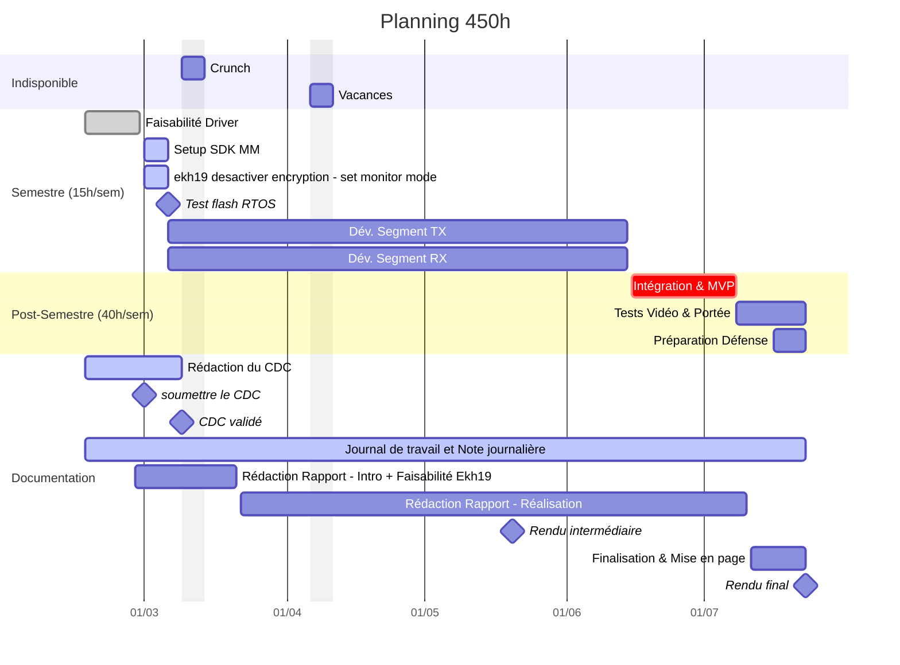
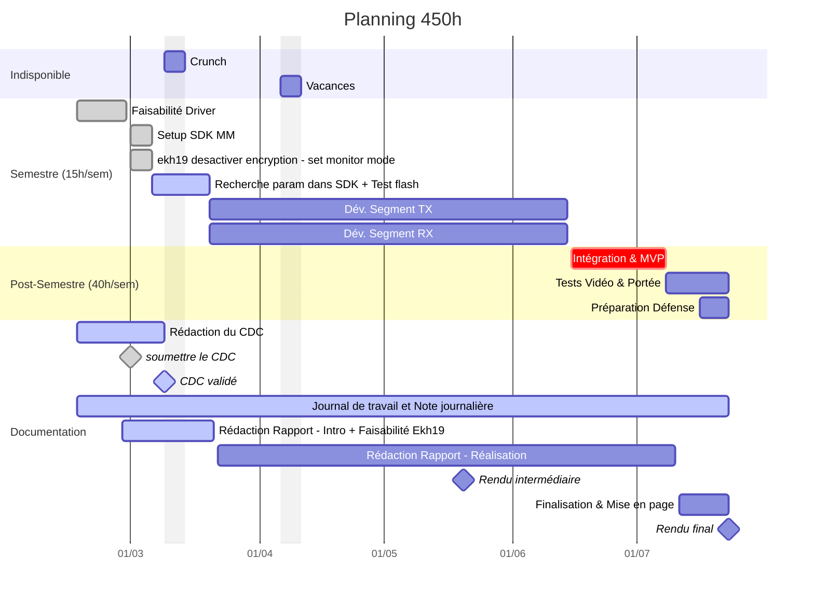
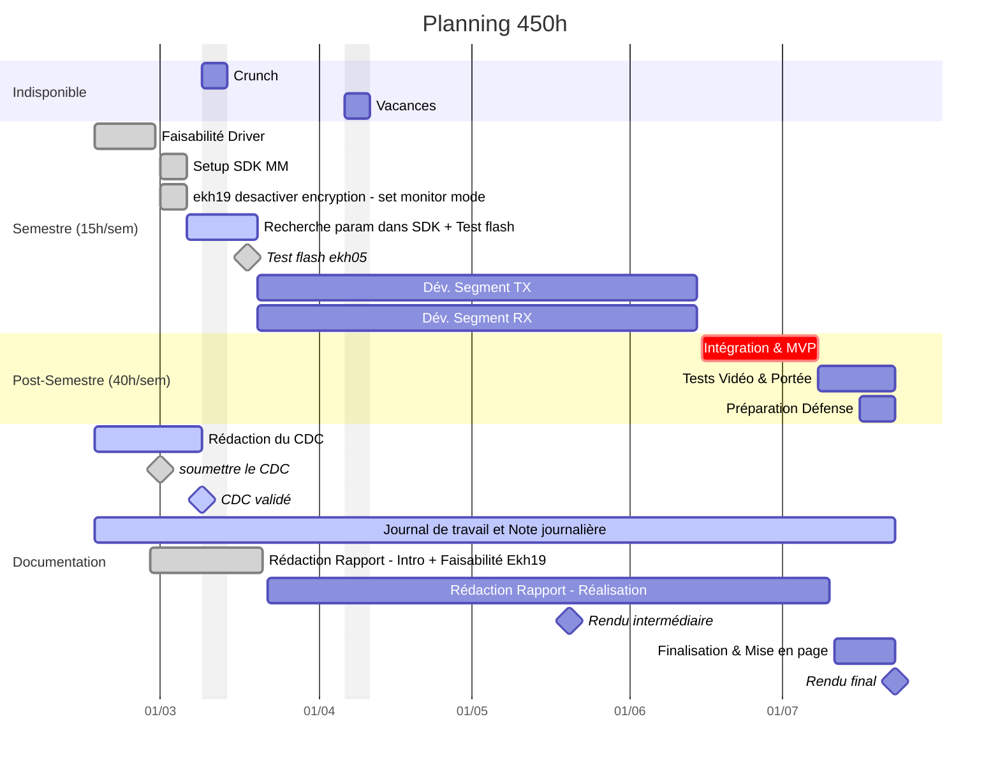
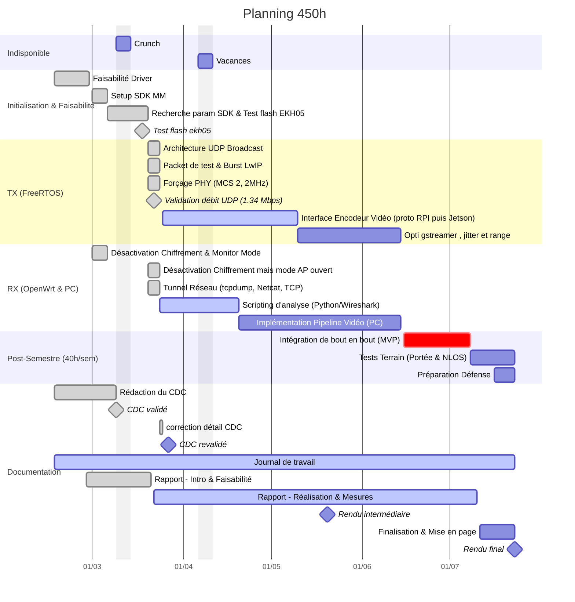
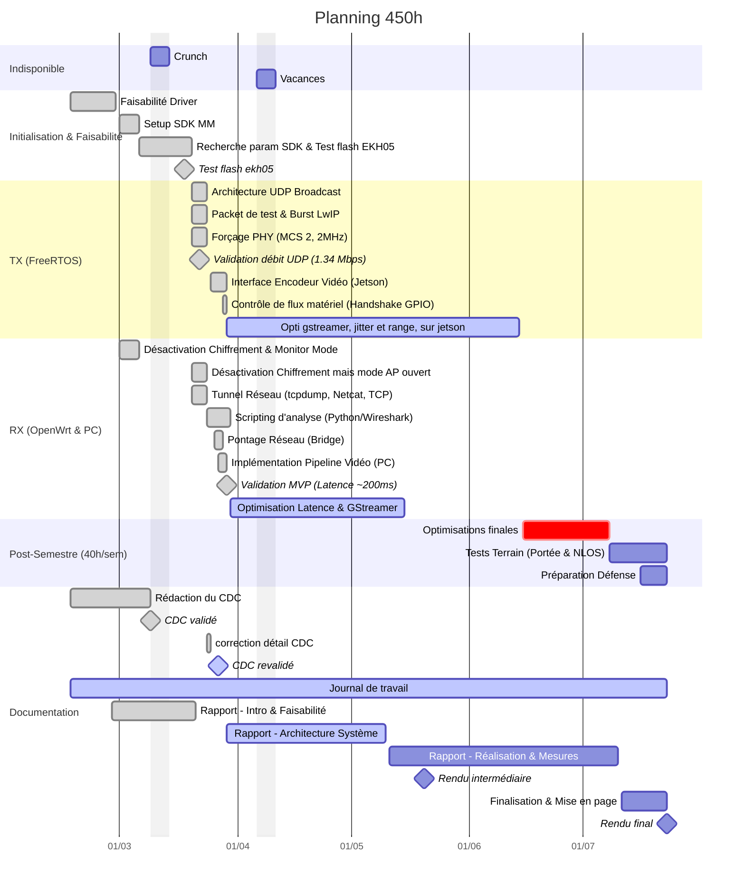
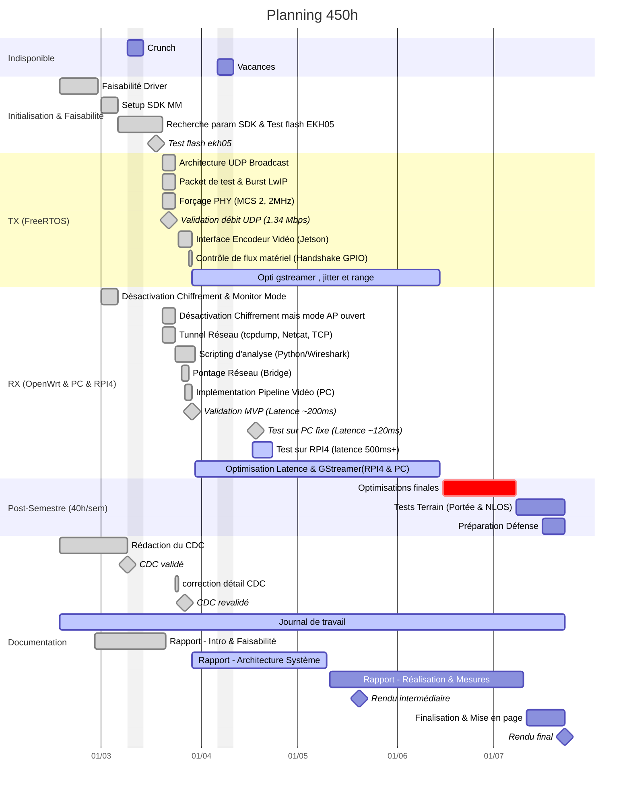
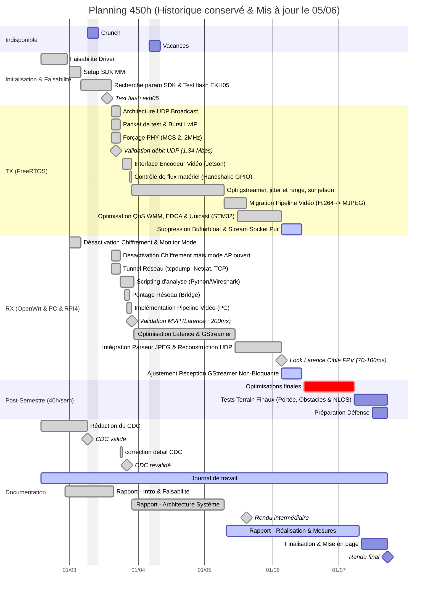

# Journal de travail
Nathan Tschantz, printemps 2026.

## Février
### Vendredi 20.02
- Lancement du travail de bachelor. 
- Première recherche sur la faisabilité de l'utilisation du MM8108-EKH19. 
- recherche d'option possible pour set le MCS et le code correcteur LDPC.

### Samedi - Mardi 21.02 - 24.02

- compilation du kernel et du driver
- modification du driver 
- test du driver modifier sur le module wifi
- Les options semble être setter et la fonction voulue

### Vendredi 27.02
- clarification de la structure du projet
- rédaction de rapport et du cahier des charges
- Lecture de documentation RTOS et EKH05

### Samedi 28.02
- fini la première version du cahier des charges.
- fini la première version du diagramme de Gantt
- setup du mm-iot-sdk avec STM32cubeIDE. (voire note journalière pour le détails)

#### Gantt
_Note :Le Gantt sera update au fur et à mesure du projet lorsque les tâches se préciseront_ 

```mermaid
gantt
    title Planning 450h
    dateFormat  YYYY-MM-DD
    axisFormat  %d/%m

    excludes 2026-03-09,2026-03-10,2026-03-11,2026-03-12,2026-03-13,2026-04-06,2026-04-07,2026-04-08,2026-04-09,2026-04-10
    
    section Indisponible
    Crunch      :2026-03-09, 2026-03-14
    Vacances    :2026-04-06, 2026-04-11

    section Semestre (15h/sem)
    Faisabilité Driver :done, p1, 2026-02-16, 2026-02-28
    Setup SDK MM       :active, p1, 2026-03-01, 2026-03-06
    ekh19 desactiver encryption - set monitor mode :active, p1, 2026-03-1, 2026-03-06
    Test flash RTOS    :milestone ,2026-03-06, 0d

    Dév. Segment TX    : tx1,2026-03-06, 2026-06-14
    Dév. Segment RX   :rx1, 2026-03-06, 2026-06-14

    section Post-Semestre (40h/sem)
    Intégration & MVP        :crit, int1, 2026-06-15, 2026-07-08
    Tests Vidéo & Portée     :int2, 2026-07-08, 2026-07-23
    Préparation Défense      :int3, 2026-07-16, 2026-07-23

    section Documentation
    Rédaction du CDC         :active, doc1, 2026-02-16, 2026-03-09
    soumettre le CDC         :milestone ,2026-03-01, 0d
    CDC validé               :milestone ,2026-03-09, 0d

    Journal de travail et Note journalière :active, doc2, 2026-02-16, 2026-07-23
    Rédaction Rapport - Intro + Faisabilité Ekh19 :doc3, 2026-02-27, 2026-03-21
    Rédaction Rapport - Réalisation :doc4, 2026-03-22, 2026-07-10
    Rendu intermédiaire         :milestone ,2026-05-20, 0d
    Finalisation & Mise en page :doc5, 2026-07-11, 2026-07-23
    Rendu final                 :milestone ,2026-07-23, 0d
```

## Mars
### Dimanche 01.03
- Forcer le monitor mode

### Vendredi 06.03
- rechercher les parametre (MCS,ldpc) dans le SDK.
- recherche de capture des paquets avec tcpdump
- établi la liste de délivrable pour cdc et fait le schémas.
### Samedi 07.03

```mermaid
gantt
    title Planning 450h
    dateFormat  YYYY-MM-DD
    axisFormat  %d/%m

    excludes 2026-03-09,2026-03-10,2026-03-11,2026-03-12,2026-03-13,2026-04-06,2026-04-07,2026-04-08,2026-04-09,2026-04-10
    
    section Indisponible
    Crunch      :2026-03-09, 2026-03-14
    Vacances    :2026-04-06, 2026-04-11

    section Semestre (15h/sem)
    Faisabilité Driver :done, p1, 2026-02-16, 2026-02-28
    Setup SDK MM       :done, p1, 2026-03-01, 2026-03-06
    ekh19 desactiver encryption - set monitor mode :done, p1, 2026-03-1, 2026-03-06
    Recherche param dans SDK + Test flash       :active, p1, 2026-03-06, 2026-03-20
    

    Dév. Segment TX    : tx1,2026-03-20, 2026-06-14
    Dév. Segment RX   :rx1, 2026-03-20, 2026-06-14

    section Post-Semestre (40h/sem)
    Intégration & MVP        :crit, int1, 2026-06-15, 2026-07-08
    Tests Vidéo & Portée     :int2, 2026-07-08, 2026-07-23
    Préparation Défense      :int3, 2026-07-16, 2026-07-23

    section Documentation
    Rédaction du CDC         :active, doc1, 2026-02-16, 2026-03-09
    soumettre le CDC         :done,milestone ,2026-03-01, 0d
    CDC validé               :active,milestone ,2026-03-09, 0d

    Journal de travail et Note journalière :active, doc2, 2026-02-16, 2026-07-23
    Rédaction Rapport - Intro + Faisabilité Ekh19 :active,doc3, 2026-02-27, 2026-03-21
    Rédaction Rapport - Réalisation :doc4, 2026-03-22, 2026-07-10
    Rendu intermédiaire         :milestone ,2026-05-20, 0d
    Finalisation & Mise en page :doc5, 2026-07-11, 2026-07-23
    Rendu final                 :milestone ,2026-07-23, 0d
```
### Mercredi 18.03
- Réception du EKH05
- premier flash du EKH05 
- setup debug et flash config.hjson


```mermaid
gantt
    title Planning 450h
    dateFormat  YYYY-MM-DD
    axisFormat  %d/%m

    excludes 2026-03-09,2026-03-10,2026-03-11,2026-03-12,2026-03-13,2026-04-06,2026-04-07,2026-04-08,2026-04-09,2026-04-10
    
    section Indisponible
    Crunch      :2026-03-09, 2026-03-14
    Vacances    :2026-04-06, 2026-04-11

    section Semestre (15h/sem)
    Faisabilité Driver :done, p1, 2026-02-16, 2026-02-28
    Setup SDK MM       :done, p1, 2026-03-01, 2026-03-06
    ekh19 desactiver encryption - set monitor mode :done, p1, 2026-03-1, 2026-03-06
    Recherche param dans SDK + Test flash       :active, p1, 2026-03-06, 2026-03-20
    Test flash ekh05         :done,milestone ,2026-03-18, 0d
    

    Dév. Segment TX    : tx1,2026-03-20, 2026-06-14
    Dév. Segment RX   :rx1, 2026-03-20, 2026-06-14

    section Post-Semestre (40h/sem)
    Intégration & MVP        :crit, int1, 2026-06-15, 2026-07-08
    Tests Vidéo & Portée     :int2, 2026-07-08, 2026-07-23
    Préparation Défense      :int3, 2026-07-16, 2026-07-23

    section Documentation
    Rédaction du CDC         :active, doc1, 2026-02-16, 2026-03-09
    soumettre le CDC         :done,milestone ,2026-03-01, 0d
    CDC validé               :active,milestone ,2026-03-09, 0d

    Journal de travail et Note journalière :active, doc2, 2026-02-16, 2026-07-23
    Rédaction Rapport - Intro + Faisabilité Ekh19 :done,doc3, 2026-02-27, 2026-03-21
    Rédaction Rapport - Réalisation :doc4, 2026-03-22, 2026-07-10
    Rendu intermédiaire         :milestone ,2026-05-20, 0d
    Finalisation & Mise en page :doc5, 2026-07-11, 2026-07-23
    Rendu final                 :milestone ,2026-07-23, 0d
```

### Vendredi 20.03
- Mise à jour du SDK Morse Micro (intégration officielle du support EKH05).
- Résolution du crash matériel au démarrage (correction du ciblage du fichier de calibration BCF).
- Configuration réseau complète : résolution du conflit IP entre les interfaces LAN et Wi-Fi sur l'EKH19 (routeur OpenWrt).
- Validation de la liaison radio par ping et analyse des contraintes réglementaires (bascule du domaine EU vers US pour désactiver le Listen-Before-Talk et lever le bridage de latence).

### Samedi 21.03 - Dimanche 22.03
- Implémentation de l'application de transmission (`udp_broadcast.c`).
- Optimisations architecturales du code C : ciblage Broadcast (No-ACK), augmentation du MTU (1400 octets), envoi en rafale (burst) et forçage du MCS 2 (2 MHz).
- Tests de performance : validation d'un débit physique de 1.34 Mbps (~120 paquets/sec).
- Calculs mathématiques de faisabilité pour le flux vidéo H.264 : validation théorique du profil 480p à 24fps.

### Mardi 24.03
- Corrections du cahier des charges et mise à jour des journaux de travail/bord.
- Création d'un pipe TCP (script Python local + Netcat sur OpenWrt) pour extraire proprement le flux `tcpdump` et analyser les trames HaLow brutes dans Wireshark.

```mermaid
gantt
    title Planning 450h
    dateFormat  YYYY-MM-DD
    axisFormat  %d/%m

    excludes 2026-03-09,2026-03-10,2026-03-11,2026-03-12,2026-03-13,2026-04-06,2026-04-07,2026-04-08,2026-04-09,2026-04-10
    
    section Indisponible
    Crunch      :2026-03-09, 2026-03-14
    Vacances    :2026-04-06, 2026-04-11

    section Initialisation & Faisabilité
    Faisabilité Driver :done, p1, 2026-02-16, 2026-02-28
    Setup SDK MM       :done, p2, 2026-03-01, 2026-03-06
    Recherche param SDK & Test flash EKH05 :done, p3, 2026-03-06, 2026-03-20
    Test flash ekh05         :done,milestone ,2026-03-18, 0d

    
    section TX (FreeRTOS)
    Architecture UDP Broadcast :done, tx1, 2026-03-20, 2026-03-24
    Packet de test & Burst LwIP :done, tx2, 2026-03-20, 2026-03-24
    Forçage PHY (MCS 2, 2MHz) :done, tx3, 2026-03-20, 2026-03-24
    Validation débit UDP (1.34 Mbps) :done,milestone ,2026-03-22, 0d
    Interface Encodeur Vidéo (proto RPI puis Jetson) :active, tx4, 2026-03-25, 2026-05-10
    Opti gstreamer  , jitter et range :tx5, 2026-05-10, 2026-06-14

    section RX (OpenWrt & PC)
    Désactivation Chiffrement & Monitor Mode :done, rx1, 2026-03-01, 2026-03-06
    Désactivation Chiffrement mais mode AP ouvert :done, rx2, 2026-03-20, 2026-03-24
    Tunnel Réseau (tcpdump, Netcat, TCP) :done, rx3, 2026-03-20, 2026-03-24
    Scripting d'analyse (Python/Wireshark) :active, rx4, 2026-03-24, 2026-04-20
    Implémentation Pipeline Vidéo (PC) :rx5, 2026-04-20, 2026-06-14

    section Post-Semestre (40h/sem)
    Intégration de bout en bout (MVP) :crit, int1, 2026-06-15, 2026-07-08
    Tests Terrain (Portée & NLOS)    :int2, 2026-07-08, 2026-07-23
    Préparation Défense              :int3, 2026-07-16, 2026-07-23

    section Documentation
    Rédaction du CDC         :done, doc1, 2026-02-16, 2026-03-09
    CDC validé               :done, milestone ,2026-03-09, 0d
    correction détail CDC     :done, doc2, 2026-03-24, 1d
    CDC revalidé               :milestone ,2026-03-27, 0d
    Journal de travail       :active, doc3, 2026-02-16, 2026-07-23
    Rapport - Intro & Faisabilité :done,doc4, 2026-02-27, 2026-03-21
    Rapport - Réalisation & Mesures :active,doc5, 2026-03-22, 2026-07-10
    Rendu intermédiaire      :milestone ,2026-05-20, 0d
    Finalisation & Mise en page :doc6, 2026-07-11, 2026-07-23
    Rendu final              :milestone ,2026-07-23, 0d
```

### Jeudi 26.03 
* Tentative de configuration d'une liaison USB entre la Jetson et le STM32 pour le transfert vidéo.

### Vendredi 27.03 
* Abandon de l'USB suite à des instabilités de connexion (déconnexions intempestives).
* Bascule sur le protocole SPI. Setup de la Jetson Nano (configuration des pins via `jetson-io`, installation de `spidev`).
(pin sur le ekh05 trouver via multimetre car impossible de trouver le schéma de routage)
* Écriture d'un script Python de test pour valider l'envoi de trames factices (*dummy payload*) sur le bus SPI à 2 MHz.

### Samedi 28.03 
* **Mise en place du pipeline de bout en bout :** Caméra rpi Camera Module 2 -> Jetson (encodage H.265) -> SPI -> STM32 -> Wi-Fi HaLow (UDP Broadcast) -> Routeur OpenWrt (Bridge) -> PC Windows (GStreamer Direct3D11).
* **Configuration réseau :** Configuration du pont logiciel (`brctl`) sur OpenWrt pour ponter directement `wlan0` vers l'Ethernet, gagnant ainsi 10 à 20 ms de traitement (plus besoin de tcpdump et netcat).
* Migration du script d'envoi Jetson de Python vers C pour supprimer la latence induite par le python et stabiliser les envois.
* **Première mesure de performance :** Latence *Glass-to-Glass* estimée à 170-200 ms avec un flux 720p à 30fps. tester avec 
de la 480p 60fps également pour environ la même latence.

### Dimanche 29.03
* **Optimisation matérielle (Handshake) :** Remplacement des délais logiciels (`usleep`) par un contrôle matériel. Configuration du GPIO 78 (Jetson) et PD15 (STM32) pour empêcher la Jetson d'inonder le buffer SPI du STM32.
* **Premiers tests de portée (Range Tests) avec flux vidéo 480p/720p :**
    * Intérieur (30m) : Traversée de murs extrêmement épais (bunker) validée (avec orientation d'antenne).
    * Extérieur (160m) : Traversée d'un mur de ferme (40cm) + végétation (arbres) validée avec une image fluide jusqu'à la limite de rupture.


```mermaid
gantt
    title Planning 450h
    dateFormat  YYYY-MM-DD
    axisFormat  %d/%m

    excludes 2026-03-09,2026-03-10,2026-03-11,2026-03-12,2026-03-13,2026-04-06,2026-04-07,2026-04-08,2026-04-09,2026-04-10
    
    section Indisponible
    Crunch      :2026-03-09, 2026-03-14
    Vacances    :2026-04-06, 2026-04-11

    section Initialisation & Faisabilité
    Faisabilité Driver :done, p1, 2026-02-16, 2026-02-28
    Setup SDK MM       :done, p2, 2026-03-01, 2026-03-06
    Recherche param SDK & Test flash EKH05 :done, p3, 2026-03-06, 2026-03-20
    Test flash ekh05         :done,milestone ,2026-03-18, 0d

    section TX (FreeRTOS)
    Architecture UDP Broadcast :done, tx1, 2026-03-20, 2026-03-24
    Packet de test & Burst LwIP :done, tx2, 2026-03-20, 2026-03-24
    Forçage PHY (MCS 2, 2MHz) :done, tx3, 2026-03-20, 2026-03-24
    Validation débit UDP (1.34 Mbps) :done,milestone ,2026-03-22, 0d
    Interface Encodeur Vidéo (Jetson) :done, tx4, 2026-03-25, 2026-03-29
    Contrôle de flux matériel (Handshake GPIO) :done, tx4b, 2026-03-28, 2026-03-29
    Opti gstreamer, jitter et range, sur jetson :active, tx5, 2026-03-29, 2026-06-14

    section RX (OpenWrt & PC)
    Désactivation Chiffrement & Monitor Mode :done, rx1, 2026-03-01, 2026-03-06
    Désactivation Chiffrement mais mode AP ouvert:done, rx2, 2026-03-20, 2026-03-24
    Tunnel Réseau (tcpdump, Netcat, TCP) :done, rx3, 2026-03-20, 2026-03-24
    Scripting d'analyse (Python/Wireshark) :done, rx4, 2026-03-24, 2026-03-30
    Pontage Réseau (Bridge) :done, rx4b, 2026-03-26, 2026-03-28
    Implémentation Pipeline Vidéo (PC) :done, rx5, 2026-03-27, 2026-03-29
    Validation MVP (Latence ~200ms) :done,milestone, 2026-03-29, 0d
    Optimisation Latence & GStreamer :active, rx6, 2026-03-30, 2026-05-15

    section Post-Semestre (40h/sem)
    Optimisations finales :crit, int1, 2026-06-15, 2026-07-08
    Tests Terrain (Portée & NLOS)    :int2, 2026-07-08, 2026-07-23
    Préparation Défense              :int3, 2026-07-16, 2026-07-23

    section Documentation
    Rédaction du CDC         :done, doc1, 2026-02-16, 2026-03-09
    CDC validé               :done, milestone ,2026-03-09, 0d
    correction détail CDC    :done, doc2, 2026-03-24, 1d
    CDC revalidé             :active, milestone ,2026-03-27, 0d
    Journal de travail       :active, doc3, 2026-02-16, 2026-07-23
    Rapport - Intro & Faisabilité :done,doc4, 2026-02-27, 2026-03-21
    Rapport - Architecture Système :active,doc4b, 2026-03-29, 2026-05-10
    Rapport - Réalisation & Mesures :doc5, 2026-05-11, 2026-07-10
    Rendu intermédiaire        :milestone ,2026-05-20, 0d
    Finalisation & Mise en page :doc6, 2026-07-11, 2026-07-23
    Rendu final                :milestone ,2026-07-23, 0d
```


## Avril
### Vendredi 17.04
- Implémentation du récepteur sur la rpi4 
- test ffplay, gstreamer, motion jpeg 
### Samedi 18.04

- divers test de commande entre jetson et rpi 

```mermaid
gantt
    title Planning 450h
    dateFormat  YYYY-MM-DD
    axisFormat  %d/%m

    excludes 2026-03-09,2026-03-10,2026-03-11,2026-03-12,2026-03-13,2026-04-06,2026-04-07,2026-04-08,2026-04-09,2026-04-10
    
    section Indisponible
    Crunch      :2026-03-09, 2026-03-14
    Vacances    :2026-04-06, 2026-04-11

    section Initialisation & Faisabilité
    Faisabilité Driver :done, p1, 2026-02-16, 2026-02-28
    Setup SDK MM       :done, p2, 2026-03-01, 2026-03-06
    Recherche param SDK & Test flash EKH05 :done, p3, 2026-03-06, 2026-03-20
    Test flash ekh05         :done,milestone ,2026-03-18, 0d

    section TX (FreeRTOS)
    Architecture UDP Broadcast :done, tx1, 2026-03-20, 2026-03-24
    Packet de test & Burst LwIP :done, tx2, 2026-03-20, 2026-03-24
    Forçage PHY (MCS 2, 2MHz) :done, tx3, 2026-03-20, 2026-03-24
    Validation débit UDP (1.34 Mbps) :done,milestone ,2026-03-22, 0d
    Interface Encodeur Vidéo (Jetson) :done, tx4, 2026-03-25, 2026-03-29
    Contrôle de flux matériel (Handshake GPIO) :done, tx4b, 2026-03-28, 2026-03-29
    Opti gstreamer , jitter et range :active, tx5, 2026-03-29, 2026-06-14

    section RX (OpenWrt & PC & RPI4)
    Désactivation Chiffrement & Monitor Mode :done, rx1, 2026-03-01, 2026-03-06
    Désactivation Chiffrement mais mode AP ouvert:done, rx2, 2026-03-20, 2026-03-24
    Tunnel Réseau (tcpdump, Netcat, TCP) :done, rx3, 2026-03-20, 2026-03-24
    Scripting d'analyse (Python/Wireshark) :done, rx4, 2026-03-24, 2026-03-30
    Pontage Réseau (Bridge) :done, rx4b, 2026-03-26, 2026-03-28
    Implémentation Pipeline Vidéo (PC) :done, rx5, 2026-03-27, 2026-03-29
    Validation MVP (Latence ~200ms) :done,milestone, 2026-03-29, 0d
    Test sur PC fixe (Latence ~120ms) :done,milestone, 2026-04-18, 0d
    Test sur RPI4 (latence 500ms+):active, rx7, 2026-04-17, 2026-04-23
    Optimisation Latence & GStreamer(RPI4 & PC):active, rx6, 2026-03-30, 2026-06-14


    section Post-Semestre (40h/sem)
    Optimisations finales :crit, int1, 2026-06-15, 2026-07-08
    Tests Terrain (Portée & NLOS)    :int2, 2026-07-08, 2026-07-23
    Préparation Défense              :int3, 2026-07-16, 2026-07-23

    section Documentation
    Rédaction du CDC         :done, doc1, 2026-02-16, 2026-03-09
    CDC validé               :done, milestone ,2026-03-09, 0d
    correction détail CDC    :done, doc2, 2026-03-24, 1d
    CDC revalidé             :done, milestone ,2026-03-27, 0d
    Journal de travail       :active, doc3, 2026-02-16, 2026-07-23
    Rapport - Intro & Faisabilité :done,doc4, 2026-02-27, 2026-03-21
    Rapport - Architecture Système :active,doc4b, 2026-03-29, 2026-05-10
    Rapport - Réalisation & Mesures :doc5, 2026-05-11, 2026-07-10
    Rendu intermédiaire        :milestone ,2026-05-20, 0d
    Finalisation & Mise en page :doc6, 2026-07-11, 2026-07-23
    Rendu final                :milestone ,2026-07-23, 0d
```

### Vendredi 24.04
- Prise de mesure pour toutes les étapes du pipline.

## Mai

### Vendredi 01.05
- Essayer d'utiliser la caméra sur la RPI4 avec le compute hat. Mais impossible de voire la caméra.
- récuperation d'une RPI4B

### Samedi 02.05
- Rédaction de rapport

### Vendredi 08.05
- mesure de latence réseau avec le montage du bouton (voire note journalière)
  - excellent résultat (10 a 15 ms)
- mesure de la latence de la caméra en faisant reboucler la vidéo directement sur la rpi4b.
  - excellent résultat aussi (5 a 7 ms)
- plus qu'a chercher les 100ms réstante dans le système
### Mecredi 20.05 15h00
**Rendu intermédiaire**

Voici la mise à jour complète de ton journal de travail pour la période de début juin. J'ai intégré tes avancées techniques majeures (résolution du bug GStreamer, passage en Unicast, optimisation de la QoS EDCA sur le STM32, et Supersampling imx219) et généré la nouvelle version du diagramme de Gantt actualisée au vendredi 05.06, reflétant le passage au format MJPEG et le déblocage de la latence cible sous les 100 ms.

---

## Juin

### Vendredi 05.06

* **Résolution du bug d'affichage UDP avec MJPEG (Slicing & Trame grise) :** Remplacement du padding de zéros (`0x00`) — qui provoquait des erreurs de syntaxe fatales sur le décodeur — par une duplication du marqueur de fin de fichier JPEG (`0xFF 0xD9`) et Ajout du composant `jpegparse` dans le pipeline GStreamer au sol pour reconstruire proprement les datagrammes fragmentés.
* **Optimisation drastique de la latence réseau :** Abandon du mode *Broadcast* (sujet à la rétention DTIM du routeur et bridé au débit minimal) au profit d'un routage direct en **Unicast** vers l'IP du récepteur.
* **Hack de la couche MAC 802.11e (QoS EDCA) sur le STM32 :** Marquage du socket LwIP en priorité critique (`pcb->tos = 0xC0` - Voice / TID 7) et forçage des registres de la puce Morse Micro pour écraser les temps de courtoisie Wi-Fi standards (`AIFS = 2`, `CW_min = 1`, `CW_max = 1`). Le drone s'approprie le canal RF et transmet sans retransmissions agressives (politique proche du No-ACK).
* **Supersampling matériel (imx219) & Alignement de flux :** Configuration de l'ISP pour capturer en 640x480 (SBGGR10) avec un *downscale* matériel en 320x240 @ 60 FPS. Le lissage du bruit numérique réduit le poids VBR des fichiers JPEG. Gel de la balance des blancs (`--awb daylight`) et de l'exposition pour assurer un preprocessing déterministe. Activation de l'option `--flush` pour éliminer la rétention de buffer de Linux.
* **Bilan des mesures :** Succès de l'architecture. Latence *Glass-to-Glass* avec un flux vidéo en 320x240 à 60 FPS et une latence stable autour de 80-90 ms (pics min à 70 ms et max à 100)


```mermaid
gantt
    title Planning 450h (Historique conservé & Mis à jour le 05/06)
    dateFormat  YYYY-MM-DD
    axisFormat  %d/%m

    excludes 2026-03-09,2026-03-10,2026-03-11,2026-03-12,2026-03-13,2026-04-06,2026-04-07,2026-04-08,2026-04-09,2026-04-10
    
    section Indisponible
    Crunch      :2026-03-09, 2026-03-14
    Vacances    :2026-04-06, 2026-04-11

    section Initialisation & Faisabilité
    Faisabilité Driver :done, p1, 2026-02-16, 2026-02-28
    Setup SDK MM       :done, p2, 2026-03-01, 2026-03-06
    Recherche param SDK & Test flash EKH05 :done, p3, 2026-03-06, 2026-03-20
    Test flash ekh05         :done,milestone ,2026-03-18, 0d

    section TX (FreeRTOS)
    Architecture UDP Broadcast :done, tx1, 2026-03-20, 2026-03-24
    Packet de test & Burst LwIP :done, tx2, 2026-03-20, 2026-03-24
    Forçage PHY (MCS 2, 2MHz) :done, tx3, 2026-03-20, 2026-03-24
    Validation débit UDP (1.34 Mbps) :done,milestone ,2026-03-22, 0d
    Interface Encodeur Vidéo (Jetson) :done, tx4, 2026-03-25, 2026-03-29
    Contrôle de flux matériel (Handshake GPIO) :done, tx4b, 2026-03-28, 2026-03-29
    Opti gstreamer, jitter et range, sur jetson :done, tx5, 2026-03-29, 2026-05-10
    Migration Pipeline Vidéo (H.264 -> MJPEG) :done, tx6, 2026-05-10, 2026-05-20
    Optimisation QoS WMM, EDCA & Unicast (STM32) :done, tx7, 2026-05-16, 2026-06-05
    Suppression Bufferbloat & Stream Socket Pur :active, tx8, 2026-06-05, 2026-06-14

    section RX (OpenWrt & PC & RPI4)
    Désactivation Chiffrement & Monitor Mode :done, rx1, 2026-03-01, 2026-03-06
    Désactivation Chiffrement mais mode AP ouvert:done, rx2, 2026-03-20, 2026-03-24
    Tunnel Réseau (tcpdump, Netcat, TCP) :done, rx3, 2026-03-20, 2026-03-24
    Scripting d'analyse (Python/Wireshark) :done, rx4, 2026-03-24, 2026-03-30
    Pontage Réseau (Bridge) :done, rx4b, 2026-03-26, 2026-03-28
    Implémentation Pipeline Vidéo (PC) :done, rx5, 2026-03-27, 2026-03-29
    Validation MVP (Latence ~200ms) :done,milestone, 2026-03-29, 0d
    Optimisation Latence & GStreamer :done, rx6, 2026-03-30, 2026-05-15
    Intégration Parseur JPEG & Reconstruction UDP :done, rx7, 2026-05-15, 2026-06-05
    Lock Latence Cible FPV (70-100ms) :done,milestone, 2026-06-05, 0d
    Ajustement Réception GStreamer Non-Bloquante :active, rx8, 2026-06-05, 2026-06-14

    section Post-Semestre (40h/sem)
    Optimisations finales :crit, int1, 2026-06-15, 2026-07-08
    Tests Terrain Finaux (Portée, Obstacles & NLOS) :int2, 2026-07-08, 2026-07-23
    Préparation Défense               :int3, 2026-07-16, 2026-07-23

    section Documentation
    Rédaction du CDC         :done, doc1, 2026-02-16, 2026-03-09
    CDC validé               :done, milestone ,2026-03-09, 0d
    correction détail CDC    :done, doc2, 2026-03-24, 1d
    CDC revalidé             :done, milestone ,2026-03-27, 0d
    Journal de travail       :active, doc3, 2026-02-16, 2026-07-23
    Rapport - Intro & Faisabilité :done,doc4, 2026-02-27, 2026-03-21
    Rapport - Architecture Système :done,doc4b, 2026-03-29, 2026-05-10
    Rendu intermédiaire         :done,milestone ,2026-05-20, 0d
    Rapport - Réalisation & Mesures :active,doc5, 2026-05-11, 2026-07-10
    Finalisation & Mise en page :doc6, 2026-07-11, 2026-07-23
    Rendu final                 :milestone ,2026-07-23, 0d
```

### Vendredi 12.06
- Nettoyage du pipeline TX : suppression complète du serveur HTTP intermédiaire en Rust.
- Développement de la version directe `gateway_spi_noserv.c` pour coupler l'outil de capture natif et le bus SPI via un pipe anonyme non-bloquant.
- Configuration et gel des fréquences CPU (2.0 GHz) et de la régulation thermique de la Raspberry Pi 4B (Force Turbo).
- Isolation matérielle complète du cœur CPU numéro 3 du planificateur Linux via la directive `isolcpus=3`.

### Lundi 15.06
- Analyse et évaluation comparative de la solution logicielle multi-threadée *uStreamer*.
- Abandon de la piste *uStreamer* en raison d'un manque de gain de performance par rapport à notre passerelle en C directe.
- Validation expérimentale de la configuration système : latence *Glass-to-Glass* stable à 70-80 ms sur l'écran du PC de diagnostic.

### Mardi 16.06
- Flashage d'une image Linux avec noyau Temps Réel durci (*Real-Time PREEMPT*).
- Montage de la partition système ext4 sous VM Linux pour configurer l'accès SSH et injecter les clés de sécurité.
- Analyse comparative des performances : l'OS Temps Réel durci offre des gains similaires à notre isolation manuelle par affinité de cœur (`taskset -c 3`).
- Validation sur moniteur haute fréquence (165 Hz) : réduction de la latence visuelle moyenne à 40-50 ms grâce à la suppression du goulot d'affichage.

### Vendredi 19.06
- Configuration d'une liaison réseau Ethernet filaire directe (PC à RPi) sans lien radio Sub-1 GHz pour isoler l'overhead logiciel.
- Mesure d'une latence résiduelle locale de 100 ms en H.264, validant techniquement le pivot d'architecture global vers le MJPEG.
- Montage de la carte radio SDR *BladeRF xA9* sur la Raspberry Pi 4B en vue des tests comparatifs DVB-T2.

### Dimanche 21.06
- Optimisation fine du pilote radio : désactivation complète de l'agrégation de paquets MAC (*A-MPDU*) afin de supprimer la gigue temporelle d'accumulation.
- Résolution des problèmes de démodulation de la BladeRF : configuration des scripts de commandeRF interactifs.

### Lundi 22.06
- Établissement du pipeline complet DVB-T2 : GStreamer -> MPEG-TS -> FIFO -> `bladeRF-cli`.
- Configuration de la station de réception TSDuck sous Windows pour le décodage matériel via Direct3D 11.
- Métrologie comparative : validation d'un retard de 2 à 7 secondes inhérent au standard MPEG-TS, justifiant définitivement le choix du Wi-Fi HaLow.

### Mardi 23.06
- Fusion et fiabilisation du code source de la gateway de production (`gateway_spi_noserv.c`).
- Implémentation du padding de sécurité par zéros et du double acquittement de Handshake pour éliminer le flicker et les crashs de GStreamer.
- Nettoyage du code d'intégration du STM32U5 et durcissement des paramètres d'accès au canal.

### Vendredi 26.06
- Intégration de la plateforme alternative *Debix Model A* et configuration de son bus SPI secondaire.
- Écriture du script d'automatisation système `init.sh` pour forcer le mode d'exposition rapide de la caméra et le polling de la bibliothèque `libgpiod`.

### Mardi 30.06
- Mesures de performance sur l'architecture Debix : obtention d'une latence de 150 ms.
- Identification du goulot d'étranglement : l'absence d'accélération matérielle MJPEG native sur l'i.MX8 délègue tout le calcul au CPU.
- Décision de conserver la Raspberry Pi 4B comme plateforme d'émission nominale pour le prototype final.

### Jeudi 02.07
- Recherches approfondies dans les manuels de référence NXP pour valider l'absence de codec matériel MJPEG sur les puces i.MX8 Mini/Plus.
- Analyse comparative des pipelines H.264 matériels NXP.

### Vendredi 03.07
- Étude fonctionnelle de l'API de puissance de Morse Micro : identification de la fonction `mmwlan_override_max_tx_power()`.
- Intégration de la fonction dans l'initialisation du firmware STM32.
- Constat de bridage matériel : la puissance de l'émetteur reste bloquée à 14 dBm au lieu des 26 dBm théoriques.

### Vendredi 06.07
- Rédaction et publication d'un ticket technique détaillé sur la plateforme communautaire de Morse Micro pour comprendre le bridage à 14 dBm.
- Structuration des chapitres de réalisation du rapport de Bachelor (reprise du rapport intermédiaire).

### Mardi 07.07
- Rédaction du corps du rapport (sections "Capture vidéo" et "Interfaçage matériel SPI").

### Vendredi 10.07
- Campagne de métrologie RF à l'analyseur de spectre : validation d'une émission AP (EKH19) conforme à 20 dBm en ping flood.
- Validation définitive de la taille des paquets applicatifs réseau (1400 octets stables) via capture globale `tcpdump`.
- Enregistrement d'un profil vidéo MJPEG dynamique d'une minute à 60 Hz pour établir le profilage mathématique exact du système (charge utile moyenne de 3204 octets par image, soit un débit applicatif réel de 1.53 Mbps réparti sur 3 paquets UDP).

### Samedi 11.07
- Intégration des données statistiques de la Debix et restructuration des schémas d'architecture du document de synthèse.
- Déplacement des sections de fragmentation vers les chapitres de bas niveau pour améliorer la cohérence de l'approche *Bottom-Up*.

### Dimanche 12.07
- Envoi des journaux de logs d'OpenWrt et des dumps complets de la configuration `config.hjson` aux équipes de support de Morse Micro.

### Lundi 13.07
- Validation de la fonction d'atténuation de puissance : le micrologiciel répond correctement aux consignes inférieures à 14 dBm.
- Session de prises de vues en extérieur (IICT) pour documenter la qualité visuelle réelle du flux FPV.

### Mardi - Jeudi 14.07 - 16.07
- Analyse statistique finale des 79 échantillons collectés par vidéométrologie visuelle à 240 FPS / 165 Hz.
- Calcul rigoureux de l'écart-type : validation d'une gigue $\sigma$ stable de 6.4 ms pour une latence moyenne absolue de 40.1 ms.
- Relecture globale, corrections typographiques, génération des tables des matières, compilation des index et finalisation de la mise en page LaTeX du rapport et des annexes séparées.

### Mardi 21.07
- Rendu

### Jeudi 23.07 avant 11h00
- **Rendu final du rapport de Bachelor et de ses annexes matérielles.**

---

## Version finale du diagramme de Gantt (21.07)

```mermaid
gantt
    title Planning 450h - Bilan Final Réel (Rendu le 23/07)
    dateFormat  YYYY-MM-DD
    axisFormat  %d/%m

    excludes 2026-03-09,2026-03-10,2026-03-11,2026-03-12,2026-03-13,2026-04-06,2026-04-07,2026-04-08,2026-04-09,2026-04-10
    
    section Indisponible
    Crunch      :2026-03-09, 2026-03-14
    Vacances    :2026-04-06, 2026-04-11

    section Initialisation & Faisabilité
    Faisabilité Driver :done, p1, 2026-02-16, 2026-02-28
    Setup SDK MM       :done, p2, 2026-03-01, 2026-03-06
    Recherche param SDK & Test flash EKH05 :done, p3, 2026-03-06, 2026-03-20
    Test flash ekh05         :done,milestone ,2026-03-18, 0d

    section TX (FreeRTOS)
    Architecture UDP Broadcast :done, tx1, 2026-03-20, 2026-03-24
    Packet de test & Burst LwIP :done, tx2, 2026-03-20, 2026-03-24
    Forçage PHY (MCS 2, 2MHz) :done, tx3, 2026-03-20, 2026-03-24
    Interface Encodeur Vidéo (Jetson) :done, tx4, 2026-03-25, 2026-03-29
    Contrôle de flux matériel (Handshake GPIO) :done, tx4b, 2026-03-28, 2026-03-29
    Opti gstreamer, jitter et range, sur jetson :done, tx5, 2026-03-29, 2026-05-10
    Migration Pipeline Vidéo (H.264 -> MJPEG) :done, tx6, 2026-05-10, 2026-05-20
    Optimisation QoS WMM, EDCA & Unicast (STM32) :done, tx7, 2026-05-16, 2026-06-05
    Suppression Bufferbloat & Stream Pipe Pur :done, tx8, 2026-06-05, 2026-06-14
    Évaluation Plateforme alternative Debix :done, tx9, 2026-06-26, 2026-07-03

    section RX (OpenWrt & PC & RPI4)
    Désactivation Chiffrement & Monitor Mode :done, rx1, 2026-03-01, 2026-03-06
    Désactivation Chiffrement (Mode AP ouvert) :done, rx2, 2026-03-20, 2026-03-24
    Tunnel Réseau (tcpdump, Netcat, TCP) :done, rx3, 2026-03-20, 2026-03-24
    Scripting d'analyse (Python/Wireshark) :done, rx4, 2026-03-24, 2026-03-30
    Pontage Réseau (Bridge transparent LAN) :done, rx4b, 2026-03-26, 2026-03-28
    Implémentation Pipeline Vidéo (PC) :done, rx5, 2026-03-27, 2026-03-29
    Validation MVP (Latence ~200ms) :done,milestone, 2026-03-29, 0d
    Optimisation Latence & GStreamer :done, rx6, 2026-03-30, 2026-05-15
    Intégration Parseur JPEG & Reconstruction UDP :done, rx7, 2026-05-15, 2026-06-05
    Lock Latence Cible FPV (70-100ms) :done,milestone, 2026-06-05, 0d
    Ajustement Réception Moniteur Diagnostic 165Hz :done, rx8, 2026-06-05, 2026-06-16
    Mesures comparatives DVB-T2 / SDR BladeRF :done, rx9, 2026-06-19, 2026-06-26

    section Post-Semestre (40h/sem)
    Tests Terrain & Range LOS/NLOS :done, val1, 2026-07-03, 2026-07-13
    Profilage mathématique des trames MJPEG :done, val2, 2026-07-10, 2026-07-12
    Analyse Statistique Finale (79 mesures) :done, val3, 2026-07-14, 2026-07-16
    Lock Latence Finale (~40ms) :done, milestone, 2026-07-16, 0d

    section Documentation
    Rédaction du CDC :done, doc1, 2026-02-16, 2026-03-09
    CDC validé :done, milestone ,2026-03-09, 0d
    Journal de travail       :done, doc3, 2026-02-16, 2026-07-23
    correction détail CDC :done, doc2, 2026-03-24, 1d
    Rapport - Intro & Faisabilité :done, doc3, 2026-02-27, 2026-03-21
    Rapport - Architecture Système :done, doc4, 2026-03-29, 2026-05-10
    Rendu intermédiaire :done, milestone ,2026-05-20, 0d
    Rapport - Réalisation, Métrologie & Code :done, doc5, 2026-05-11, 2026-07-16
    Finalisation & Mise en page :done, doc6, 2026-07-11, 2026-07-22
    Rendu final du rapport de Bachelor :done, milestone ,2026-07-23, 0d