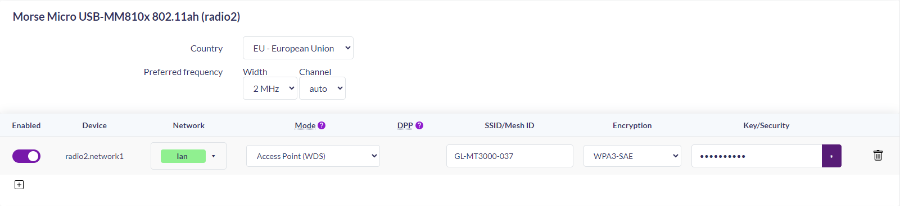
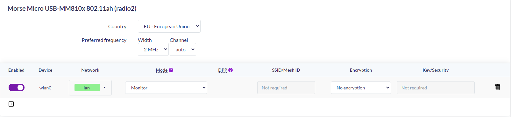

# Note journalière
Nathan Tschantz, printemps 2026.
## Février
### Vendredi 20.02
Lancement du travail de bachelor. Première recherche sur la faisabilité de l'utilisation du MM8108-EKH19. Une fonction contient bien les options recherchée: set le MCS et code correcteur LDPC.

Le MCS est settable via un fichier (chercher) sur dans module.L'activation de LDPC n'est pas exposé par le driver et aucun des utilitaires (iw, morse_cli, hostapd). Il faudrait donc modifier les appels de fonction qui set ces param directement dans le driver.

dans les source du driver:
- command.c
```c
int morse_cmd_set_fixed_transmission_rate(struct morse *mors, s32 bandwidth_mhz, s32 mcs_index,
					s8 use_sgi, s8 nss_idx)
{
	struct morse_cmd_req_set_transmission_rate req;

	morse_cmd_init(mors, &req.hdr, MORSE_CMD_ID_SET_TRANSMISSION_RATE, 0, sizeof(req));

	req.enabled = 1;
	req.bandwidth_mhz = cpu_to_le32(bandwidth_mhz);
	req.mcs_index = cpu_to_le32(mcs_index);
	req.nss_idx = nss_idx;
	req.use_sgi = use_sgi;
	req.tx_80211ah_format = cpu_to_le32(-1);
	req.use_traveling_pilots = -1;
	req.use_stbc = -1;	
	req.use_ldpc = 1;
	//req.use_ldpc = -1;
	//MORSE_INFO(mors, "MORSE_HACK: LDPC force a 1 et MCS a 2\n");
    pr_info("MORSE_HACK: LDPC force a 1 et MCS a 2\n");
	return morse_cmd_tx(mors, NULL, (struct morse_cmd_req *)&req, 0, 0, __func__);
}
```

- en haut de rc.c
```c
/* Enable/Disable the fixed rate (Disabled by default) */
static bool enable_fixed_rate __read_mostly = true;
module_param(enable_fixed_rate, bool, 0644);
MODULE_PARM_DESC(enable_fixed_rate, "Enable the fixed rate");

/* Set the fixed mcs (Takes effect when enable_fixed_rate is activated) */
//static int fixed_mcs __read_mostly = 4;
static int fixed_mcs __read_mostly = 2;
module_param(fixed_mcs, int, 0644);
MODULE_PARM_DESC(fixed_mcs, "Fixed MCS (only used when enable_fixed_rate is on)");
```

Setup de l'adresse IP de l'Ethernet comme expliquer dans MM6108_MM8108-Eval-Kit-User-Guide-2.8.pdf. Puisque l'adresse de l'ethernet de l'EKH19 est 192.168.8.1 (pour le Halow c'est 192.168.12.1). Donc on set notre adresse dans le même subnet, en l'occurence 192.168.8.10 masque 255.255.255.0 et donc la passerelle par défaut 192.168.8.1

7h30.
### Samedi - Mardi 21.02 - 24.02

Pour modifier le driver, cloner le repos github du fork de openWrt par Morse Micro. Il n'est pas possible de compiler uniquement le driver sans avoir le kernel openwrt. Donc suivre ce README.md pour setup et compiler le kernel https://github.com/MorseMicro/openwrt/. 

Une fois le kernel compiler les modif fait dans les fichier précédent doivent être faite dans. 

openwrt/build_dir/target-aarch64_cortex-a53_musl/linux-mediatek_filogic/morse_driver-1.16.4/...
- command.c idem précédent
- rc.c idem précédent
- usb.c ci-dessous
```c
static int morse_usb_probe(struct usb_interface *interface, const struct usb_device_id *id)
{
	int ret;
	struct morse *mors;
	struct morse_usb *musb;
	struct morse_chip_series *mors_chip_series = (struct morse_chip_series *)id->driver_info;
	const bool reset_hw = false;
	const bool reattach_hw = false;
	/* let the user know what node this device is now attached to */
	dev_info(&interface->dev,"#### MODIFIED DRIVER ####\n"); <---- ICI
	dev_info(&interface->dev,
		 "USB Morse device now attached to Morse driver (minor=%d)", interface->minor);¨
       
        ...
    	
        usb_autopm_get_interface(interface);
    #ifdef CONFIG_MORSE_ENABLE_TEST_MODES
    usb_test_fin:
    #endif
	    /***************************************************************************/
	    morse_cmd_set_fixed_transmission_rate(mors, 1, 2, 0, 0); <---- ICI
	    /***************************************************************************/
	    return 0;
    #ifdef CONFIG_MORSE_USER_ACCESS
    err_uaccess:
    
    ...

```
**ATTENTION: ces modifications sont temporaire !!! si on fait un make clean du kernel elles seront erase. a terme il faudrait donc ajouter un patch.**

Une fois ces modification faite, on peut recompiler UNIQUEMENT le driver.()les commande suivante sont éfféctuées dans morse-wifi/openwrt/
```bash
$> make package/morse_driver/compile V=s
```
Ensuite on récupère le .ko et on le copie dans le dossier temporaire sur le module wifi.
```bash
$> scp build_dir/target-aarch64_cortex-a53_musl/linux-mediatek_filogic/morse_driver-1.16.4/ipkg-aarch64_cortex-a53/kmod-morse/lib/modules/5.15.167/morse.ko root@192.168.8.1:/tmp/
```
**ATTENTION: ces modifications sont temporaire !!! au restart le .ko sera erase**


Sur l'EKH.
```bash
root@DUT-8108-EKH19-2_9_3:/tmp rmmod morse
# couper le wifi
root@DUT-8108-EKH19-2_9_3:/tmp wifi down
'radio2' is disabled
root@DUT-8108-EKH19-2_9_3:/tmp insmod morse.ko
# set une ...
root@DUT-8108-EKH19-2_9_3:/tmp ifconfig morse0 10.0.0.1 netmask 255.255.255.0 up
# relancer le wifi
root@DUT-8108-EKH19-2_9_3:/tmp wifi up
# pinger une adresse IP inexistante
root@DUT-8108-EKH19-2_9_3:/tmp ping -I morse0 -c 3 10.0.0.2
PING 10.0.0.2 (10.0.0.2): 56 data bytes

--- 10.0.0.2 ping statistics ---
3 packets transmitted, 0 packets received, 100% packet loss
root@DUT-8108-EKH19-2_9_3:/tmp dmesg | grep HACK
[  291.577635] MORSE_HACK: LDPC force a 1 et MCS a 2
```
Parfois ca ne marchait pas ^avait sembler résoudre le probléme.

mais apparement ca ca suffit
```bash
root@DUT-8108-EKH19-2_9_3:/tmp rmmod morse
root@DUT-8108-EKH19-2_9_3:/tmp insmod morse.ko
root@DUT-8108-EKH19-2_9_3:/tmp dmesg | grep HACK
[   56.327830] MORSE_HACK: LDPC force a 1 et MCS a 2
```

sais plus combien de temps ~10h
### Vendredi 27.02

- Clarifier la structure du projet: 
	- Encodeur vidéo: donné, a connecter a la jetson
	- jetson/OS : recupérer le stream vidéo et l'envoyer au module wifi 
	- module wifi (TX): choix a faire, si utilisable on garde l'EKH19 (sinon EKH05-01)
	- module wifi (RX): On utilisera l'EKH05-01 (avec RTOS) pour recupèrer et l'envoyer 
		au PC pour l'image
	- Display 		  : récuperer l'image et la streamer

A. IP based UDP Broadcast EKH19 (ou 05 selon capacité) + RX en monitor mode en utilisant libpicap

B. Raw broadcast + LDPC COMPLIQUÉ car fonction cacher dans le binaire.

C. utiliser les examples...

a faire: 
- installer et prendre en main le SDK mm-iot-SDK et l'ouvrir dans
STM32cubeIDE
- réaliser le cahier des charges
- faire l'introduction 
- checker si on peux desactiver l'encryption sur le ekh19 (et le mettre en monitor mode)

### Samedi 28.02
- fini la première version du cahier des charges.

**Setup de l'environnement de développement (MM IoT SDK & STM32CubeIDE sous Windows)**

Voici les étapes réalisées pour configurer la chaîne de cross compilation sous Windows avec STM32CubeIDE :

**1. Récupération du SDK (Git)**

* Fork du dépôt officiel `MorseMicro/mm-iot-sdk` sur GitHub.
* Clonage local dans `C:\Users\natha\OneDrive\Bureau\TB\mm-iot-sdk`.
* Téléchargement des dépendances vitales (FreeRTOS, lwIP, mbedTLS) via la commande :
`git submodule update --init --recursive`

**2. Importation dans STM32CubeIDE**

* Création du Workspace `C:\Users\natha\OneDrive\Bureau\TB\workspace_mm`.
* Le SDK n'utilisant pas la structure standard de STM32cubeIDE, l'importation a été faite via : **File > New > Makefile Project with Existing Code**.
* Sélection du dossier cible pour l'EKH05 : `\mm-iot-sdk\examples\ping\targets\mm-mm6108-ekh05`.
* Sélection de la toolchain : **ARM Cross GCC**.

**3. Configuration du compilateur sous Windows (Variables d'environnement)**

* Windows ne possédant pas nativement `make`, il a fallu lier les outils internes de STM32CubeIDE au projet.
* Dans `Properties > C/C++ Build > Environment`, ajout de deux chemins en tête de la variable `PATH` :
* Le chemin vers `make.exe` (situé dans `C:\ST\STM32CubeIDE_1.19.0\STM32CubeIDE\plugins\com.st.stm32cube.ide.mcu.externaltools.make.win32_2.2.0.202409170845\tools\bin`).
* Le chemin vers `arm-none-eabi-gcc.exe` (situé dans `C:\ST\STM32CubeIDE_1.19.0\STM32CubeIDE\plugins\com.st.stm32cube.ide.mcu.externaltools.gnu-tools-for-stm32.13.3.rel1.win32_1.0.0.202411081344\tools\bin`).

**4. Modification des Makefiles (Adaptation Linux -> Windows)**

* Le SDK force nativement l'utilisation d'une toolchain spécifique (10.3) située dans les répertoires Linux (`/opt/`).
* Modification du fichier `\mm-iot-sdk\framework\mkcore-arm-cortex-m33f.mk` pour empecher la recherche de ces dossiers et utiliser la `PATH` de Windows :
```mk
# Configure the toolchain
TOOLCHAIN_VERSION ?= 10.3-2021.07

# Try to find the toolchain if not already specified
==================== On commente ca ====================
#ifeq ($(TOOLCHAIN_DIR),)
#    directory_exists = $(shell [ -d $(1) ] && echo "exists")
#    TOOLCHAIN_DIR := /opt/morse/gcc-arm-none-eabi-$(TOOLCHAIN_VERSION)
#    ifeq ($(call directory_exists,$(TOOLCHAIN_DIR)),)
#        TOOLCHAIN_DIR := /opt/gcc-arm-none-eabi-$(TOOLCHAIN_VERSION)
#        ifeq ($(call directory_exists,$(TOOLCHAIN_DIR)),)
#            $(error Unable to find arm-none-eabi-$(TOOLCHAIN_VERSION) toolchain)
#        endif
#   endif
#else
#	TOOLCHAIN_DIR := $(TOOLCHAIN_DIR)
#endif
========================================================
# --- MODIFICATION POUR WINDOWS / STM32CubeIDE ---
# On ignore la recherche des dossiers Linux /opt/...
# et on laisse le PATH système de STM32CubeIDE trouver le compilateur.
TOOLCHAIN_DIR := 
TOOLCHAIN_BASE := arm-none-eabi-

======================= et ca ==========================
#TOOLCHAIN_BASE := $(TOOLCHAIN_DIR)/bin/arm-none-eabi-
========================================================

CC := "$(TOOLCHAIN_BASE)gcc"
CXX := "$(TOOLCHAIN_BASE)g++"
AS := $(CC) -x assembler-with-cpp
OBJCOPY := "$(TOOLCHAIN_BASE)objcopy"
```

La compilation fonctionne, le .elf est bien générer.
(les .elf ce trouve dans `C:\Users\natha\OneDrive\Bureau\TB\mm-iot-sdk\examples\ping\targets\mm-mm6108-ekh05`)

## Mars
### Dimanche 01.03

dans la gui `http://192.168.12.1/cgi-bin/luci/admin/config` il possible
de directement activer le monitor mode (qui desactive l'encryption par défaut) ou de rester en mode AP mais sans l'encryption.
Enfaite il faut bien se connecter sur 192.168.12.1 et non 192.168.8.1 (12 = HaLow, 8 = Ethernet) mais les image ci-dessous rest valide lan deviens ahwlan



Pour que le driver modifier soit lancer au démarage
```bash
root@DUT-8108-EKH19-2_9_3:/tmp cd /lib/modules/5.15.167/
# on sauvegarde le driver original
root@DUT-8108-EKH19-2_9_3:/tmp cp morse.ko morse.ko.bak
# et on remplace le driver
root@DUT-8108-EKH19-2_9_3:/tmp cp /tmp/morse.ko ./
```

dans command.c
```c
int morse_cmd_set_rate_control(struct morse *mors)
{
	struct morse_cmd_req_set_rate_control req;
	int ret;

	morse_cmd_init(mors, &req.hdr, MORSE_CMD_ID_SET_RATE_CONTROL, 0, sizeof(req));
	req.mcs10_mode = morse_mac_get_mcs10_mode();
	req.mcs_mask = cpu_to_le16(morse_mac_get_mcs_mask());
	req.enable_sgi_rc = mors->custom_configs.enable_sgi_rc;

	//return morse_cmd_tx(mors, NULL, (struct morse_cmd_req *)&req, 0, 0, __func__);

	// ================================================================
    ret = morse_cmd_tx(mors, NULL, (struct morse_cmd_req *)&req, 0, 0, __func__);

    if (ret == 0) {
        printk(KERN_INFO "MORSE_HACK: RateControl OK, forçage MCS2 + LDPC...\n");
        morse_cmd_set_fixed_transmission_rate(mors, 2, 2, 0, 0);
    }

    return ret;
	// ================================================================
}
```

pour focer le monitor mode en dure dans mac.c `|| 1` (il faudra chercher quelque chose de plus propre)
```c
static int morse_mac_ops_config(struct ieee80211_hw *hw, u32 changed)
{
	int err = 0;
	struct morse *mors = hw->priv;
	struct ieee80211_conf *conf = &hw->conf;
	bool channel_valid;
...
//=======================================================
	if (changed & IEEE80211_CONF_CHANGE_MONITOR || 1) {
		int ret = 0;
		struct morse_vif *mon_if = &mors->mon_if;

		MORSE_DBG(mors, "%s: change monitor mode: %s\n",
			  __func__, conf->flags & IEEE80211_CONF_MONITOR ? "true" : "false");
		if (conf->flags & IEEE80211_CONF_MONITOR || 1) {
			ret = morse_cmd_add_if(mors,
					       &mon_if->id, mors->macaddr, NL80211_IFTYPE_MONITOR);
			if (ret)
				MORSE_ERR(mors, "monitor interface add failed %d\n", ret);
			else
				MORSE_INFO(mors, "monitor interfaced added %d\n", mon_if->id);
			mors->monitor_mode = true;
		} else {
			if (mon_if->id != INVALID_VIF_ID) {
				morse_cmd_rm_if(mors, mon_if->id);
				MORSE_INFO(mors, "monitor interfaced removed\n");
			}
			mon_if->id = INVALID_VIF_ID;
			mors->monitor_mode = false;
		}
	}
//=======================================================

...
exit:
	mutex_unlock(&mors->lock);
	return err;
}
```
dans skbq.c tentative d'activation directment dans le préambule du packet
```c
int morse_skbq_skb_tx(struct morse_skbq *mq, struct sk_buff **skb_orig,
		      struct morse_skb_tx_info *tx_info, u8 channel)
{
	struct morse_buff_skb_header hdr;
	struct morse *mors;
	size_t end_of_skb_pad;
	struct sk_buff *skb = *skb_orig;
	int ret = 0;
	u8 *aligned_head;
	u8 *data;
...
	if (tx_info)
		memcpy(&hdr.tx_info, tx_info, sizeof(*tx_info));
	else
		memset(&hdr.tx_info, 0, sizeof(hdr.tx_info));


	// ==============================================================
	if (channel != MORSE_SKB_CHAN_MGMT && channel != MORSE_SKB_CHAN_COMMAND) {
        
        // On initialise le code de base (MCS 2, BW 2MHz)
        hdr.tx_info.rates[0].morse_ratecode = MORSE_RATECODE_INIT(1, 0, 2, MORSE_RATE_PREAMBLE_S1G_SHORT);

        // ACTIVATION MANUELLE LDPC (https://destevez.net/2025/01/decoding-ieee-802-11ah/)
        // On force le bit B17 (Coding) et B18 (LDPC Extra)
        // (1 << 17) | (1 << 18) = 0x60000
        hdr.tx_info.rates[0].morse_ratecode |= cpu_to_le32(0x60000);

        // Zéro retransmission
        hdr.tx_info.rates[0].count = 1;

        printk_ratelimited(KERN_INFO "MORSE_FPV: Hack SIG-1 (B17-B18) -> LDPC FORCE OK\n");
    }
    // ==============================================================

	skb_push(skb, data - aligned_head);
	morse_skb_header_put(&hdr, skb->data);
	...
	return ret
}
```
pour l'instant pas de preuve que LDPC est bien actif...

### Vendredi 06.03
- rechercher les parametre (MCS ldpc) dans le SDK.

Dans ping.c on peut utiliser la fonction `mmwlan_ate_override_rate_control` dans `#include "mmwlan.h"`

`\mm-iot-sdk\examples\ping\src\ping.c`
```c
    app_wlan_start();

    set_debug_state(DEBUG_STATE_CONNECTED);

	/******************************************************************/
	// ate = automated test equipement (fonction utiliser en interne pour tester des configs précise)
	enum mmwlan_status override_status = mmwlan_ate_override_rate_control(
	    MMWLAN_MCS_1,      // tx_rate_override
	    MMWLAN_BW_NONE,    // bandwidth_override
	    MMWLAN_GI_NONE     // gi_override
	);

	if (override_status == MMWLAN_SUCCESS) {
	    printf("SUCCES : Le MCS = 1\n");
	} else {
	    printf("ERREUR : Impossible de forcer le MCS (Code: %d)\n", override_status);
	}
	/******************************************************************/

    /* Delay to allow communications to settle so we measure only idle current */
    mmosal_task_sleep(150);

    set_debug_state(DEBUG_STATE_CONNECTED_IDLE);
```

`\mm-iot-sdk\framework\morselib\include\mmwlan.h`
```c
/**
 * Enable/disable override of rate control parameters.
 *
 * @param tx_rate_override      Overrides the transmit MCS rate. Set to @ref MMWLAN_MCS_NONE for no
 *                              override.
 * @param bandwidth_override    Overrides the TX bandwidth. Set to @ref MMWLAN_BW_NONE for no
 *                              override.
 * @param gi_override           Overrides the guard interval. Set to @ref MMWLAN_GI_NONE for no
 *                              override.
 *
 * @return @ref MMWLAN_SUCCESS on success, else an appropriate error code.
 */
enum mmwlan_status mmwlan_ate_override_rate_control(enum mmwlan_mcs tx_rate_override,
                                                    enum mmwlan_bw bandwidth_override,
                                                    enum mmwlan_gi gi_override);
```

pour ce qui est de LDPC normalement il devrait être activer par défaut par wpa_supplicant au vue du .h il faudra expérimenter.
pour l'instant c'est bon signe(`framework\src\hostap\wpa_supplicant\config_ssid.h:50`)
```c
#define DEFAULT_DISABLE_LDPC 0
```


- capture des paquets avec tcpdump. Il faut mettre l'interface en mode moniteur

Enregistrement du .pcap

C'est la commande `tcpdump -w` qui va générer le fichier.

```bash
sudo tcpdump -i wlan0 -s 0 -w capture_halow.pcap
```

**Explication de la commande :**

* `sudo` : Nécessaire car écouter le trafic réseau demande des droits administrateur.
* `-i wlan0` : Spécifie l'interface à écouter.
* `-s 0` : Indique à tcpdump de capturer le paquet dans son intégralité (*Snaplength = 0*), et pas seulement les premiers octets. C'est pour voir les données complètes.
* `-w capture_halow.pcap` : écrit tout dans le `.pcap`.

une fois la `capture_halow.pcap` on peut l'analyser avec wireshark

a faire:
établir la liste de délivrable pour cdc et schéma.
- les codes, la doc, les notes.

### Jeudi 18.03

#### Configuration du Débogage (STM32CubeIDE)

##### 1. Transformer le projet en "Projet ARM"

* Clic droit sur le projet > *Properties* > *C/C++ Build* > *Toolchain Editor*.
* Changer la "Current Toolchain" pour **MCU ARM GCC**.

##### 2. Créer la Configuration de Debug

* *Debug Configurations...*
* **Onglet Main :**
* **C/C++ Application :** Pointer vers le fichier binaire généré par la compilation (ex: `build/ping.elf`).
* **Onglet Debugger :**
* **Debug Probe :** Sélectionner `ST-LINK (ST-LINK GDB server)`.
* **Interface :** Choisir `SWD` (Serial Wire Debug).
* **ST-LINK S/N :** Cliquez sur *Scan* pour détecter l'ID unique de la carte EKH05.

La sonde USB (ST-LINK) ne peut parler qu'à **un seul programme à la fois**. (putty cubeide)

Pour ton journal de bord, le flashage du `config.hjson` est une étape de **provisionnement**. Contrairement au code C qui est l'intelligence de ton application, le Config Store est la "carte d'identité" et le "manuel de réglages" de ta puce Wi-Fi.

Voici le résumé technique de cette procédure :

#### 3. Flashage de la Configuration (Config Store)

Cette étape est indispensable car la puce Morse Micro ne peut pas démarrer sans son micro-code (BCF) et ses paramètres régionaux (Country Code).

##### Principe de fonctionnement

Le flashage repose sur une architecture client-serveur :

1. **Le Serveur (OpenOCD) :** Il crée un tunnel de communication entre le port USB et le processeur de la carte.
2. **Le Client (Script Python) :** Il lit le fichier `.hjson`, prépare les données binaires, et les envoie au serveur pour les mettres dans une zone spécifique de la mémoire Flash (`0x08004000`).

#### Procédure de flashage

À chaque fois qu'on modif le SSID, le mot de passe ou le pays dans `config.hjson`, on doit : 

##### Lancer le pont de communication (Terminal 1)

Utilisez la version propre d'OpenOCD (xPack) https://github.com/xpack-dev-tools/openocd-xpack/releases/ pour éviter les récursions infinies des scripts ST :

(dans mm-iot-sdk)
```powershell
C:\xpack-openocd-0.12.0-7\bin\openocd.exe -f framework/src/platforms/mm-mm6108-ekh05/openocd.cfg

```

*Laissez ce terminal ouvert. Il doit afficher `Listening on port 6666` ou 3333 etc.*

##### Injecter les données (Terminal 2)

Dossier `framework` et exécutez ce bloc qui prépare l'environnement et lance l'écriture :

```powershell
# Définition du chemin racine pour trouver le BCF
$env:MMIOT_ROOT = "C:\Users\natha\OneDrive\Bureau\TB\mm-iot-sdk\framework"

# Ajout de GDB au PATH pour que Python puisse l'utiliser
$gdbPath = (Get-ChildItem -Path C:\ST\STM32CubeIDE_1.19.0 -Filter "arm-none-eabi-gdb.exe" -Recurse -ErrorAction SilentlyContinue | Select-Object -First 1).DirectoryName
$env:PATH += ";$gdbPath"

# Commande d'écriture finale
python ./tools/platform/program-configstore.py -H localhost write-json ../examples/ping/config.hjson

```

1. **Erreur de Signature :** Le message `Invalid signature found` lors du premier flash est normal. Il indique que la mémoire était vierge avant l'écriture.

??? pas encore sur 

2. **Choix du BCF :** La carte utilise une puce **MM8108**. Il a fallu impérativement utiliser 
le fichier de calibration `bcf_mf08651_us.mbin` (et non le 6108 par défaut) pour éviter l'erreur `Transport init failed (Chip ID 0x0000)`.

3. **Variable d'environnement :** Sans l'outil `pipenv`, le script Python ne sait pas résoudre le symbole `$MMIOT_ROOT`. Il faut donc le déclarer manuellement dans PowerShell avant de lancer le script.


## Avril

## Mai

### Mecredi 20.05 15h00
**Rendu intermédiaire** 

## Juin
## Juillet

### Jeudi 23.07 avant 11h00
**Rendu final du rapport**