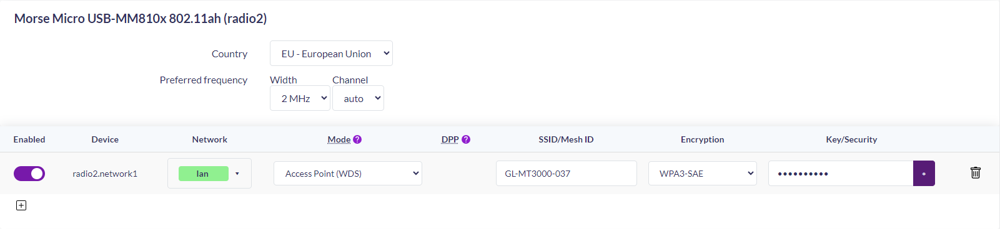
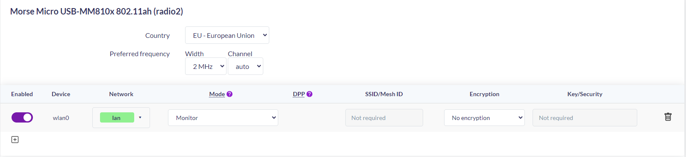
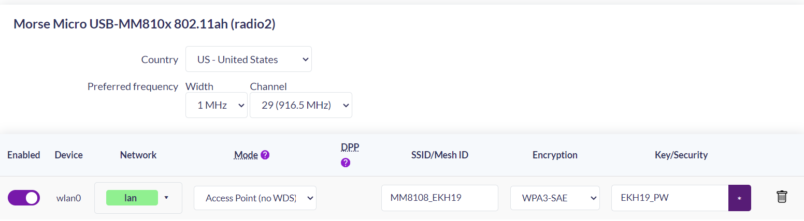

# Note journalière
Nathan Tschantz, printemps 2026.
## Février
### Vendredi 20.02
Lancement du travail de bachelor. Première recherche sur la faisabilité de l'utilisation du MM8108-EKH19. Une fonction contient bien les options recherchée: set le MCS et code correcteur LDPC.

Le MCS est settable via un fichier (chercher) sur dans module.L'activation de LDPC n'est pas exposé par le driver et aucun des utilitaires (iw, morse_cli, hostapd). Il faudrait donc modifier les appels de fonction qui set ces param directement dans le driver.

dans les source du driver:
- command.c
```c
int morse_cmd_set_fixed_transmission_rate(struct morse *mors, s32 bandwidth_mhz, s32 mcs_index,
					s8 use_sgi, s8 nss_idx)
{
	struct morse_cmd_req_set_transmission_rate req;

	morse_cmd_init(mors, &req.hdr, MORSE_CMD_ID_SET_TRANSMISSION_RATE, 0, sizeof(req));

	req.enabled = 1;
	req.bandwidth_mhz = cpu_to_le32(bandwidth_mhz);
	req.mcs_index = cpu_to_le32(mcs_index);
	req.nss_idx = nss_idx;
	req.use_sgi = use_sgi;
	req.tx_80211ah_format = cpu_to_le32(-1);
	req.use_traveling_pilots = -1;
	req.use_stbc = -1;	
	req.use_ldpc = 1;
	//req.use_ldpc = -1;
	//MORSE_INFO(mors, "MORSE_HACK: LDPC force a 1 et MCS a 2\n");
    pr_info("MORSE_HACK: LDPC force a 1 et MCS a 2\n");
	return morse_cmd_tx(mors, NULL, (struct morse_cmd_req *)&req, 0, 0, __func__);
}
```

- en haut de rc.c
```c
/* Enable/Disable the fixed rate (Disabled by default) */
static bool enable_fixed_rate __read_mostly = true;
module_param(enable_fixed_rate, bool, 0644);
MODULE_PARM_DESC(enable_fixed_rate, "Enable the fixed rate");

/* Set the fixed mcs (Takes effect when enable_fixed_rate is activated) */
//static int fixed_mcs __read_mostly = 4;
static int fixed_mcs __read_mostly = 2;
module_param(fixed_mcs, int, 0644);
MODULE_PARM_DESC(fixed_mcs, "Fixed MCS (only used when enable_fixed_rate is on)");
```

Setup de l'adresse IP de l'Ethernet comme expliquer dans MM6108_MM8108-Eval-Kit-User-Guide-2.8.pdf. Puisque l'adresse de l'ethernet de l'EKH19 est 192.168.8.1 (pour le Halow c'est 192.168.12.1). Donc on set notre adresse dans le même subnet, en l'occurence 192.168.8.10 masque 255.255.255.0 et donc la passerelle par défaut 192.168.8.1

7h30.
### Samedi - Mardi 21.02 - 24.02

Pour modifier le driver, cloner le repos github du fork de openWrt par Morse Micro. Il n'est pas possible de compiler uniquement le driver sans avoir le kernel openwrt. Donc suivre ce README.md pour setup et compiler le kernel https://github.com/MorseMicro/openwrt/. 

Une fois le kernel compiler les modif fait dans les fichier précédent doivent être faite dans. 

openwrt/build_dir/target-aarch64_cortex-a53_musl/linux-mediatek_filogic/morse_driver-1.16.4/...
- command.c idem précédent
- rc.c idem précédent
- usb.c ci-dessous
```c
static int morse_usb_probe(struct usb_interface *interface, const struct usb_device_id *id)
{
	int ret;
	struct morse *mors;
	struct morse_usb *musb;
	struct morse_chip_series *mors_chip_series = (struct morse_chip_series *)id->driver_info;
	const bool reset_hw = false;
	const bool reattach_hw = false;
	/* let the user know what node this device is now attached to */
	dev_info(&interface->dev,"#### MODIFIED DRIVER ####\n"); <---- ICI
	dev_info(&interface->dev,
		 "USB Morse device now attached to Morse driver (minor=%d)", interface->minor);¨
       
        ...
    	
        usb_autopm_get_interface(interface);
    #ifdef CONFIG_MORSE_ENABLE_TEST_MODES
    usb_test_fin:
    #endif
	    /***************************************************************************/
	    morse_cmd_set_fixed_transmission_rate(mors, 1, 2, 0, 0); <---- ICI
	    /***************************************************************************/
	    return 0;
    #ifdef CONFIG_MORSE_USER_ACCESS
    err_uaccess:
    
    ...

```
**ATTENTION: ces modifications sont temporaire !!! si on fait un make clean du kernel elles seront erase. a terme il faudrait donc ajouter un patch.**

Une fois ces modification faite, on peut recompiler UNIQUEMENT le driver.()les commande suivante sont éfféctuées dans morse-wifi/openwrt/
```bash
$> make package/morse_driver/compile V=s
```
Ensuite on récupère le .ko et on le copie dans le dossier temporaire sur le module wifi.
```bash
$> scp build_dir/target-aarch64_cortex-a53_musl/linux-mediatek_filogic/morse_driver-1.16.4/ipkg-aarch64_cortex-a53/kmod-morse/lib/modules/5.15.167/morse.ko root@192.168.8.1:/tmp/
```
**ATTENTION: ces modifications sont temporaire !!! au restart le .ko sera erase**


Sur l'EKH.
```bash
root@DUT-8108-EKH19-2_9_3:/tmp rmmod morse
# couper le wifi
root@DUT-8108-EKH19-2_9_3:/tmp wifi down
'radio2' is disabled
root@DUT-8108-EKH19-2_9_3:/tmp insmod morse.ko
# set une ...
root@DUT-8108-EKH19-2_9_3:/tmp ifconfig morse0 10.0.0.1 netmask 255.255.255.0 up
# relancer le wifi
root@DUT-8108-EKH19-2_9_3:/tmp wifi up
# pinger une adresse IP inexistante
root@DUT-8108-EKH19-2_9_3:/tmp ping -I morse0 -c 3 10.0.0.2
PING 10.0.0.2 (10.0.0.2): 56 data bytes

--- 10.0.0.2 ping statistics ---
3 packets transmitted, 0 packets received, 100% packet loss
root@DUT-8108-EKH19-2_9_3:/tmp dmesg | grep HACK
[  291.577635] MORSE_HACK: LDPC force a 1 et MCS a 2
```
Parfois ca ne marchait pas ^avait sembler résoudre le probléme.

mais apparement ca ca suffit
```bash
root@DUT-8108-EKH19-2_9_3:/tmp rmmod morse
root@DUT-8108-EKH19-2_9_3:/tmp insmod morse.ko
root@DUT-8108-EKH19-2_9_3:/tmp dmesg | grep HACK
[   56.327830] MORSE_HACK: LDPC force a 1 et MCS a 2
```

sais plus combien de temps ~10h
### Vendredi 27.02

- Clarifier la structure du projet: 
	- Encodeur vidéo: donné, a connecter a la jetson
	- jetson/OS : recupérer le stream vidéo et l'envoyer au module wifi 
	- module wifi (TX): choix a faire, si utilisable on garde l'EKH19 (sinon EKH05-01)
	- module wifi (RX): On utilisera l'EKH05-01 (avec RTOS) pour recupèrer et l'envoyer 
		au PC pour l'image
	- Display 		  : récuperer l'image et la streamer

A. IP based UDP Broadcast EKH19 (ou 05 selon capacité) + RX en monitor mode en utilisant libpicap

B. Raw broadcast + LDPC COMPLIQUÉ car fonction cacher dans le binaire.

C. utiliser les examples...

a faire: 
- installer et prendre en main le SDK mm-iot-SDK et l'ouvrir dans
STM32cubeIDE
- réaliser le cahier des charges
- faire l'introduction 
- checker si on peux desactiver l'encryption sur le ekh19 (et le mettre en monitor mode)

### Samedi 28.02
- fini la première version du cahier des charges.

**Setup de l'environnement de développement (MM IoT SDK & STM32CubeIDE sous Windows)**

Voici les étapes réalisées pour configurer la chaîne de cross compilation sous Windows avec STM32CubeIDE :

**1. Récupération du SDK (Git)**

* Fork du dépôt officiel `MorseMicro/mm-iot-sdk` sur GitHub.
* Clonage local dans `C:\Users\natha\OneDrive\Bureau\TB\mm-iot-sdk`.
* Téléchargement des dépendances vitales (FreeRTOS, lwIP, mbedTLS) via la commande :
`git submodule update --init --recursive`

**2. Importation dans STM32CubeIDE**

* Création du Workspace `C:\Users\natha\OneDrive\Bureau\TB\workspace_mm`.
* Le SDK n'utilisant pas la structure standard de STM32cubeIDE, l'importation a été faite via : **File > New > Makefile Project with Existing Code**.
* Sélection du dossier cible pour l'EKH05 : `\mm-iot-sdk\examples\ping\targets\mm-mm6108-ekh05`.
* Sélection de la toolchain : **ARM Cross GCC**.

**3. Configuration du compilateur sous Windows (Variables d'environnement)**

* Windows ne possédant pas nativement `make`, il a fallu lier les outils internes de STM32CubeIDE au projet.
* Dans `Properties > C/C++ Build > Environment`, ajout de deux chemins en tête de la variable `PATH` :
* Le chemin vers `make.exe` (situé dans `C:\ST\STM32CubeIDE_1.19.0\STM32CubeIDE\plugins\com.st.stm32cube.ide.mcu.externaltools.make.win32_2.2.0.202409170845\tools\bin`).
* Le chemin vers `arm-none-eabi-gcc.exe` (situé dans `C:\ST\STM32CubeIDE_1.19.0\STM32CubeIDE\plugins\com.st.stm32cube.ide.mcu.externaltools.gnu-tools-for-stm32.13.3.rel1.win32_1.0.0.202411081344\tools\bin`).

**4. Modification des Makefiles (Adaptation Linux -> Windows)**

* Le SDK force nativement l'utilisation d'une toolchain spécifique (10.3) située dans les répertoires Linux (`/opt/`).
* Modification du fichier `\mm-iot-sdk\framework\mkcore-arm-cortex-m33f.mk` pour empecher la recherche de ces dossiers et utiliser la `PATH` de Windows :
```mk
# Configure the toolchain
TOOLCHAIN_VERSION ?= 10.3-2021.07

# Try to find the toolchain if not already specified
==================== On commente ca ====================
#ifeq ($(TOOLCHAIN_DIR),)
#    directory_exists = $(shell [ -d $(1) ] && echo "exists")
#    TOOLCHAIN_DIR := /opt/morse/gcc-arm-none-eabi-$(TOOLCHAIN_VERSION)
#    ifeq ($(call directory_exists,$(TOOLCHAIN_DIR)),)
#        TOOLCHAIN_DIR := /opt/gcc-arm-none-eabi-$(TOOLCHAIN_VERSION)
#        ifeq ($(call directory_exists,$(TOOLCHAIN_DIR)),)
#            $(error Unable to find arm-none-eabi-$(TOOLCHAIN_VERSION) toolchain)
#        endif
#   endif
#else
#	TOOLCHAIN_DIR := $(TOOLCHAIN_DIR)
#endif
========================================================
# --- MODIFICATION POUR WINDOWS / STM32CubeIDE ---
# On ignore la recherche des dossiers Linux /opt/...
# et on laisse le PATH système de STM32CubeIDE trouver le compilateur.
TOOLCHAIN_DIR := 
TOOLCHAIN_BASE := arm-none-eabi-

======================= et ca ==========================
#TOOLCHAIN_BASE := $(TOOLCHAIN_DIR)/bin/arm-none-eabi-
========================================================

CC := "$(TOOLCHAIN_BASE)gcc"
CXX := "$(TOOLCHAIN_BASE)g++"
AS := $(CC) -x assembler-with-cpp
OBJCOPY := "$(TOOLCHAIN_BASE)objcopy"
```

La compilation fonctionne, le .elf est bien générer.
(les .elf ce trouve dans `C:\Users\natha\OneDrive\Bureau\TB\mm-iot-sdk\examples\ping\targets\mm-mm6108-ekh05`)

## Mars
### Dimanche 01.03

dans la gui `http://192.168.12.1/cgi-bin/luci/admin/config` il possible
de directement activer le monitor mode (qui desactive l'encryption par défaut) ou de rester en mode AP mais sans l'encryption.
Enfaite il faut bien se connecter sur 192.168.12.1 et non 192.168.8.1 (12 = HaLow, 8 = Ethernet) mais les image ci-dessous rest valide lan deviens ahwlan



Pour que le driver modifier soit lancer au démarage
```bash
root@DUT-8108-EKH19-2_9_3:/tmp cd /lib/modules/5.15.167/
# on sauvegarde le driver original
root@DUT-8108-EKH19-2_9_3:/tmp cp morse.ko morse.ko.bak
# et on remplace le driver
root@DUT-8108-EKH19-2_9_3:/tmp cp /tmp/morse.ko ./
```

dans command.c
```c
int morse_cmd_set_rate_control(struct morse *mors)
{
	struct morse_cmd_req_set_rate_control req;
	int ret;

	morse_cmd_init(mors, &req.hdr, MORSE_CMD_ID_SET_RATE_CONTROL, 0, sizeof(req));
	req.mcs10_mode = morse_mac_get_mcs10_mode();
	req.mcs_mask = cpu_to_le16(morse_mac_get_mcs_mask());
	req.enable_sgi_rc = mors->custom_configs.enable_sgi_rc;

	//return morse_cmd_tx(mors, NULL, (struct morse_cmd_req *)&req, 0, 0, __func__);

	// ================================================================
    ret = morse_cmd_tx(mors, NULL, (struct morse_cmd_req *)&req, 0, 0, __func__);

    if (ret == 0) {
        printk(KERN_INFO "MORSE_HACK: RateControl OK, forçage MCS2 + LDPC...\n");
        morse_cmd_set_fixed_transmission_rate(mors, 2, 2, 0, 0);
    }

    return ret;
	// ================================================================
}
```

pour focer le monitor mode en dure dans mac.c `|| 1` (il faudra chercher quelque chose de plus propre)
```c
static int morse_mac_ops_config(struct ieee80211_hw *hw, u32 changed)
{
	int err = 0;
	struct morse *mors = hw->priv;
	struct ieee80211_conf *conf = &hw->conf;
	bool channel_valid;
...
//=======================================================
	if (changed & IEEE80211_CONF_CHANGE_MONITOR || 1) {
		int ret = 0;
		struct morse_vif *mon_if = &mors->mon_if;

		MORSE_DBG(mors, "%s: change monitor mode: %s\n",
			  __func__, conf->flags & IEEE80211_CONF_MONITOR ? "true" : "false");
		if (conf->flags & IEEE80211_CONF_MONITOR || 1) {
			ret = morse_cmd_add_if(mors,
					       &mon_if->id, mors->macaddr, NL80211_IFTYPE_MONITOR);
			if (ret)
				MORSE_ERR(mors, "monitor interface add failed %d\n", ret);
			else
				MORSE_INFO(mors, "monitor interfaced added %d\n", mon_if->id);
			mors->monitor_mode = true;
		} else {
			if (mon_if->id != INVALID_VIF_ID) {
				morse_cmd_rm_if(mors, mon_if->id);
				MORSE_INFO(mors, "monitor interfaced removed\n");
			}
			mon_if->id = INVALID_VIF_ID;
			mors->monitor_mode = false;
		}
	}
//=======================================================

...
exit:
	mutex_unlock(&mors->lock);
	return err;
}
```
dans skbq.c tentative d'activation directment dans le préambule du packet
```c
int morse_skbq_skb_tx(struct morse_skbq *mq, struct sk_buff **skb_orig,
		      struct morse_skb_tx_info *tx_info, u8 channel)
{
	struct morse_buff_skb_header hdr;
	struct morse *mors;
	size_t end_of_skb_pad;
	struct sk_buff *skb = *skb_orig;
	int ret = 0;
	u8 *aligned_head;
	u8 *data;
...
	if (tx_info)
		memcpy(&hdr.tx_info, tx_info, sizeof(*tx_info));
	else
		memset(&hdr.tx_info, 0, sizeof(hdr.tx_info));


	// ==============================================================
	if (channel != MORSE_SKB_CHAN_MGMT && channel != MORSE_SKB_CHAN_COMMAND) {
        
        // On initialise le code de base (MCS 2, BW 2MHz)
        hdr.tx_info.rates[0].morse_ratecode = MORSE_RATECODE_INIT(1, 0, 2, MORSE_RATE_PREAMBLE_S1G_SHORT);

        // ACTIVATION MANUELLE LDPC (https://destevez.net/2025/01/decoding-ieee-802-11ah/)
        // On force le bit B17 (Coding) et B18 (LDPC Extra)
        // (1 << 17) | (1 << 18) = 0x60000
        hdr.tx_info.rates[0].morse_ratecode |= cpu_to_le32(0x60000);

        // Zéro retransmission
        hdr.tx_info.rates[0].count = 1;

        printk_ratelimited(KERN_INFO "MORSE_FPV: Hack SIG-1 (B17-B18) -> LDPC FORCE OK\n");
    }
    // ==============================================================

	skb_push(skb, data - aligned_head);
	morse_skb_header_put(&hdr, skb->data);
	...
	return ret
}
```
pour l'instant pas de preuve que LDPC est bien actif...

### Vendredi 06.03
- rechercher les parametre (MCS ldpc) dans le SDK.

Dans ping.c on peut utiliser la fonction `mmwlan_ate_override_rate_control` dans `#include "mmwlan.h"`

`\mm-iot-sdk\examples\ping\src\ping.c`
```c
    app_wlan_start();

    set_debug_state(DEBUG_STATE_CONNECTED);

	/******************************************************************/
	// ate = automated test equipement (fonction utiliser en interne pour tester des configs précise)
	enum mmwlan_status override_status = mmwlan_ate_override_rate_control(
	    MMWLAN_MCS_1,      // tx_rate_override
	    MMWLAN_BW_NONE,    // bandwidth_override
	    MMWLAN_GI_NONE     // gi_override
	);

	if (override_status == MMWLAN_SUCCESS) {
	    printf("SUCCES : Le MCS = 1\n");
	} else {
	    printf("ERREUR : Impossible de forcer le MCS (Code: %d)\n", override_status);
	}
	/******************************************************************/

    /* Delay to allow communications to settle so we measure only idle current */
    mmosal_task_sleep(150);

    set_debug_state(DEBUG_STATE_CONNECTED_IDLE);
```

`\mm-iot-sdk\framework\morselib\include\mmwlan.h`
```c
/**
 * Enable/disable override of rate control parameters.
 *
 * @param tx_rate_override      Overrides the transmit MCS rate. Set to @ref MMWLAN_MCS_NONE for no
 *                              override.
 * @param bandwidth_override    Overrides the TX bandwidth. Set to @ref MMWLAN_BW_NONE for no
 *                              override.
 * @param gi_override           Overrides the guard interval. Set to @ref MMWLAN_GI_NONE for no
 *                              override.
 *
 * @return @ref MMWLAN_SUCCESS on success, else an appropriate error code.
 */
enum mmwlan_status mmwlan_ate_override_rate_control(enum mmwlan_mcs tx_rate_override,
                                                    enum mmwlan_bw bandwidth_override,
                                                    enum mmwlan_gi gi_override);
```

pour ce qui est de LDPC normalement il devrait être activer par défaut par wpa_supplicant au vue du .h il faudra expérimenter.
pour l'instant c'est bon signe(`framework\src\hostap\wpa_supplicant\config_ssid.h:50`)
```c
#define DEFAULT_DISABLE_LDPC 0
```


- capture des paquets avec tcpdump. Il faut mettre l'interface en mode moniteur

Enregistrement du .pcap

C'est la commande `tcpdump -w` qui va générer le fichier.

```bash
sudo tcpdump -i wlan0 -s 0 -w capture_halow.pcap
```

**Explication de la commande :**

* `sudo` : Nécessaire car écouter le trafic réseau demande des droits administrateur.
* `-i wlan0` : Spécifie l'interface à écouter.
* `-s 0` : Indique à tcpdump de capturer le paquet dans son intégralité (*Snaplength = 0*), et pas seulement les premiers octets. C'est pour voir les données complètes.
* `-w capture_halow.pcap` : écrit tout dans le `.pcap`.

une fois la `capture_halow.pcap` on peut l'analyser avec wireshark

a faire:
établir la liste de délivrable pour cdc et schéma.
- les codes, la doc, les notes.

### Mercredi 18.03

#### Configuration du Débogage (STM32CubeIDE)

##### 1. Transformer le projet en "Projet ARM"

* Clic droit sur le projet > *Properties* > *C/C++ Build* > *Toolchain Editor*.
* Changer la "Current Toolchain" pour **MCU ARM GCC**.

##### 2. Créer la Configuration de Debug

* *Debug Configurations...*
* **Onglet Main :**
* **C/C++ Application :** Pointer vers le fichier binaire généré par la compilation (ex: `build/ping.elf`).
* **Onglet Debugger :**
* **Debug Probe :** Sélectionner `ST-LINK (ST-LINK GDB server)`.
* **Interface :** Choisir `SWD` (Serial Wire Debug).
* **ST-LINK S/N :** Cliquez sur *Scan* pour détecter l'ID unique de la carte EKH05.

La sonde USB (ST-LINK) ne peut parler qu'à **un seul programme à la fois**. (putty cubeide)

Pour ton journal de bord, le flashage du `config.hjson` est une étape de **provisionnement**. Contrairement au code C qui est l'intelligence de ton application, le Config Store est la "carte d'identité" et le "manuel de réglages" de ta puce Wi-Fi.

Voici le résumé technique de cette procédure :

#### 3. Flashage de la Configuration (Config Store)

Cette étape est indispensable car la puce Morse Micro ne peut pas démarrer sans son micro-code (BCF) et ses paramètres régionaux (Country Code).

##### Principe de fonctionnement

Le flashage repose sur une architecture client-serveur :

1. **Le Serveur (OpenOCD) :** Il crée un tunnel de communication entre le port USB et le processeur de la carte.
2. **Le Client (Script Python) :** Il lit le fichier `.hjson`, prépare les données binaires, et les envoie au serveur pour les mettres dans une zone spécifique de la mémoire Flash (`0x08004000`).

#### Procédure de flashage

À chaque fois qu'on modif le SSID, le mot de passe ou le pays dans `config.hjson`, on doit : 

##### Lancer le pont de communication (Terminal 1)

Utilisez la version propre d'OpenOCD (xPack) https://github.com/xpack-dev-tools/openocd-xpack/releases/ pour éviter les récursions infinies des scripts ST :

(dans mm-iot-sdk)
```powershell
C:\xpack-openocd-0.12.0-7\bin\openocd.exe -f framework/src/platforms/mm-mm6108-ekh05/openocd.cfg

```

*Laissez ce terminal ouvert. Il doit afficher `Listening on port 6666` ou 3333 etc.*

##### Injecter les données (Terminal 2)

Dossier `framework` et exécutez ce bloc qui prépare l'environnement et lance l'écriture :

```powershell
# Définition du chemin racine pour trouver le BCF
$env:MMIOT_ROOT = "C:\Users\natha\OneDrive\Bureau\TB\mm-iot-sdk\framework"

# Ajout de GDB au PATH pour que Python puisse l'utiliser
$gdbPath = (Get-ChildItem -Path C:\ST\STM32CubeIDE_1.19.0 -Filter "arm-none-eabi-gdb.exe" -Recurse -ErrorAction SilentlyContinue | Select-Object -First 1).DirectoryName
$env:PATH += ";$gdbPath"

# Commande d'écriture finale
python ./tools/platform/program-configstore.py -H localhost write-json ../examples/ping/config.hjson

```

1. **Erreur de Signature :** Le message `Invalid signature found` lors du premier flash est normal. Il indique que la mémoire était vierge avant l'écriture.

??? pas encore sur 

2. **Choix du BCF :** La carte utilise une puce **MM8108**. Il a fallu impérativement utiliser 
le fichier de calibration `bcf_mf08651_us.mbin` (et non le 6108 par défaut) pour éviter l'erreur `Transport init failed (Chip ID 0x0000)`.

3. **Variable d'environnement :** Sans l'outil `pipenv`, le script Python ne sait pas résoudre le symbole `$MMIOT_ROOT`. Il faut donc le déclarer manuellement dans PowerShell avant de lancer le script.

### Vendredi 20.03

**GIGANTESQUE** coup de chance. le SDK a été update durant la semaine du crunch pour ajouter le support a la carte mm8108-ekh05 se qui explique bcf_mf08651_us.mbin

Changer l'ip vers http://192.168.13.1/ pour laisser 192.168.12.1 au TX



modif principales:
(config.hjson)
```json
        /* The 2 letter country code to ensure the correct regulatory domain is used */
        "wlan.country_code": "US"

        /* If true use DHCP, else the static IP configuration will be used */
        "ip.dhcp_enabled": "false"

        /* These settings are ignored if DHCP is used, but mandatory if using static IP */
		"ip.address": "192.168.12.50",
		"ip.netmask": "255.255.255.0",
		"ip.gateway": "192.168.12.1"

		...
        // "wlan.duty_cycle_mode": "bur
		
        "ping.target": "192.168.12.1"
        "ping.count": "1000"
        "ping.interval": "50"
        "ping.size": "1450"

```
mm_app_loadconfig.c
```c
#ifndef STATIC_LOCAL_IP
/** Statically configured IP address (if ENABLE_DHCP is not set). */
#define STATIC_LOCAL_IP "192.168.12.2"
#endif

```


**1: Déblocage matériel**
Le problème initial : Le firmware STM32 plantait au démarrage (Transport init failed 0x0000). La communication SPI entre le MCU et la puce Wi-Fi ne se faisait pas.

Le code C était compilé pour l'ancienne plateforme mm6108 car la target mm-mm8108-ekh05 n'éxistait pas encore dans le sdk.

Par chance le SDK Morse Micro a été mis a jour durant la semaine du Crunch. Donc un pull a permis de récuperer la configuration mm-mm8108-ekh05.

Configuration du BCF : Ajustement du fichier config.hjson pour cibler le fichier de calibration matériel exact de la puce (bcf_mf15457.mbin), paramétré sur la région US pour autoriser le canal de test.

**2 : Configuration de l'infrastructure réseau (EKH19)**
Mise en place de la carte EKH19 (intégrée au routeur GL.iNet MT3000) comme Point d'Accès (AP) via l'interface OpenWrt (LuCI).

Configuration de l'interface ahwlan avec un canal large bande de 1 MHz (Canal 27 / 915.5 MHz) optimisé pour les tests longue portée et bas débit (MCS 1).

**3 : Le routage**
Le "Fallback" de l'IP : L'EKH05 refusait de prendre l'IP statique définie dans le JSON et retombait sur son IP de sécurité (192.168.1.2).

Contournement : Modification directe dans le code C (mm_app_loadconfig.c) pour forcer l'IP source à 192.168.12.2 et s'aligner sur le sous-réseau du routeur.

silence des Pings  : La liaison radio était établie (STA connected), mais les Pings subissaient 100% de pertes.

Diagnostic avec tcpdump : L'analyse des trames a prouvé que l'EKH05 envoyait bien des requêtes ARP, prouvant que la radio fonctionnait. Cependant, le routeur ne répondait pas.

La résolution du conflit IP : Découverte dans OpenWrt que l'interface Ethernet (lan) et l'interface Wi-Fi (ahwlan) possédaient toutes les deux exactement la même adresse IP (192.168.12.1). Le routeur bloquait le trafic par sécurité. Le changement de l'IP LAN (192.168.13.1)a débloqué le routage.

**4 : Validation et Constats réglementaires**
Succès du MCS : Preuve validée que l'API Morse Micro a bien forcé le module radio à transmettre en MCS 1, observable via la latence de base (~27 ms pour des paquets de 1450 octets).

Le bridage Européen (ETSI) : Constat majeur : l'utilisation du domaine réglementaire EU (868 MHz) fait exploser la latence à ~670 ms à cause des obligations légales de partage des ondes (Listen Before Talk et restriction du Duty Cycle).

Pour ce travail : Passage sur le domaine US (916.5 MHz) pour désactiver les bridages logiciels, permettant ainsi de mesurer les véritables performances brutes du changement de MCS sans interférence légale.

*NORMALEMENT* cette fréquence n'est PAS utilisées officiellement... https://www.bakom.admin.ch/en/harmonised-frequency-ranges (entre 915 et 921 cela devrait aller)


Après les test avec les pings ont passe au packet UDP et au monitor mode.

### Samedi 21.03 - Dimanche 22.03
#### 1. Les 5 modifications architecturales dans `udp_broadcast.c`


* **Le ciblage de l'IP de Broadcast (Le "No-ACK") :**
    * *Code :* `IP4_ADDR(ip_2_ip4(&dest_ip), 192, 168, 12, 255);`
    * *Pourquoi :* En ciblant l'adresse de diffusion locale (`.255`), la couche réseau LwIP force l'en-tête MAC Wi-Fi à utiliser l'adresse de destination `FF:FF:FF:FF:FF:FF`. Selon la norme 802.11, les trames envoyées à cette adresse ne déclenchent aucun acquittement (ACK) de la part du récepteur. Cela supprime les renvois de paquets et garantit une latence réseau nulle.
* **L'augmentation de la taille du Payload (Le MTU) :**
    * *Code :* `pbuf_alloc(PBUF_TRANSPORT, 1400, PBUF_RAM);`
    *Avec 1400 octets, nous nous approchons de la limite maximale d'une trame Ethernet standard. Cela diminue la taille des en-têtes (MAC + IP + UDP) par rapport aux données utiles, et diminuant l'overhead.
* **Le mode d'envoie :**
    * *Code :* Une boucle `for (int i = 0; i < 10; i++)` imbriquée dans la boucle principale.
    * *Pourquoi :* Le système d'exploitation FreeRTOS de la carte gère le temps par "Ticks". Utiliser `mmosal_task_sleep(10)` entre chaque paquet briderait le processeur. En générant 10 paquets d'un coup (14 000 octets) avant de rendre la main au système (`mmosal_task_sleep(1)`), on sature intentionnellement la file d'attente TX de la couche MAC pour qu'elle émette (presque) en continu.
* **Le forçage de la modulation (compromis Portée/Débit) comme précédement:**
    * *Code :* `mmwlan_ate_override_rate_control(MMWLAN_MCS_2, MMWLAN_BW_2MHZ, MMWLAN_GI_NONE);`
    * *Pourquoi :* Nous désactivons l'algorithme d'adaptation de débit (Rate Control) du SDK. Nous forçons le **MCS 2** sur **2 MHz** pour garantir une modulation robuste (QPSK) capable de traverser les murs. (tout ceci sur le channel 30 donc 917MHz) j'ai décaler la fréquence car la band width est passé à deux.
* **La synchronisation LwIP:**
    * *Code :* L'ajout de `while (!is_network_ready)` lié au `link_status_callback`.
    * *Pourquoi :* Empêche l'application de crasher (Hard Fault) en essayant de transmettre avant que la pile réseau LwIP n'ait reçu son adresse IP statique et validé l'association Wi-Fi 802.11 avec le routeur.


**Après mesure je recois environ 120 packet de 1400 octets par secondes en moyenne soit une vitesse de 1.344 Mbps** 

#### Caclue du Débit Brut en 24 bits couleur nécessaire pour de la vidéo

L'équation du débit brut (non compressé) est la suivante :

$$D_{brut} = W \times H \times F \times B_{pp}$$

Où :
* $W$ : Largeur en pixels
* $H$ : Hauteur en pixels
* $F$ : Fréquence d'images (24 fps)
* $B_{pp}$ : Profondeur de couleur (24 bits/pixel)

**Pour la 720p (1280x720) :**
$$D_{brut\_720p} = 1280 \times 720 \times 24 \times 24 = 530841600 \text{ bps}$$
Soit **~530.8 Mbps**.

**Pour la 480p (854x480) :**
$$D_{brut\_480p} = 854 \times 480 \times 24 \times 24 = 236113920 \text{ bps}$$
Soit **~236.1 Mbps**.

#### 2. Le Débit Compressé (H.264)

La norme de compression vidéo H.264 (AVC) est le standard pour le streaming temps réel. Un encodeur H.264 configuré pour du streaming peut atteindre un **ratio de compression de 1:200** (il écrase la taille des données par 200).(par contre le clarté et netteté ne sera peut être pas éxcellente)

L'équation du débit compressé devient :

$$D_{cible} = \frac{D_{brut}}{C_{ratio}}$$

Où $C_{ratio}$ est le facteur de compression (200).

**Pour la 720p compressée :**
$$D_{cible\_720p} = \frac{530.8 \text{ Mbps}}{200} \approx 2.65 \text{ Mbps}$$

**Pour la 480p compressée :**
$$D_{cible\_480p} = \frac{236.1 \text{ Mbps}}{200} \approx 1.19 \text{ Mbps}$$

#### 3. Le Bilan

pour MCS 2 / 2 MHz.

* **Le scénario 720p (2.12 Mbps) :** Le flux vidéo exigera **~60% de débit en plus** que ce que la carte radio peut fournir.
* **Le scénario 480p (0.94 Mbps) :** Le flux vidéo consommera environ **70% de la capacité réseau**. Les 30% restants (**~400 kbps**) nous donne une bonne marge (on pourrait même réduire la compréssion ou de pallier a des interférences et des ralentissment).

Ces équations prouvent mathématiquement que la 480p à 24 fps est le réalisable pour la liaison radio Sub-1GHz optimisée pour la portée.


### Mardi 24.03

correction d'erreurs dans le cahier des charges et mise a jour des notes journalières et du journal de travail.

pip des packets UDP du routeur au PC en lancant ce script
```py
import socket

TCP_IP = "0.0.0.0"
TCP_PORT = 9999

# On crée un serveur TCP (SOCK_STREAM)
sock = socket.socket(socket.AF_INET, socket.SOCK_STREAM)
sock.bind((TCP_IP, TCP_PORT))
sock.listen(1)

print(f"En attente de la connexion du routeur sur le port TCP {TCP_PORT}...")
conn, addr = sock.accept()
print(f"Routeur connecté depuis {addr} ! Enregistrement en cours...")

packets_received = 0

with open("analyse_pkt_udp.pcap", "wb") as f:
    try:
        while True:
            data = conn.recv(4096)
            if not data:
                break
            
            f.write(data)
            f.flush()
            
            packets_received += 1
            if packets_received % 50 == 0:
                print(f"   -> {packets_received} blocs de données enregistrés...")
                
    except KeyboardInterrupt:
        print("\nFin de la capture")

print(f"Fichier 'analyse_pkt_udp.pcap' sauvegardé")
conn.close()
sock.close()
```
et cette commande dans openwrt
```bash
tcpdump -i wlan0 -U -s 0 -w - "udp port 1337" | nc 192.168.12.10 9999
```
en suite le .pcap peut être ouvert avec wireshark

**TL;DR : Toutes les manips des quelques derniers jours ont été faites avec le routeur en mode AP mais ouvert (sans encryption ni mot de passe). Les envois UDP nécessitent une connexion préalable, puis une fois connecté, les paquets sont envoyés à l'adresse de broadcast du réseau (soit 192.168.12.255), ce qui permet au point d'accès (AP) de ne pas répondre avec des ACK le tout avec un MCS de 2 une BW de 2MHz et sur le channel US 30 (917MHz)**
### Jeudi 26.03 
tentative de setup de l'USB

### Vendredi 27.03 
L'USB est reconnu mais se fait déco, probablement un problème de stabilité.
on oubli l'USB et on par sur du SPI.
Setup de la jetson nano 2G dev kit (https://developer.nvidia.com/embedded/learn/get-started-jetson-nano-2gb-devkit#setup).
faire un réseau partager depuis le telephone puis ssh jetsontb@10.120.243.168 ensuite installer pip3 puis spidev. ensuite setup l'interface SPI avec sudo /opt/nvidia/jetson-io/jetson-io.py et sélection de SPI1 (set pin manually) puis 
reboot.
test d'envoie
```py
import spidev
import time

# Initialisation du bus SPI (Bus 0, Chip Select 0 -> /dev/spidev0.0)
spi = spidev.SpiDev()
spi.open(0, 0)

# Configuration : 2 MHz pour le test, Mode 0 (standard)
spi.max_speed_hz = 2000000
spi.mode = 0

print("--- Transmission SPI demarree ---")
print("Appuyez sur Ctrl+C pour arreter.")

try:
    while True:
        # On cree un faux paquet video de 32 octets pour le test
        # Le paquet commence par 0xDE, 0xAD, 0xBE, 0xEF pour qu on le reconnaisse facilement
        dummy_payload = [0xDE, 0xAD, 0xBE, 0xEF] + [i % 256 for i in range(28)]

        # Envoi des donnees sur la broche MOSI
        spi.xfer2(dummy_payload)

        print("Paquet envoye")
        time.sleep(1) # On envoie 1 paquet par seconde pour le test

except KeyboardInterrupt:
    spi.close()
    print("\nArret du test SPI.")
```

mettre le nouveau script

expliquer comment trouver les pin avec le multimetre
spi fonctionnel mais plus faible débit que réaliser précédement
activer spi dans core inc ou un truc du genre

### Samedi 28.03 

transmission d'un flux vidéo 720p, encodage en H.265, puis bus SPI vers un microcontrôleur, qui le diffuse en Broadcast. OpenWrt réceptionne les packet et la ponte directement vers le PC le décodage.

**Caméra CSI** ➡️ **Jetson (H.265)** ➡️ *(SPI @ 5MHz)* ➡️ **STM32** ➡️ *(Wi-Fi HaLow UDP Broadcast)* ➡️ **Routeur OpenWrt (Bridge)** ➡️ *(Ethernet)* ➡️ **PC Windows (Direct3D11)**

#### 2. Topologie Réseau (Subnet `192.168.12.x`) RESUMe Générale

Pour éviter les conflits de routage sur l'OS récepteur, le réseau FPV est strictement isolé, sans accès Internet croisé.

| Équipement | Rôle | Adresse IP | Note de configuration réseau |
| :--- | :--- | :--- | :--- |
| **PC Windows** | Afficheur (GStreamer) | `192.168.12.10` | **Passerelle par défaut : VIDE.** Masque : `255.255.255.0` |
| **OpenWrt** | Routeur / Pont radio | `192.168.12.1` | Pont logiciel (Bridge) obligatoire entre `wlan0` et l'Ethernet |
| **STM32** | Émetteur Radio | `192.168.12.2` | Émet vers l'IP Broadcast `192.168.12.255` |


#### 3. Configuration générale
##### A. La Ground Station (PC Windows)
* **Pipeline GStreamer :** Utilisation de l'accélération matérielle Direct3D11(de du proc graphique) pour améliorer la durée décodage. Désactivation de la synchronisation logicielle pour un affichage immédiat.
* **Commande d'écoute :**
  ```bash
  ./gst-launch-1.0 udpsrc port=1337 buffer-size=0 ! h265parse config-interval=-1 ! d3d11h265dec ! d3d11videosink sync=false async=false
  ```

##### B. Le Relais Radio (Routeur OpenWrt)
* Par défaut, OpenWrt isole le WLAN et le LAN. Il faut forcer le bridge matériel pour que le flux Broadcast traverse le routeur directement, sans traitement CPU (pas de TCPDump, ni Netcat (ca a fait gagner 10 a 20 ms de traitement)).
* **Commande de pontage (Bridge) :**
  ```bash
  brctl addif br-ahwlan wlan0
  # car
  
  root@MM8108_EKH19:~> brctl show
  bridge name     bridge id               STP enabled     interfaces
  br-ahwlan               7fff.9483c470d038       no              eth1
  root@MM8108_EKH19:~> brctl addif br-ahwlan wlan0
  root@MM8108_EKH19:~> brctl show
  bridge name     bridge id               STP enabled     interfaces
  br-ahwlan               7fff.9483c470d038       no              wlan0
                                                        eth1
  ```

##### C. L'Émetteur Radio (STM32)
* Envoi en UDP Broadcast pour éviter les attentes d'accusés de réception (ACK) du protocole Wi-Fi standard.
* **Configuration C (LwIP) :** L'IP de destination (`dest_ip`) doit être configurée sur l'adresse de diffusion locale.
  ```c
  IP4_ADDR(ip_2_ip4(&dest_ip), 192, 168, 12, 255);
  ```

##### D. L'encodeur Vidéo (Nvidia Jetson)
* **Contrainte logicielle :** Passage du script Python initial à un programme en C pour supprimer les allocations mémoire dynamiques et utiliser des horloges système précises (`usleep`).
* **Contrôle de Flux (Flow Control) :** Injection d'un délai fixe de **1 milliseconde** entre chaque bloc SPI de 1400 octets pour éviter de noyer la RAM du STM32 (Buffer Overrun).
* **Pipeline GStreamer (intégré au code C) :** Mode UltraFast, CBR 1 Mbps, Zéro-Buffer OS (`setvbuf`).
  ```bash
  gst-launch-1.0 -q nvarguscamerasrc ! 'video/x-raw(memory:NVMM),width=1280,height=720,format=NV12,framerate=30/1' ! nvv4l2h265enc bitrate=1000000 control-rate=1 insert-sps-pps=true idrinterval=15 maxperf-enable=1 preset-level=1 ! h265parse ! video/x-h265,stream-format=byte-stream ! fdsink fd=1 sync=false
  ```

#### 4. Performances Actuelles (Baseline v1.0)

* **Résolution :** 1280x720 (720p)
* **Framerate :** 30 FPS
* **Bitrate Vidéo :** 1 Mbps (Constant Bit Rate)
* **Taille des trames SPI :** 1400 octets (MTU compatible)
* **Latence "Glass-to-Glass" moyenne :** ~170 à 200 ms (Mesurée via chronomètre à l'écran).
* **Stabilité :** Fluide, mais pas idéale a cause de à la méthode d'attente logicielle (`usleep`). (Idéalement il faudrait que le MCU nous annonce quand il a de la mémoire à dispo pour que l'attente soit opti)


envoie de la vidéo en python
```bash
sudo apt-get install python3-opencv
```
```py
import spidev
import time
import subprocess
import sys

# Config SPI
spi = spidev.SpiDev()
spi.open(0, 0)
spi.max_speed_hz = 5000000 # 5 MHz
spi.mode = 0

CHUNK_SIZE = 1400

# GStreamer H.265
gst_cmd = [
    "gst-launch-1.0", "-q",
    "nvarguscamerasrc", "!",
    "video/x-raw(memory:NVMM),width=1280,height=720,format=NV12,framerate=30/1", "!",
    "nvv4l2h265enc", "bitrate=1000000", "control-rate=1", "insert-sps-pps=true", "idrinterval=15", "maxperf-enable=1", "preset-level=1", "!",
    "h265parse", "!",
    "video/x-h265,stream-format=byte-stream", "!",
    "fdsink", "fd=1", "sync=false", "async=false"
]

print(">>> Démarrage du flux Caméra H265 vers SPI...")

# lancement GStreamer
p = subprocess.Popen(gst_cmd, stdout=subprocess.PIPE, bufsize=CHUNK_SIZE)

try:
    while True:
        # 1400 octets de vidéo
        chunk = p.stdout.read(CHUNK_SIZE)
        
        if not chunk:
            print("Fin du flux vidéo ou erreur de la caméra.")
            break
        
        if len(chunk) < CHUNK_SIZE:
            chunk = chunk + b'\x00' * (CHUNK_SIZE - len(chunk))
            
        # On balance sur le SPI
        spi.writebytes2(chunk)
        time.sleep(0.001)
except KeyboardInterrupt:
    print("\nArrêt")
finally:
    p.terminate()
    spi.close()
    print("Fermeture terminée.")

```
envoie de la vidéo en c
```c
#include <stdio.h>
#include <stdlib.h>
#include <stdint.h>
#include <string.h>
#include <unistd.h>
#include <fcntl.h>
#include <sys/ioctl.h>
#include <linux/spi/spidev.h>

#define CHUNK_SIZE 1400
#define SPI_DEVICE "/dev/spidev0.0"

int main() {
    int spi_fd;
    uint32_t mode = 0;
    uint32_t speed = 5000000; // 5 MHz
    uint8_t bits = 8;

    printf(">>> Initialisation du SPI en C...\n");

    //  port SPI
    spi_fd = open(SPI_DEVICE, O_RDWR);
    if (spi_fd < 0) {
        perror("Erreur: Impossible d'ouvrir le SPI");
        return 1;
    }

    // config SPI
    ioctl(spi_fd, SPI_IOC_WR_MODE, &mode);
    ioctl(spi_fd, SPI_IOC_WR_BITS_PER_WORD, &bits);
    ioctl(spi_fd, SPI_IOC_WR_MAX_SPEED_HZ, &speed);

    // config GStreamer (exactement la même que Python)
    const char *gst_cmd = "gst-launch-1.0 -q nvarguscamerasrc ! "
                          "'video/x-raw(memory:NVMM),width=1280,height=720,format=NV12,framerate=40/1' ! "
                          "nvv4l2h265enc bitrate=1200000 control-rate=1 insert-sps-pps=true idrinterval=15 maxperf-enable=1 preset-level=1 ! "
                          "h265parse ! video/x-h265,stream-format=byte-stream ! fdsink fd=1 sync=false";

    printf(">>> Démarrage de GStreamer...\n");

    // popen lance la commande et nous permet de lire la sortie standard (stdout)
    FILE *pipe = popen(gst_cmd, "r");
    if (!pipe) {
        perror("Erreur: Impossible de lancer GStreamer");
        close(spi_fd);
        return 1;
    }
    setvbuf(pipe, NULL, _IONBF, 0);
    // transfert SPI
    uint8_t buffer[CHUNK_SIZE];
    struct spi_ioc_transfer tr = {
        .tx_buf = (unsigned long)buffer,
        .rx_buf = 0,
        .len = CHUNK_SIZE,
        .speed_hz = speed,
        .bits_per_word = bits,
    };

    printf(">>> Flux vidéo actif --> Envoi en cours...\n");

    while (1) {
        // 1400 octets GStreamer -> buffer SPI
        size_t bytes_read = fread(buffer, 1, CHUNK_SIZE, pipe);

        if (bytes_read == 0) {
            printf("Fin du flux vidéo.\n");
            break;
        }

        if (bytes_read < CHUNK_SIZE) {
            memset(buffer + bytes_read, 0, CHUNK_SIZE - bytes_read);
        }

        // transfert SPI
        if (ioctl(spi_fd, SPI_IOC_MESSAGE(1), &tr) < 1) {
            perror("Erreur: Échec du transfert SPI");
            break;
        }

        usleep(1000);
    }

    pclose(pipe);
    close(spi_fd);
    printf("Fermeture terminée.\n");

    return 0;
}
```

### Dimanche 29.03
Test de range avec ce setup 
jetson (720p 24fps consigne de 400kbps)
```c
#include <stdio.h>
#include <stdlib.h>
#include <stdint.h>
#include <string.h>
#include <unistd.h>
#include <fcntl.h>
#include <sys/ioctl.h>
#include <linux/spi/spidev.h>

#define CHUNK_SIZE 1400
#define SPI_DEVICE "/dev/spidev0.0"
#define GPIO_VALUE_PATH "/sys/class/gpio/gpio78/value"
#define GPIO_EXPORT_PATH "/sys/class/gpio/export"
#define GPIO_DIR_PATH "/sys/class/gpio/gpio78/direction"

// Fonction pour initialiser le GPIO 78 proprement
void setup_gpio() {
    int fd;

    // Exporter le GPIO 78 (si pas déjà fait)
    fd = open(GPIO_EXPORT_PATH, O_WRONLY);
    if (fd >= 0) {
        write(fd, "78", 2);
        close(fd);
    }

    usleep(100000); // Laisse 100ms à Linux pour créer les fichiers

    // Définir la direction en "in" (Entrée)
    fd = open(GPIO_DIR_PATH, O_WRONLY);
    if (fd >= 0) {
        write(fd, "in", 2);
        close(fd);
    }
}

int main() {
    int spi_fd, gpio_fd;
    uint32_t mode = 0;
    uint32_t speed = 5000000; // 5 MHz
    uint8_t bits = 8;

    printf(">>> Initialisation du GPIO 78...\n");
    setup_gpio();

    // On ouvre le fichier GPIO une seule fois pour une lecture ultra-rapide
    gpio_fd = open(GPIO_VALUE_PATH, O_RDONLY);
    if (gpio_fd < 0) {
        perror("Erreur: Impossible d'ouvrir le GPIO 78");
        return 1;
    }

    printf(">>> Initialisation du SPI en C...\n");
    spi_fd = open(SPI_DEVICE, O_RDWR);
    if (spi_fd < 0) {
        perror("Erreur: Impossible d'ouvrir le SPI");
        return 1;
    }

    ioctl(spi_fd, SPI_IOC_WR_MODE, &mode);
    ioctl(spi_fd, SPI_IOC_WR_BITS_PER_WORD, &bits);
    ioctl(spi_fd, SPI_IOC_WR_MAX_SPEED_HZ, &speed);
    //const char *gst_cmd = "gst-launch-1.0 -q nvarguscamerasrc "
    //                  "aelock=true awblock=true ! "
    //                  "'video/x-raw(memory:NVMM),width=1280,height=720,format=NV12,framerate=30/1' ! "
      //                "nvv4l2h265enc bitrate=1000000 control-rate=1 insert-sps-pps=true "
        //              "idrinterval=30 maxperf-enable=1 preset-level=1 ! "
          //            "video/x-h265,stream-format=byte-stream ! fdsink fd=1 sync=false";
    const char *gst_cmd = "gst-launch-1.0 -q nvarguscamerasrc "
                          "aelock=true awblock=true ! "
                          "'video/x-raw(memory:NVMM),width=720,height=480,format=NV12,framerate=24/1' ! "
                          "nvv4l2h265enc bitrate=400000 control-rate=1 insert-sps-pps=true idrinterval=1000 maxperf-enable=1 preset-level=1 ! "
                          "video/x-h265,stream-format=byte-stream ! fdsink fd=1 sync=false";
    //const char *gst_cmd = "gst-launch-1.0 -q nvarguscamerasrc ! "
    //                      "'video/x-raw(memory:NVMM),width=1280,height=720,format=NV12,framerate=30/1' ! "
    //                      "nvv4l2h265enc bitrate=1000000 control-rate=1 insert-sps-pps=true idrinterval=120 maxperf-enable=1 preset-level=1 ! "
    //                      "h265parse ! video/x-h265,stream-format=byte-stream ! fdsink fd=1 sync=false";
    //const char *gst_cmd = "gst-launch-1.0 -q nvarguscamerasrc ! "
    //                      "'video/x-raw(memory:NVMM),width=640,height=360,format=NV12,framerate=30/1' ! "
    //                      "nvv4l2h265enc bitrate=200000 control-rate=1 insert-sps-pps=true idrinterval=30 maxperf-enable=1 preset-level=1 ! "
    //                      "video/x-h265,stream-format=byte-stream ! fdsink fd=1 sync=false";
    printf(">>> Démarrage de GStreamer...\n");
    FILE *pipe = popen(gst_cmd, "r");
    if (!pipe) return 1;

    // TUE LE CACHE LOGICIEL : Flux tendu absolu
    setvbuf(pipe, NULL, _IONBF, 0);

    uint8_t buffer[CHUNK_SIZE];
    struct spi_ioc_transfer tr = {
        .tx_buf = (unsigned long)buffer,
        .rx_buf = 0,
        .len = CHUNK_SIZE,
        .speed_hz = speed,
        .bits_per_word = bits,
    };

    printf(">>> Flux vidéo actif ! Attente du signal STM32...\n");

    char gpio_val;

    while (1) {
        size_t bytes_read = fread(buffer, 1, CHUNK_SIZE, pipe);
        if (bytes_read == 0) break;
        if (bytes_read < CHUNK_SIZE) {
            memset(buffer + bytes_read, 0, CHUNK_SIZE - bytes_read);
        }
        int stuck_counter = 0;
        do {
            lseek(gpio_fd, 0, SEEK_SET);
            if (read(gpio_fd, &gpio_val, 1) != 1) {
                // Sécurité si Linux refuse de lire
                gpio_val = '0';
            }

            if (gpio_val == '0') {
                stuck_counter++;
                // Affiche un message d'alerte sans spammer le terminal
                if (stuck_counter % 500000 == 0) {
                    printf("ATTENTION: La Jetson est bloquée, le STM32 dit STOP (LOW)\n");
                }
            }
        } while (gpio_val == '0');

        // Feu vert ! On envoie sur le SPI instantanément
        if (ioctl(spi_fd, SPI_IOC_MESSAGE(1), &tr) < 1) {
            perror("Erreur SPI");
            break;
        }
    }

    pclose(pipe);
    close(spi_fd);
    close(gpio_fd);
    return 0;
}
```
Sur le STM
```c

#include <string.h>
#include <endian.h>
#include "mmosal.h"
#include "mmwlan.h"
#include "mmconfig.h"

#include "mmipal.h"
#include "lwip/icmp.h"
#include "lwip/tcpip.h"
#include "lwip/udp.h"
#include "lwip/netif.h"


#include "mm_app_common.h"
#include "stm32u5xx_hal.h"

// --- SPI ---
#define SPI_PAYLOAD_SIZE 1400

SPI_HandleTypeDef hspi1;
uint8_t spi_rx_buffer[SPI_PAYLOAD_SIZE];
volatile bool spi_packet_received = false;
// ---------------------
/* Application default configurations. */

/** Number of broadcast packet to transmit */
#define DEFAULT_BROADCAST_PACKET_COUNT 100
/** UDP port to bind too. */
#define DEFAULT_UDP_PORT 1337
/** Interval between successive packet transmission. */
#define DEFAULT_PACKET_INTERVAL_MS 100
/** Maximum length of broadcast tx packet payload */
#define BROADCAST_PACKET_MAX_TX_PAYLOAD_LEN 35
/** Format string to use for the tx packet payload */
#define BROADCAST_PACKET_TX_PAYLOAD_FMT "G'day World, packet no. %lu."
/** Default mode for the application */
#define DEFAULT_UDP_BROADCAST_MODE TX_MODE
/** Default ID used in the rx metadata. */
#define DEFAULT_UDP_BROADCAST_ID 0

/** Key used to identify received broadcast packets. */
#define MMBC_KEY 0x43424d4d

/** Enumeration of the various broadcast modes that can be used. */
enum udp_broadcast_mode
{
    /** Transmit mode. Application will transmit a set amount of broadcast packets. */
    TX_MODE,
    /** Receive mode. Application will listen for any broadcast packets and process any that start
     * with @ref MMBC_KEY */
    RX_MODE
};

/** UDP broadcast rx payload format. */
PACK_STRUCT_STRUCT struct udp_broadcast_rx_payload
{
    /** Key used to identify payload.*/
    uint32_t key;

    /** Flexible array member used to access color data for each ID. */
    struct
    {
        /** Red intensity. */
        uint8_t red;
        /** Green intensity. */
        uint8_t green;
        /** Blue intensity. */
        uint8_t blue;
    } data[];
};

/** Struct used in rx mode for storing state. */
struct udp_broadcast_rx_metadata
{
    /** The last time in milliseconds that a valid payload was received. */
    uint32_t last_rx_time_ms;
    /** ID of the device, used to retrieve data from the payload. */
    uint32_t id;
};

/** Global data structure used in RX mode to record metadata. */
static struct udp_broadcast_rx_metadata rx_metadata = { 0 };


static volatile bool is_network_ready = false;

/* Callback pour savoir quand la connexion est prete*/
static void link_status_callback(const struct mmipal_link_status *link_status)
{
    if (link_status->link_state == MMIPAL_LINK_UP) {
        printf("\n>>> CONNECTE A OPENWRT <<<\n");
        is_network_ready = true;
    }
}

/**
 * Callback function to handle received data from the UDP pcb.
 *
 * @warning Be aware that @c addr might point into the pbuf @c p so freeing this pbuf can make
 *          @c addr invalid, too.
 *
 * @param arg   User supplied argument used to store a reference to the global rx_metadata struct.
 * @param pcb   The udp_pcb which received data
 * @param p     The packet buffer that was received
 * @param addr  The remote IP address from which the packet was received
 * @param port  The remote port from which the packet was received
 */
static void udp_raw_recv(void *arg,
                         struct udp_pcb *pcb,
                         struct pbuf *p,
                         const ip_addr_t *addr,
                         u16_t port)
{
    LWIP_UNUSED_ARG(pcb);
    LWIP_UNUSED_ARG(addr);
    LWIP_UNUSED_ARG(port);

    if (p == NULL)
    {
        return;
    }

    struct udp_broadcast_rx_metadata *metadata = (struct udp_broadcast_rx_metadata *)arg;
    struct udp_broadcast_rx_payload *payload = (struct udp_broadcast_rx_payload *)p->payload;
    uint32_t current_time_ms = mmosal_get_time_ms();

    /* This is the minimum length we need to prevent reading off the end of the payload. */
    uint32_t min_payload_len =
        sizeof(payload->key) + (sizeof(payload->data[0]) * (metadata->id + 1));

    if (p->len < min_payload_len)
    {
        printf("Payload length to short. Len: %u. Min len: %lu\n", p->len, min_payload_len);
        goto exit;
    }

    if (le32toh(payload->key) != MMBC_KEY)
    {
        printf("Invalid payload received.\n");
        goto exit;
    }

    printf("Valid payload received. \n"
           "    Time since last: %lums\n"
           "    Data recieved: 0x%02x%02x%02x\n\n",
           (current_time_ms - metadata->last_rx_time_ms),
           payload->data[metadata->id].red,
           payload->data[metadata->id].green,
           payload->data[metadata->id].blue);

    metadata->last_rx_time_ms = current_time_ms;

    mmhal_set_led(LED_RED, payload->data[metadata->id].red);
    mmhal_set_led(LED_GREEN, payload->data[metadata->id].green);
    mmhal_set_led(LED_BLUE, payload->data[metadata->id].blue);

exit:
    pbuf_free(p);
}

/**
 * Set a receive callback for the UDP PCB. This callback will be called when receiving a datagram
 * for the pcb.
 *
 * @param pcb UDP protocol control block to register the callback for
 */
static void udp_broadcast_rx_start(struct udp_pcb *pcb)
{
    mmconfig_read_uint32("udp_broadcast.id", &(rx_metadata.id));

    LOCK_TCPIP_CORE();
    udp_recv(pcb, udp_raw_recv, &rx_metadata);
    UNLOCK_TCPIP_CORE();
}

/**
 * Broadcast a udp packet every @ref DEFAULT_PACKET_INTERVAL_MS until @ref
 * DEFAULT_BROADCAST_PACKET_COUNT packets have been sent.
 *
 * @note If the parameters are set in the config store they will be used.
 *
 * @param pcb UDP protocol control block to use for transmission
 */
static void udp_broadcast_tx_start(struct udp_pcb *pcb)
{
    //err_t err;

    ip_set_option(pcb, SOF_BROADCAST);
    ip_addr_t dest_ip;
    IP4_ADDR(ip_2_ip4(&dest_ip), 192, 168, 12, 255);

    printf(">>> PONT SPI-WIFI ACTIVE ! En attente de la Jetson... <<<\n");
    HAL_GPIO_WritePin(GPIOD, GPIO_PIN_15, GPIO_PIN_SET);

        while (1)
        {
            if (spi_packet_received) {

            	struct pbuf *p = pbuf_alloc(PBUF_TRANSPORT, SPI_PAYLOAD_SIZE, PBUF_REF);
            	if (p != NULL) {
            	    p->payload = (void *)spi_rx_buffer;

            	    LOCK_TCPIP_CORE();
            	    udp_sendto(pcb, p, &dest_ip, 1337);
            	    UNLOCK_TCPIP_CORE();

            	    pbuf_free(p);
            	}

                spi_packet_received = false;

                // STM32 écoute
                HAL_SPI_Receive_IT(&hspi1, spi_rx_buffer, SPI_PAYLOAD_SIZE);

                // Ensuite GO pour la Jetson
                HAL_GPIO_WritePin(GPIOD, GPIO_PIN_15, GPIO_PIN_SET);

            } else {
                mmosal_task_sleep(1);
            }
        }
}

/**
 * Initialize the UDP protocol control block. Binds to @ref DEFAULT_UDP_PORT
 *
 * @note If the parameters are set in the config store they will be used.
 *
 * @return Reference to the pcb is successfully initialized else NULL
 */
static struct udp_pcb *init_udp_pcb(void)
{
    struct udp_pcb *pcb = NULL;
    LOCK_TCPIP_CORE();
    pcb = udp_new();
    if (pcb != NULL) {
        udp_bind(pcb, IP_ANY_TYPE, 1337);
    }
    UNLOCK_TCPIP_CORE();
    return pcb;
}
/**
 * Get the mode from config store.
 *
 * @return translates the value of @c udp_broadcast.mode into a @ref udp_broadcast_mode, if no valid
 *         mode is set @ref DEFAULT_UDP_BROADCAST_MODE is returned.
 */
static enum udp_broadcast_mode get_mode(void)
{
    enum udp_broadcast_mode mode = DEFAULT_UDP_BROADCAST_MODE;
    char mode_str[32];
    if (mmconfig_read_string("udp_broadcast.mode", mode_str, sizeof(mode_str)) > 0)
    {
        if (strcasecmp(mode_str, "tx") == 0)
        {
            mode = TX_MODE;
        }
        else if (strcasecmp(mode_str, "rx") == 0)
        {
            mode = RX_MODE;
        }
        else
        {
            printf("Unknown mode: %s. Reverting to default.\n", mode_str);
        }
    }

    return mode;
}

void SPI_Slave_Init(void)
{
    // 1. Activer les horloges du SPI1, du Port E(SPI) et port D (Spare GPIO)(go no go jetson)
    __HAL_RCC_SPI1_CLK_ENABLE();
    __HAL_RCC_GPIOE_CLK_ENABLE();
    __HAL_RCC_GPIOD_CLK_ENABLE();

    // D10(PE12), D13(PE13), D12(PE14) et D11(PE15)
    GPIO_InitTypeDef GPIO_InitStruct = {0};
    GPIO_InitStruct.Pin = GPIO_PIN_12 | GPIO_PIN_13 | GPIO_PIN_14 | GPIO_PIN_15;
    GPIO_InitStruct.Mode = GPIO_MODE_AF_PP;
    GPIO_InitStruct.Pull = GPIO_NOPULL;
    GPIO_InitStruct.Speed = GPIO_SPEED_FREQ_HIGH;

    GPIO_InitStruct.Alternate = GPIO_AF5_SPI1; // Sur U5, Port E = SPI1 (AF5) !
    HAL_GPIO_Init(GPIOE, &GPIO_InitStruct);

    // Config SPI1
    hspi1.Instance = SPI1;
    hspi1.Init.Mode = SPI_MODE_SLAVE;
    hspi1.Init.Direction = SPI_DIRECTION_2LINES;
    hspi1.Init.DataSize = SPI_DATASIZE_8BIT;
    hspi1.Init.CLKPolarity = SPI_POLARITY_LOW;
    hspi1.Init.CLKPhase = SPI_PHASE_1EDGE;

    // CS sur D10
    hspi1.Init.NSS = SPI_NSS_HARD_INPUT;

    hspi1.Init.FirstBit = SPI_FIRSTBIT_MSB;
    hspi1.Init.TIMode = SPI_TIMODE_DISABLED;
    hspi1.Init.CRCCalculation = SPI_CRCCALCULATION_DISABLED;
    hspi1.Init.CRCPolynomial = 7;

    if (HAL_SPI_Init(&hspi1) != HAL_OK) {
    	printf("ERREUR : Echec initialisation SPI1 !\n");
	} else {
        printf("SPI Esclave (SPI1) initialise sur PE12 a PE15 !\n");
    }

        // --- LES 2 LIGNES MANQUANTES POUR LE MODE '_IT' --- mode IT ?
	HAL_NVIC_SetPriority(SPI1_IRQn, 5, 0);
	HAL_NVIC_EnableIRQ(SPI1_IRQn);

	// Initialisation de la broche Handshake (PD15) (Go no go jetson)
	GPIO_InitTypeDef GPIO_InitStruct_Handshake = {0};
	GPIO_InitStruct_Handshake.Pin = GPIO_PIN_15;
	GPIO_InitStruct_Handshake.Mode = GPIO_MODE_OUTPUT_PP;
	GPIO_InitStruct_Handshake.Pull = GPIO_NOPULL;
	GPIO_InitStruct_Handshake.Speed = GPIO_SPEED_FREQ_HIGH;
	HAL_GPIO_Init(GPIOD, &GPIO_InitStruct_Handshake);
}
// Quand le STM32 a reçu un paquet
void HAL_SPI_RxCpltCallback(SPI_HandleTypeDef *hspi)
{
    if (hspi->Instance == SPI1) {
    	HAL_GPIO_WritePin(GPIOD, GPIO_PIN_15, GPIO_PIN_RESET);
        spi_packet_received = true;
        HAL_SPI_Receive_IT(&hspi1, spi_rx_buffer, SPI_PAYLOAD_SIZE);
    }
}

void SPI1_IRQHandler(void)
{
    HAL_SPI_IRQHandler(&hspi1);
}


/**
 * Main entry point to the application. This will be invoked in a thread once operating system
 * and hardware initialization has completed. It may return, but it does not have to.
 */
void app_init(void)
{
    printf("\n\n--- PIPELINE JETSON -> STM32 -> WIFI ---\n\n");

    SPI_Slave_Init();

    HAL_SPI_Receive_IT(&hspi1, spi_rx_buffer, SPI_PAYLOAD_SIZE);

    app_wlan_init();
    mmipal_set_link_status_callback(link_status_callback);

    printf("Connexion a l'AP OpenWrt en cours...\n");
    app_wlan_start();

    mmwlan_ate_override_rate_control(MMWLAN_MCS_2, MMWLAN_BW_2MHZ, MMWLAN_GI_NONE);
    printf("forcage OK : 2 MHz / MCS 2 force.\n");
    mmwlan_set_power_save_mode(MMWLAN_PS_DISABLED); // pour que quand il n'est pas sous load les ping passe bien

    while (!is_network_ready) {
        mmosal_task_sleep(10);
    }

    struct udp_pcb *pcb = init_udp_pcb();
    if (pcb != NULL) {
        udp_broadcast_tx_start(pcb);
    }

    (void)get_mode;
    (void)udp_broadcast_rx_start;
}

```
commande de capture sur le PC `./gst-launch-1.0 udpsrc port=1337 buffer-size=0 ! h265parse config-interval=-1 ! avdec_h265 max-threads=1 ! d3d11videosink sync=false async=false max-lateness=0`

- Latence glass to glass éstimée en filmant un timer sur l'écran: 200ms (donc de très prés)
- Distance:
	- chambre - cave (30m) mur extrément épais (bunker) ca passe mais l'antenne doit être orienter vers la sortie.
	- chambre - champ (160m): presque mesure a vue 1 mur de ferme 40 cm + arbre et reflet sur les maisons alentour 
généralement image fluide jusqu'a atteindre la limite qui coup très brutallement

### Mardi 31.03
la latence semble tomber au alentour de 150 - 170 ms avec 
jetson :
```c
const char *gst_cmd = "gst-launch-1.0 -q nvarguscamerasrc aelock=true awblock=true ! "
                      "'video/x-raw(memory:NVMM),width=720,height=480,format=NV12,framerate=30/1' ! "
                      "nvv4l2h264enc bitrate=400000 control-rate=1 insert-sps-pps=true idrinterval=15 maxperf-enable=1 preset-level=1 num-B-Frames=0 ! "
                      "h264parse ! video/x-h264,stream-format=byte-stream ! fdsink fd=1 sync=false blocksize=1400";
```
PC (C:\Program Files\gstreamer\1.0\msvc_x86_64\bin):
```bash
./gst-launch-1.0 udpsrc port=1337 buffer-size=0 ! h264parse disable-passthrough=true ! d3d11h264dec ! queue max-size-buffers=1 leaky=downstream ! d3d11videosink sync=false async=false max-lateness=0
```
on passe a ffmpeg
```bash
winget install Gyan.FFmpeg
```
c'est plus lent que gstreamer
```bash
jetsontb@ubuntu:/usr/src/jetson_multimedia_api/samples/10_camera_recording$ sudo make
```  
la camera ne connais pas la 480p donc elle panique et essie de la 720p 120fps
```bash
jetsontb@ubuntu:~/TEST$ gst-launch-1.0 nvarguscamerasrc aelock=true awblock=true ! \
> 'video/x-raw(memory:NVMM),width=720,height=480,format=NV12,framerate=30/1' ! \
> identity name=AVANT_ENCODEUR silent=false ! \
> nvv4l2h264enc bitrate=400000 control-rate=1 insert-sps-pps=true idrinterval=15 maxperf-enable=1 preset-level=1 num-B-Frames=0 ! \
> identity name=APRES_ENCODEUR silent=false ! \
> h264parse ! fakesink
Setting pipeline to PAUSED ...
Opening in BLOCKING MODE
Pipeline is live and does not need PREROLL ...
Setting pipeline to PLAYING ...
New clock: GstSystemClock
Redistribute latency...
NvMMLiteOpen : Block : BlockType = 4
===== NVMEDIA: NVENC =====
NvMMLiteBlockCreate : Block : BlockType = 4
GST_ARGUS: Creating output stream
CONSUMER: Waiting until producer is connected...
GST_ARGUS: Available Sensor modes :
GST_ARGUS: 3264 x 2464 FR = 21.000000 fps Duration = 47619048 ; Analog Gain range min 1.000000, max 10.625000; Exposure Range min 13000, max 683709000;

GST_ARGUS: 3264 x 1848 FR = 28.000001 fps Duration = 35714284 ; Analog Gain range min 1.000000, max 10.625000; Exposure Range min 13000, max 683709000;

GST_ARGUS: 1920 x 1080 FR = 29.999999 fps Duration = 33333334 ; Analog Gain range min 1.000000, max 10.625000; Exposure Range min 13000, max 683709000;

GST_ARGUS: 1640 x 1232 FR = 29.999999 fps Duration = 33333334 ; Analog Gain range min 1.000000, max 10.625000; Exposure Range min 13000, max 683709000;

GST_ARGUS: 1280 x 720 FR = 59.999999 fps Duration = 16666667 ; Analog Gain range min 1.000000, max 10.625000; Exposure Range min 13000, max 683709000;

GST_ARGUS: 1280 x 720 FR = 120.000005 fps Duration = 8333333 ; Analog Gain range min 1.000000, max 10.625000; Exposure Range min 13000, max 683709000;

GST_ARGUS: Running with following settings:
   Camera index = 0
   Camera mode  = 5
   Output Stream W = 1280 H = 720
   seconds to Run    = 0
   Frame Rate = 120.000005
GST_ARGUS: Setup Complete, Starting captures for 0 seconds
GST_ARGUS: Starting repeat capture requests.
CONSUMER: Producer has connected; continuing.
H264: Profile = 66, Level = 0
^Chandling interrupt.
Interrupt: Stopping pipeline ...
Execution ended after 0:00:05.172663697
Setting pipeline to PAUSED ...
Setting pipeline to READY ...
GST_ARGUS: Cleaning up
CONSUMER: Done Success
GST_ARGUS: Done Success
Setting pipeline to NULL ...
Freeing pipeline ...
```

**Méthodologie :**
Pour déterminer si la latence provenait du système embarqué (Caméra $\rightarrow$ Jetson $\rightarrow$ SPI $\rightarrow$ STM32 $\rightarrow$ HaLow) ou de la station au sol (PC Windows), j'ai isolé la station de réception.

**Tests réalisés (Uniquement sur le PC Windows) :**
1. **Test 1 - La balle rebondissante (`videotestsrc`) :** Génération locale d'une animation à 30 fps, encodée, envoyée sur UDP (127.0.0.1) et décodée par GStreamer. 
   * *Résultat :* Sensation visuelle de "lourdeur", mais difficile à quantifier sans point de repère.
2. **Test 2 - Le test du miroir (Webcam + Timer) :** Capture de la webcam locale du PC (`mfvideosrc`), encodée et décodée via la même pipeline UDP locale. Un chronomètre a été filmé devant l'écran pour mesurer le décalage ("Glass-to-Glass delay").
   * *Résultat :* Mesure d'une latence d'environ **200 ms** en boucle purement locale.

**Conclusions:**
* **Innocence de l'architecture embarquée :** Le test du chronomètre prouve mathématiquement que le système Jetson + SPI + STM32 + Wi-Fi HaLow n'est pas le goulot d'étranglement. L'encodeur matériel Nvidia (`nvv4l2h264enc`) fait son travail en quelques dizaines de millisecondes.
* **Le PC Windows est le coupable :** La majorité de la latence (probablement 100+ ms) est introduite par le décodage et l'affichage de réception sous Windows. 
* **Causes identifiées sur la station au sol :**
  1. **L'attente du Byte-Stream :** En l'absence de protocole RTP, le parseur (`h264parse`) attend le premier octet de l'image suivante pour valider l'image en cours, ajoutant un délai (~33 ms à 30 fps).
  2. **Les tampons de décodage :** Les décodeurs logiciels/matériels sur PC conservent toujours quelques images en cache pour garantir la fluidité.
  3. **Le DWM de Windows (Desktop Window Manager) :** L'OS impose une composition d'affichage avec un "Triple Buffering" (V-Sync non désactivable pour le mode fenêtré), ajoutant mécaniquement 2 à 3 images de retard avant l'affichage de la frame.
  
donc en tout probablement environ 3 a 4 frame bloquées dans des buffer donc environ 120ms


## Avril
### Vendredi 17.04
établissement de la réception de la rpi4. ne pas oublier de mettre l'IP manuel 192.168.12.50 puis 
```bash
sudo nice -n -20 gst-launch-1.0 udpsrc port=1337 ! h264parse ! v4l2h264dec ! kmssink sync=false
```
divers essais, notamment Motion JPEG mais pas asser de débit. beaucoup de commande essayer jusqu a ce que cela fonction...
ajouter l'essaie de ffplay (3 secondes de latences)

### Samedi 18.04

activer le spi, éditer le code et le recompiler (rappel)
```bash
sudo modprobe spidev
nano camera_to_rpi.c
gcc -O3 -o camera_to_rpi camera_to_rpi.c
```
active le "low latency" mode de la video
```bash
v4l2-ctl -d /dev/video0 --set-ctrl low_latency_mode=1
```
Si le pipline video plante et qu'on à plus accés a la vidéo on la reset avec ca.
```bash
sudo systemctl restart nvargus-daemon
```


avec RTP (marche pas parce que on hache les packets il faudrait revoir le MCU)
```bash
sudo nice -n -20 gst-launch-1.0 udpsrc port=1337 buffer-size=2097152 ! \
    "application/x-rtp, media=video, clock-rate=90000, encoding-name=H264, payload=96" ! \
    rtph264depay ! \
    h264parse ! \
    v4l2h264dec capture-io-mode=4 ! \
    v4l2convert output-io-mode=dmabuf-import ! \
    "video/x-raw, format=NV12" ! \
    kmssink sync=false skip-vsync=true
```

```c
const char *gst_cmd = "gst-launch-1.0 -q nvarguscamerasrc ! "
                      "\"video/x-raw(memory:NVMM),width=640,height=480,format=NV12,framerate=30/1\" ! "
                      "nvv4l2h264enc bitrate=800000 control-rate=1 preset-level=1 maxperf-enable=1 "
                      "profile=0 insert-sps-pps=true "
                      "slice-header-spacing=1400 bit-packetization=1 "
                      "SliceIntraRefreshInterval=30 ! "
                      "h264parse ! rtph264pay config-interval=1 pt=96 ! "
                      "fdsink fd=1 sync=false blocksize=1400";
```


sans rtp sur la RPI4, la latence est énorme, entre 400 et 700 ms.

```bash
sudo nice -n -20 gst-launch-1.0 udpsrc port=1337 buffer-size=0 ! h264parse ! v4l2h264dec ! kmssink sync=false
```

```c
const char *gst_cmd = "gst-launch-1.0 -q nvarguscamerasrc aelock=true awblock=true ! "
                      "\"video/x-raw(memory:NVMM),width=640,height=480,format=NV12,framerate=30/1\" ! "
                      "nvv4l2h264enc bitrate=800000 control-rate=1 preset-level=1 maxperf-enable=1 "
                      "profile=0 insert-sps-pps=true idrinterval=15 "
                      "slice-header-spacing=1400 bit-packetization=1 ! "
                      "h264parse ! "
                      "fdsink fd=1 sync=false blocksize=1400";
```

### Vendredi 24.04
#### Profilage de la chaîne d'émission (Jetson, SPI, MCU -> PC)

**Objectif :** Mesurer le temps exact de traitement et de transmission matérielle d'une trame vidéo complète (Frame), depuis le capteur de la caméra jusqu'à l'envoi dans la couche radio Wi-Fi HaLow.

#### 1. Mesure de la Latence de Capture & Encodage (Jetson)
* **Méthode :** Utilisation des `Tracers` natifs de GStreamer pour profiler le temps de passage dans l'encodeur matériel H.265 (`nvv4l2h265enc`).
* **Commande exécutée :**
    ```bash
    export GST_DEBUG="GST_TRACER:7"
    export GST_TRACERS="latency(flags=element)"
    ./camera_to_pc 2> latency.log
    grep "sink=(string)fdsink0_sink" latency.log | awk -F'time=\\(guint64\\)' '{print $2}' | awk -F',' '{printf "%.2f ms\n", $1 / 1000000}'
    ```
* **Résultat validé :** Le temps de traitement interne de la Jetson est stabilisé à **~1.2 ms** par trame.

#### 2. Temps de traitement par Paquet (SPI & MCU)
Le flux vidéo est découpé en paquets de 1400 octets avant l'envoi.

* **Latence de Transfert SPI (Théorique pur) :**
    * Fréquence d'horloge SPI : 5 MHz ($5\,000\,000 \text{ bits/s}$).
    * Taille du bloc : 1400 octets ($11\,200 \text{ bits}$).
    * Temps de transfert : $t = \frac{11\,200}{5\,000\,000} = \mathbf{2.24 \text{ ms / paquet}}$.

* **Latence de Traitement MCU (STM32) :**
    * **Méthode :** Utilisation du registre matériel DWT (Data Watchpoint and Trace) pour compter les cycles d'horloge exacts entre la fin de réception SPI et la fin de l'encapsulation UDP par LwIP.
    * **Correction apportée :** Suppression d'un double réarmement de l'interruption SPI qui bloquait le HAL.
    * **Résultat validé :** Moyenne mesurée à **~0.8 ms / paquet** (Min: 0.3 ms, Max: 1.2 ms).

* **Temps de transit total pour 1 paquet :** $2.24 \text{ ms} + 0.8 \text{ ms} = \mathbf{3.04 \text{ ms}}$.

#### 3. Latence Réelle d'Émission par Trame (Sérialisation)
Une image vidéo H.265 complète est rarement contenue dans un seul paquet de 1400 octets. Le mécanisme de *Handshake* matériel (GPIO 78 / PD15) bloque la Jetson tant que le STM32 n'a pas fini de traiter le paquet précédent. Le temps d'émission est donc sérialisé.

* **Paramètres de flux actuels :** Bitrate de 400 kbps à 24 FPS.
* **Taille moyenne d'une image :** $400\,000 / (24 \times 8) = \mathbf{2\,083 \text{ octets}}$.
* **Nombre de paquets par image :** $\lceil 2083 / 1400 \rceil = \mathbf{2 \text{ paquets}}$.
* **Calcul de la latence d'émission totale :**
  $$Latence = T_{Jetson} + (\text{Nb}_{Paquets} \times T_{Transit})$$
  $$Latence = 1.2 \text{ ms} + (2 \times 3.04 \text{ ms}) = \mathbf{7.28 \text{ ms}}$$

**Bilan de l'étape :** Le système met en moyenne **7.28 millisecondes** pour capturer, encoder, transférer et router une image réseau complète jusqu'à l'antenne radio. C'est une performance excellente pour un drone FPV. Le paramètre GStreamer `idrinterval=1000` est crucial ici : en évitant les I-Frames massives (qui nécessiteraient de nombreux paquets), il maintient cette latence sous les 10 ms.
#### Profilage de la Réception et Découverte de l'ISP

**Objectif :** Identifier la cause de la latence "Glass-to-Glass" de ~215 ms mesurée visuellement, alors que l'émetteur a été profilé à ~7.3 ms.

#### 1. Profilage du Décodage Logiciel (PC Windows)
* **Hypothèse initiale :** Le décodeur logiciel FFmpeg (`avdec_h265`) prend des dizaines de millisecondes pour traiter le flux.
* **Méthode :** Utilisation des traceurs GStreamer via PowerShell.
  ```powershell
  $env:GST_DEBUG="GST_TRACER:7"
  $env:GST_TRACERS="latency(flags=element)"
  .\gst-launch-1.0 udpsrc port=1337 buffer-size=0 ! h265parse config-interval=-1 ! avdec_h265 max-threads=1 ! d3d11videosink sync=false async=false max-lateness=0 2> pc_latency.log
  ```
* **Résultat :** L'analyse des logs prouve que le CPU décode le H.265 en **~2.0 ms** en moyenne (Min: 0.8 ms, Max: 5.5 ms). Le décodage n'est donc **pas** le goulot d'étranglement. L'activation du décodage matériel GPU (`d3d11h265dec`) améliore l'efficacité énergétique mais ne justifie pas les 200 ms de délai.

#### 2. Identification de la Latence : L'ISP de la caméra
La soustraction des temps mesurés ($215 \text{ ms} - 7.3 \text{ ms (TX)} - 3 \text{ ms (Radio)} - 2 \text{ ms (RX)}$) a mis en évidence un déficit de **~200 ms**.
* **Cause isolée :** L'Image Signal Processor (ISP) matériel de la Jetson Nano.
* **Explication :** L'ISP (`nvarguscamerasrc`) utilise un système de tampons (buffers) internes pour calculer l'exposition automatique (AE) et la balance des blancs (AWB). Par défaut, il conserve jusqu'à 4 images en file d'attente avant de les transmettre à l'encodeur.
* **Calcul du délai à 24 FPS :** Une image dure $1000 / 24 = 41.6 \text{ ms}$. Le délai induit par les 4 buffers de l'ISP est donc de $4 \times 41.6 = \mathbf{166.4 \text{ ms}}$.

#### 3. Validation de l'hypothèse (Le Fix du Framerate)
* **Action :** Forcer le capteur photo à s'échantillonner à **60 FPS** pour vider ces buffers matériels plus de deux fois plus vite.
* **Nouveau calcul théorique :** $4 \text{ buffers} \times (1000 / 60) = \mathbf{66.6 \text{ ms}}$.
* **Résultat pratique :** La latence visuelle Glass-to-Glass a chuté instantanément autour de **100 à 130 ms**, confirmant formellement l'impact de la fréquence d'échantillonnage de l'ISP sur la latence FPV.

---
Voici la version fusionnée, épurée et orientée "données brutes" pour ton journal de bord. Les explications longues sont retirées pour laisser la place aux commandes, aux métriques et aux conclusions techniques immédiates.

#### 3. Optimisation de la ground station (Raspberry Pi 4)
* **Objectif :** Porter le système sur le récepteur embarqué final, la récéption vidéo fonctionnait mais avec une latence immense (voire notes précédentes).
* **Contrainte :** Absence du décodeur matériel H.265 (`v4l2slh265dec`) sur l'OS du RPi donc on passe a un flux H.264.
* **Nouveau Pipeline Émission (Jetson H.264 / 30 FPS / Sans B-Frames) :**
  ```c
  const char *gst_cmd = "gst-launch-1.0 -q nvarguscamerasrc aelock=true awblock=true tnr-mode=0 ee-mode=0 ! "
                        "\"video/x-raw(memory:NVMM),width=640,height=480,format=NV12,framerate=30/1\" ! "
                        "nvv4l2h264enc bitrate=400000 control-rate=1 preset-level=1 maxperf-enable=1 "
                        "profile=0 insert-sps-pps=true idrinterval=1000 num-B-Frames=0 "
                        "slice-header-spacing=1400 bit-packetization=1 ! "
                        "h264parse ! fdsink fd=1 sync=false blocksize=1400";
  ```
* **Commande de test matériel RPi (Échec) :**
  ```bash
  sudo GST_DEBUG="GST_TRACER:7" GST_TRACERS="latency(flags=element)" nice -n -20 gst-launch-1.0 udpsrc port=1337 buffer-size=0 ! "video/x-h264, stream-format=byte-stream" ! h264parse ! v4l2h264dec ! kmssink sync=false 2> rpi_latency.log
  ```
  * *Diagnostic :* Le décodeur matériel (`v4l2h264dec`) impose un Buffer interne de ~10 images (éstimation), verrouillant la latence à **~300 ms**.
* **Commande finale validée (Décodage Logiciel RPi) :**
  ```bash
  sudo GST_DEBUG="GST_TRACER:7" GST_TRACERS="latency(flags=element)" nice -n -20 gst-launch-1.0 udpsrc port=1337 buffer-size=0 ! h264parse config-interval=-1 ! avdec_h264 ! videoconvert ! kmssink sync=false 2> rpi_latency.log
  ```
  * *Extraction des temps :* `grep "avdec_h264" rpi_latency.log | awk -F'time=\\(guint64\\)' '{print $2}' | awk -F',' '{printf "%.2f ms\n", $1 / 1000000}' | head -n 5`
  * *Résultat :* Le processeur ARM contourne le buffer matériel et décode la trame en **~3 ms**.

#### Conclusion et Compromis Système (Trade-off)
Pour éviter de remplir le buffer du rpi, le capteur est passé 30 FPS. Cela réintroduit le délai ISP à la source ($4 \times 33.3$ ms = ~133 ms). 
La latence "Glass-to-Glass" théorique absolue du système final s'établit donc autour de **160 à 180 ms**. Ce compromis garantit une stabilité parfaite de la trame sans accumulation de latence dans le temps. mesurer via timer filmer = entre 180 et 200 donc on est pas mal, comme le PC pratiquement.

commande final pour la rpi
```bash
nice -n -20 gst-launch-1.0 udpsrc port=1337 buffer-size=0 ! h264parse config-interval=-1 ! avdec_h264 ! videoconvert ! kmssink sync=false
```
#### 4. détail de la mesure sur le MCU
* **Objectif :** Mesurer le temps d'exécution exact mis par le STM32 pour transférer un payload de 1400 octets depuis le buffer SPI vers la stack réseau LwIP (encapsulation UDP/IP) puis vers le modem Wi-Fi HaLow.
* **Méthode (Registre matériel DWT) :** Pour profiler des temps inférieurs à la milliseconde, les fonctions classiques (`HAL_GetTick()`) sont inutilisables. Le code exploite le composant ARM CoreSight DWT (*Data Watchpoint and Trace*). Le registre `DWT->CYCCNT` s'incrémente à chaque coup d'horloge du processeur. À 160 MHz (`SystemCoreClock`), un cycle correspond à une résolution absolue de **6.25 nanosecondes**.

* **Implémentation et Trace d'exécution :**

  **1. Initialisation du compteur matériel :** Avant d'entrer dans la boucle d'émission, on active le registre de traçage du cœur ARM.
  ```c
  // --- ACTIVATION DU COMPTEUR DE CYCLES DWT ---
  CoreDebug->DEMCR |= CoreDebug_DEMCR_TRCENA_Msk;
  DWT->CYCCNT = 0;
  DWT->CTRL |= DWT_CTRL_CYCCNTENA_Msk;
  ```

  **2. Trigger de départ (Interruption SPI) :** Le chronomètre est démarré (`dwt_start`) dans le gestionnaire d'interruption matériel dès que le paquet SPI de 1400 octets est complet, juste avant de bloquer la Jetson avec le Handshake (GPIO 15).
  ```c
  void HAL_SPI_RxCpltCallback(SPI_HandleTypeDef *hspi) {
      if (hspi->Instance == SPI1) {
          // Démarrer le chrono instantanément
          dwt_start = DWT->CYCCNT;
          
          HAL_GPIO_WritePin(GPIOD, GPIO_PIN_15, GPIO_PIN_RESET);
          spi_packet_received = true;
      }
  }
  ```

  **3. Trigger de fin et Calcul (Boucle principale) :** Après la création du buffer réseau (`pbuf_alloc`) et l'appel à la fonction d'envoi UDP (`udp_sendto`), on relève le compteur. Le calcul du temps en microsecondes est affiché périodiquement pour ne pas saturer l'UART.
  ```c
  // --- ARRÊT DU CHRONO ET CALCUL ---
  dwt_end = DWT->CYCCNT;
  mcu_cycles = dwt_end - dwt_start;

  // Affichage 1 fois tous les 100 paquets pour préserver le temps CPU
  if ((packet_counter++ % 100) == 0) {
      uint32_t freq_mhz = SystemCoreClock / 1000000; // ex: 160 MHz
      uint32_t time_us = mcu_cycles / freq_mhz;

      printf("[Profilage] Temps de traitement MCU : %lu us (%lu cycles)\n", time_us, mcu_cycles);
  }
  ```

* **Conclusion de la mesure :** L'extraction de cette métrique a permis de valider un temps de traitement MCU ultra-court de **~0.8 ms par paquet** (soit environ 128 000 cycles d'horloge). Le STM32 agit donc comme un routeur "Zero-Delay" et n'est pas un goulot d'étranglement dans le pipeline.

## Mai
### Vendredi 01.05
Essayer d'utiliser la caméra sur la RPI4 avec le compute hat. Mais impossible de voire la caméra... Cepedant
j'ai pu récupérer une RPI4B qui devrait faire l'affaire. Après lecture de la doc OpenHD il est préferable d'utiliser la library MMAL plutôt que libcam, car bien que déprécier elle permet d'attendre une latence plus faible.

Une solution serait de flasher l'os d'OpenHD, le travail de bachelor portant sur la communication et non pas 
sur la capture vidéo cela pourrait simplifier la mise en place de l'émetteur (cela demendra une analyse du projet OpenHD)


récption depuis pc de la rpi4b
```bash
.\gst-launch-1.0 udpsrc address=0.0.0.0 port=1337 buffer-size=0 ! "video/x-h264,width=640,height=480,framerate=60/1,stream-format=byte-stream,profile=baseline" ! h264parse disable-passthrough=true ! d3d11h264dec ! queue max-size-buffers=1 leaky=downstream ! d3d11videosink sync=false async=false max-lateness=0
```
### Vendredi 08.05


montage hardware, masse des 2 rpi relier, masse relier au pin 11 (BCM 17) par une pull down 10k. les deux pin 11 relier ensemble et au bouton. autre coter du bouton relier au 3.3v d'une des 2 carte. 

#### 1. Le Code TX (Émetteur : `latency_tx.c`)


attendre qu'on presse le bouton (Pin 11), s'assure que le STM32 est prêt (Pin 18), puis injecter immédiatement un faux paquet de 1400 octets.

```c
#include <stdio.h>
#include <stdlib.h>
#include <stdint.h>
#include <string.h>
#include <unistd.h>
#include <fcntl.h>
#include <sys/ioctl.h>
#include <linux/spi/spidev.h>
#include <sys/mman.h>

#define CHUNK_SIZE 1400
#define SPI_DEVICE "/dev/spidev0.0"

// Numérotation BCM stricte pour /dev/gpiomem
#define GPIO_BTN 17       // Pin physique 11 (Le Bouton)
#define GPIO_HANDSHAKE 24 // Pin physique 18 (Le STM32)

volatile unsigned *gpio;

void setup_gpiomem() {
    int mem_fd = open("/dev/gpiomem", O_RDWR | O_SYNC);
    if (mem_fd < 0) { perror("Erreur gpiomem"); exit(1); }
    gpio = (volatile unsigned *)mmap(NULL, 4096, PROT_READ | PROT_WRITE, MAP_SHARED, mem_fd, 0);
    close(mem_fd);

    // Configurer le GPIO 24 (Handshake) en ENTRÉE (bits 12-14 du registre 2)
    *(gpio + 2) &= ~(7 << 12); 
    
    // Configurer le GPIO 17 (Bouton) en ENTRÉE (bits 21-23 du registre 1)
    *(gpio + 1) &= ~(7 << 21);
}

int main() {
    int spi_fd;
    uint32_t speed = 5000000; // 5 MHz
    uint8_t bits = 8;
    uint32_t mode = 0;

    setup_gpiomem();

    spi_fd = open(SPI_DEVICE, O_RDWR);
    if (spi_fd < 0) { perror("SPI open"); return 1; }

    ioctl(spi_fd, SPI_IOC_WR_MODE, &mode);
    ioctl(spi_fd, SPI_IOC_WR_BITS_PER_WORD, &bits);
    ioctl(spi_fd, SPI_IOC_WR_MAX_SPEED_HZ, &speed);

    // Faux paquet vidéo (rempli de 0xAA)
    uint8_t buffer[CHUNK_SIZE];
    memset(buffer, 0xAA, CHUNK_SIZE);

    struct spi_ioc_transfer tr = {
        .tx_buf = (uint64_t)(uintptr_t)buffer,
        .rx_buf = 0,
        .len = CHUNK_SIZE,
        .speed_hz = speed,
        .bits_per_word = bits,
        .cs_change = 0,
    };

    printf(">>> TX PRET. En attente du bouton sur la Pin 11...\n");

    while (1) {
        // 1. Attente active du front montant du BOUTON
        while ( (*(gpio + 13) & (1 << GPIO_BTN)) == 0 );

        // 2. Attente active du HANDSHAKE STM32
        int stuck_counter = 0;
        while ( (*(gpio + 13) & (1 << GPIO_HANDSHAKE)) == 0 ) {
            stuck_counter++;
            if (stuck_counter % 5000000 == 0) {
                printf("TX Bloqué : Le STM32 n'est pas prêt (Pin 18 LOW)\n");
            }
        }

        // 3. ENVOI IMMÉDIAT
        if (ioctl(spi_fd, SPI_IOC_MESSAGE(1), &tr) < 1) {
            perror("Erreur SPI");
            break;
        }

        printf("[TX] Paquet test envoyé !\n");
        
        // Anti-rebond : on attend 500ms avant d'autoriser un nouveau test
        usleep(500000); 
    }

    close(spi_fd);
    return 0;
}
```

---

#### 2. Le Code RX (Chronomètre : `latency_rx.c`)

```c
#include <stdio.h>
#include <stdlib.h>
#include <stdint.h>
#include <unistd.h>
#include <fcntl.h>
#include <sys/mman.h>
#include <time.h>
#include <pthread.h>
#include <arpa/inet.h>
#include <sys/socket.h>

#define GPIO_BTN 17 // Pin physique 11 (Le Bouton partagé avec le TX)
#define PORT 1337   // Le port UDP d'écoute

volatile unsigned *gpio;
volatile uint64_t t_start = 0;
volatile uint64_t t_end = 0;
volatile int packet_received = 0;

// Initialisation ultra-rapide du GPIO
void setup_gpiomem() {
    int mem_fd = open("/dev/gpiomem", O_RDWR | O_SYNC);
    if (mem_fd < 0) { perror("Erreur gpiomem"); exit(1); }
    gpio = (volatile unsigned *)mmap(NULL, 4096, PROT_READ | PROT_WRITE, MAP_SHARED, mem_fd, 0);
    close(mem_fd);

    // Configurer le GPIO 17 en ENTRÉE
    *(gpio + 1) &= ~(7 << 21);
}

// Fonction pour récupérer l'horloge système en nanosecondes
uint64_t get_time_ns() {
    struct timespec ts;
    clock_gettime(CLOCK_MONOTONIC_RAW, &ts);
    return (uint64_t)ts.tv_sec * 1000000000ULL + ts.tv_nsec;
}

// Thread réseau : Bloqué jusqu'à ce qu'un paquet UDP arrive
void* udp_listener(void* arg) {
    int sockfd = socket(AF_INET, SOCK_DGRAM, 0);
    struct sockaddr_in servaddr = {0};
    servaddr.sin_family = AF_INET;
    servaddr.sin_addr.s_addr = INADDR_ANY;
    servaddr.sin_port = htons(PORT);
    bind(sockfd, (const struct sockaddr *)&servaddr, sizeof(servaddr));

    uint8_t buffer[2000];
    
    while(1) {
        // Bloque le thread ici jusqu'à la réception
        recvfrom(sockfd, (char *)buffer, sizeof(buffer), 0, NULL, NULL);
        
        // PAQUET REÇU : on marque l'heure d'arrivée
        t_end = get_time_ns();
        packet_received = 1;
    }
    return NULL;
}

int main() {
    setup_gpiomem();
    
    // Lancement du thread d'écoute réseau
    pthread_t thread_id;
    pthread_create(&thread_id, NULL, udp_listener, NULL);

    printf(">>> RX CHRONO PRET. Écoute sur le port UDP %d et la Pin 11...\n", PORT);

    while (1) {
        packet_received = 0;
        
        // 1. Attente active du BOUTON
        while ( (*(gpio + 13) & (1 << GPIO_BTN)) == 0 );

        // 2. LE BOUTON EST PRESSÉ ! Lancement du chrono
        t_start = get_time_ns();
        printf("Bouton détecté, attente du paquet réseau...\n");

        // 3. Attente de la validation du thread réseau
        while (!packet_received) {
            // Timeout de sécurité (1 seconde)
            if (get_time_ns() - t_start > 1000000000ULL) {
                printf("[ERREUR] Timeout : Le paquet a été perdu en vol !\n");
                break;
            }
        }

        // 4. Calcul de la latence de transmission pure
        if (packet_received) {
            double latency_ms = (t_end - t_start) / 1000000.0;
            printf("==========================================\n");
            printf("LATENCE DE TRANSMISSION MESURÉE : %.3f ms\n", latency_ms);
            printf("==========================================\n\n");
        }

        // Anti-rebond (500ms) avant le prochain test
        usleep(500000); 
    }
    return 0;
}
```

#### Compilation et Exécution :
* Sur le TX : `gcc latency_tx.c -o latency_tx` puis `sudo ./latency_tx`
* Sur le RX : `gcc latency_rx.c -o latency_rx -pthread` puis `sudo ./latency_rx`


video rpi to rpi 
```bash
nice -n -20 gst-launch-1.0 -v udpsrc address=0.0.0.0 port=1337 buffer-size=0 ! "video/x-h264,width=640,height=480,framerate=60/1,stream-format=byte-stream,profile=baseline" ! h264parse disable-passthrough=true config-interval=-1 ! v4l2h264dec ! queue max-size-buffers=1 leaky=downstream ! kmssink sync=false max-lateness=0
```

on va faire une test ou l'on va envoyer 10 packet un par un pour faire une moyennes (on affiche quand meme les résultat intérédiaire). puis une burst de 10 packet et on ne mesure que la latence totale que l on divisera par 10 pour obtenir une moyenne dans un flux sans overhead.


Le programme va donc fonctionner comme une **machine à états** :

* **Appuis 1 à 10 :** Le TX envoie 1 paquet. Le RX mesure et accumule. Au 10ème, il affiche la moyenne.
* **Appui 11 :** Le TX envoie une rafale de 10 paquets instantanément. Le RX attend le 10ème, fige le chrono, calcule le total et divise par 10 pour te donner la latence "en flux pur" (sans overhead de départ).
* *Le cycle recommence ensuite.*

Voici les deux codes mis à jour avec cette logique.

#### 1. Le Code TX (Émetteur de test : `latency_tx.c`)

```c
#include <stdio.h>
#include <stdlib.h>
#include <stdint.h>
#include <string.h>
#include <unistd.h>
#include <fcntl.h>
#include <sys/ioctl.h>
#include <linux/spi/spidev.h>
#include <sys/mman.h>

#define CHUNK_SIZE 1400
#define SPI_DEVICE "/dev/spidev0.0"

#define GPIO_BTN 17       // Pin physique 11 (Le Bouton)
#define GPIO_HANDSHAKE 24 // Pin physique 18 (Le STM32)

volatile unsigned *gpio;

void setup_gpiomem() {
    int mem_fd = open("/dev/gpiomem", O_RDWR | O_SYNC);
    if (mem_fd < 0) { perror("Erreur gpiomem"); exit(1); }
    gpio = (volatile unsigned *)mmap(NULL, 4096, PROT_READ | PROT_WRITE, MAP_SHARED, mem_fd, 0);
    close(mem_fd);

    *(gpio + 2) &= ~(7 << 12); // GPIO 24 en ENTRÉE
    *(gpio + 1) &= ~(7 << 21); // GPIO 17 en ENTRÉE
}

int main() {
    int spi_fd;
    uint32_t speed = 5000000; // 5 MHz
    uint8_t bits = 8;
    uint32_t mode = 0;

    setup_gpiomem();

    spi_fd = open(SPI_DEVICE, O_RDWR);
    if (spi_fd < 0) { perror("SPI open"); return 1; }

    ioctl(spi_fd, SPI_IOC_WR_MODE, &mode);
    ioctl(spi_fd, SPI_IOC_WR_BITS_PER_WORD, &bits);
    ioctl(spi_fd, SPI_IOC_WR_MAX_SPEED_HZ, &speed);

    uint8_t buffer[CHUNK_SIZE];
    memset(buffer, 0xAA, CHUNK_SIZE);

    struct spi_ioc_transfer tr = {
        .tx_buf = (uint64_t)(uintptr_t)buffer,
        .rx_buf = 0,
        .len = CHUNK_SIZE,
        .speed_hz = speed,
        .bits_per_word = bits,
        .cs_change = 0,
    };

    int test_step = 0;

    while (1) {
        if (test_step < 10) {
            printf("\n>>> [UNITAIRE %d/10] Appuie sur le bouton pour envoyer 1 paquet...\n", test_step + 1);
        } else {
            printf("\n>>> [BURST TEST] Appuie sur le bouton pour envoyer la RAFALE de 10 paquets...\n");
        }

        // 1. Attente du BOUTON
        while ( (*(gpio + 13) & (1 << GPIO_BTN)) == 0 );

        if (test_step < 10) {
            // --- ENVOI UNITAIRE ---
            int timeout = 0, stm_ready = 1;
            while ( (*(gpio + 13) & (1 << GPIO_HANDSHAKE)) == 0 ) {
                if (timeout++ > 5000000) { stm_ready = 0; break; }
            }
            if (stm_ready) {
                ioctl(spi_fd, SPI_IOC_MESSAGE(1), &tr);
                printf(" -> Paquet envoyé.\n");
                test_step++;
            } else {
                printf("[ERREUR] STM32 bloqué.\n");
            }
        } else {
            // --- ENVOI EN RAFALE (BURST) ---
            int paquets_ok = 0;
            for (int i = 0; i < 10; i++) {
                int timeout = 0, stm_ready = 1;
                while ( (*(gpio + 13) & (1 << GPIO_HANDSHAKE)) == 0 ) {
                    if (timeout++ > 5000000) { stm_ready = 0; break; }
                }
                if (!stm_ready) {
                    printf("[ERREUR] STM32 a planté au paquet %d.\n", i+1);
                    break;
                }
                ioctl(spi_fd, SPI_IOC_MESSAGE(1), &tr);
                paquets_ok++;
                usleep(100); // 100us pour laisser le STM32 réagir
            }
            if (paquets_ok == 10) {
                printf(" -> Rafale de 10 paquets envoyée !\n");
                test_step = 0; // Réinitialise le cycle de test
            }
        }

        // Anti-rebond du bouton
        usleep(500000); 
    }

    close(spi_fd);
    return 0;
}

```

---

### 2. Le Code RX (Chronomètre de précision : `latency_rx.c`)

```c
#include <stdio.h>
#include <stdlib.h>
#include <stdint.h>
#include <unistd.h>
#include <fcntl.h>
#include <sys/mman.h>
#include <time.h>
#include <pthread.h>
#include <arpa/inet.h>
#include <sys/socket.h>

#define GPIO_BTN 17 
#define PORT 1337   

volatile unsigned *gpio;
volatile uint64_t t_start = 0;
volatile uint64_t t_end = 0;
volatile int packet_count = 0;

void setup_gpiomem() {
    int mem_fd = open("/dev/gpiomem", O_RDWR | O_SYNC);
    if (mem_fd < 0) { perror("Erreur gpiomem"); exit(1); }
    gpio = (volatile unsigned *)mmap(NULL, 4096, PROT_READ | PROT_WRITE, MAP_SHARED, mem_fd, 0);
    close(mem_fd);
    *(gpio + 1) &= ~(7 << 21); // GPIO 17 en ENTRÉE
}

uint64_t get_time_ns() {
    struct timespec ts;
    clock_gettime(CLOCK_MONOTONIC_RAW, &ts);
    return (uint64_t)ts.tv_sec * 1000000000ULL + ts.tv_nsec;
}

// Thread réseau
void* udp_listener(void* arg) {
    int sockfd = socket(AF_INET, SOCK_DGRAM, 0);
    struct sockaddr_in servaddr = {0};
    servaddr.sin_family = AF_INET;
    servaddr.sin_addr.s_addr = INADDR_ANY;
    servaddr.sin_port = htons(PORT);
    bind(sockfd, (const struct sockaddr *)&servaddr, sizeof(servaddr));

    uint8_t buffer[2000];
    
    while(1) {
        recvfrom(sockfd, (char *)buffer, sizeof(buffer), 0, NULL, NULL);
        t_end = get_time_ns(); // Mise à jour de l'heure d'arrivée
        packet_count++;        // Incrémente le compteur de paquets reçus
    }
    return NULL;
}

int main() {
    setup_gpiomem();
    
    pthread_t thread_id;
    pthread_create(&thread_id, NULL, udp_listener, NULL);

    int test_step = 0;
    double sum_latencies = 0;

    printf(">>> RX CHRONO PRET. Initialisation...\n");

    while (1) {
        // Préparation des variables partagées avant l'appui du bouton
        packet_count = 0;
        
        // 1. Attente du BOUTON
        while ( (*(gpio + 13) & (1 << GPIO_BTN)) == 0 );

        // 2. Lancement du chrono
        t_start = get_time_ns();
        
        int target_packets = (test_step < 10) ? 1 : 10;
        
        // 3. Attente réseau avec Timeout
        while (packet_count < target_packets) {
            if (get_time_ns() - t_start > 1500000000ULL) { // Timeout 1.5s
                printf("[ERREUR] Timeout ! Seulement %d/%d paquet(s) reçu(s).\n", packet_count, target_packets);
                test_step = 0; 
                sum_latencies = 0;
                break;
            }
        }

        // 4. Calculs et Affichage
        if (packet_count == target_packets) {
            double latency_ms = (t_end - t_start) / 1000000.0;
            
            if (test_step < 10) {
                // Phase 1 : Test unitaire
                printf("Test %d/10 | Latence : %.3f ms\n", test_step + 1, latency_ms);
                sum_latencies += latency_ms;
                
                if (test_step == 9) {
                    printf("------------------------------------------\n");
                    printf("MOYENNE UNITAIRE : %.3f ms\n", sum_latencies / 10.0);
                    printf("------------------------------------------\n");
                }
                test_step++;
            } else {
                // Phase 2 : Test en rafale
                printf("==========================================\n");
                printf("LATENCE BURST TOTALE (10 paquets) : %.3f ms\n", latency_ms);
                printf("MOYENNE EN FLUX (Latence / 10)    : %.3f ms\n", latency_ms / 10.0);
                printf("==========================================\n\n");
                
                // Fin du cycle, on repart à zéro
                test_step = 0;
                sum_latencies = 0;
            }
        }

        // Anti-rebond
        usleep(500000); 
    }
    return 0;
}

```


```bash
rainette@raspberrypi:~/TB_Nathan_Tschantz $ ./latency_rx
>>> RX CHRONO PRET. Initialisation...
Test 1/10 | Latence : 10.551 ms
Test 2/10 | Latence : 11.199 ms
Test 3/10 | Latence : 10.982 ms
Test 4/10 | Latence : 11.348 ms
Test 5/10 | Latence : 10.740 ms
Test 6/10 | Latence : 11.162 ms
Test 7/10 | Latence : 11.071 ms
Test 8/10 | Latence : 11.167 ms
Test 9/10 | Latence : 11.216 ms
Test 10/10 | Latence : 11.192 ms
------------------------------------------
MOYENNE UNITAIRE : 11.063 ms
------------------------------------------
==========================================
LATENCE BURST TOTALE (10 paquets) : 124.721 ms
MOYENNE EN FLUX (Latence / 10)    : 12.472 ms
==========================================

Test 1/10 | Latence : 10.819 ms
Test 2/10 | Latence : 10.654 ms
Test 3/10 | Latence : 10.468 ms
Test 4/10 | Latence : 15.534 ms
Test 5/10 | Latence : 10.350 ms
Test 6/10 | Latence : 16.148 ms
Test 7/10 | Latence : 10.311 ms
Test 8/10 | Latence : 10.473 ms
Test 9/10 | Latence : 10.212 ms
Test 10/10 | Latence : 13.688 ms
------------------------------------------
MOYENNE UNITAIRE : 11.866 ms
------------------------------------------
==========================================
LATENCE BURST TOTALE (10 paquets) : 151.813 ms
MOYENNE EN FLUX (Latence / 10)    : 15.181 ms
==========================================

Test 1/10 | Latence : 10.151 ms
Test 2/10 | Latence : 10.158 ms
Test 3/10 | Latence : 10.054 ms
Test 4/10 | Latence : 14.248 ms
Test 5/10 | Latence : 13.643 ms
Test 6/10 | Latence : 10.003 ms
Test 7/10 | Latence : 10.291 ms
Test 8/10 | Latence : 9.814 ms
...

```

- mesure de la latence de la caméra en faisant reboucler la vidéo directement sur la rpi4b.
  - excellent résultat aussi (5 a 7 ms)
- plus qu'a chercher les 100ms réstante dans le système

```bash
nice -n -20 gst-launch-1.0 -v udpsrc address=0.0.0.0 port=1337 buffer-size=0 ! "video/x-h264,width=640,height=480,framerate=60/1,stream-format=byte-stream,profile=baseline" ! h264parse disable-passthrough=true config-interval=-1 ! avdec_h264 max-threads=4 ! queue max-size-buffers=1 leaky=downstream ! autovideosink sync=false
```
vérifier la commande.
### Mecredi 20.05 15h00
**Rendu intermédiaire**
### Vendredi 22.05

fait de nouveau test avec le bouton. la latence pour un burst de 100 packets était entre 500 et 1000 ms donc entre 5 et 10ms par packets,excellent.
mais avec 1000 ca plantais... (refaire le teste maintenant que la rpi est flasher) 

test de latence entre la rpi4b et mon pc avec cable ethernet directe... et comme attendu on tombe sur environ 100ms alors que il y a aucun élément réseau. 
cela confirme que le reste de la latence (20 a 40ms) provient de mon réseau sub 1G mais le reste et la majorité viens de l'encodage/décodage

RX :
```bash
./gst-launch-1.0 -e -v udpsrc port=1337 buffer-size=0 ! "video/x-h264,width=640,height=480,framerate=60/1,profile=baseline,stream-format=byte-stream,alignment=nal" ! h264parse disable-passthrough=true config-interval=-1 ! queue max-size-buffers=1 leaky=downstream ! avdec_h264 ! videoconvert ! autovideosink sync=false
```
TX :
```bash
rpicam-vid -t 0 --width 640 --height 480 --framerate 60 --bitrate 400000 --profile baseline --inline --intra 60 --flush -o - | nc -u 192.168.100.20 1337
```


On reflash la rpi compute module 4 avec un Raspberry Pi OS (Lite) 64-bit pour avoir les derniers software et surtout éviter d'avoir une UI.
```bash
sudo apt update && sudo apt install -y gstreamer1.0-tools gstreamer1.0-plugins-good gstreamer1.0-plugins-bad

sudo apt update && sudo apt install -y gstreamer1.0-libav
```

100 a 120 ms aussi rpi to rpi via ethernet mais l'image est sacadée et de moins bonne qualité que sur mon pc.
RX :
```bash
sudo nice -n -20 gst-launch-1.0 -v udpsrc port=1337 buffer-size=0 ! h264parse disable-passthrough=true config-interval=-1 ! queue max-size-buffers=1 leaky=downstream ! avdec_h264 ! videoconvert ! kmssink sync=false async=false max-lateness=0
```
TX :
```bash
rpicam-vid -t 0 --width 640 --height 480 --framerate 60 --bitrate 400000 --profile baseline --inline --intra 60 --flush -o - | gst-launch-1.0 -e fdsrc fd=0 ! "videox-h264,stream-format=byte-stream" ! udpsink host=192.168.100.20 port=1337 sync=false async=false
```

tentative de controle du décodeur matériel
```bash
tb26@rpivrx:~ $ sudo apt install -y v4l-utils
tb26@rpivrx:~ $ v4l2-ctl --list-devices
bcm2835-codec-decode (platform:bcm2835-codec):
        /dev/video10
        /dev/video11
        /dev/video12
        /dev/video18
        /dev/video31

bcm2835-isp (platform:bcm2835-isp):
        /dev/video13
        /dev/video14
        /dev/video15
        /dev/video16
        /dev/video20
        /dev/video21
        /dev/video22
        /dev/video23
        /dev/media0
        /dev/media1

rpi-hevc-dec (platform:rpi-hevc-dec):
        /dev/video19
        /dev/media3

bcm2835-codec (vchiq:bcm2835-codec):
        /dev/media2
tb26@rpivrx:~ $ sudo v4l2-ctl -d /dev/video10 --set-ctrl=low_latency_mode=1
unknown control 'low_latency_mode'
tb26@rpivrx:~ $ sudo v4l2-ctl -d /dev/video10 --set-ctrl=num_capture_buffers=1
unknown control 'num_capture_buffers'
tb26@rpivrx:~ $ v4l2-ctl -d /dev/video10 -l

User Controls

  min_number_of_capture_buffers 0x00980927 (int)    : min=1 max=1 step=1 default=1 value=1 flags=read-only

Codec Controls

                     h264_level 0x00990a67 (menu)   : min=0 max=15 default=11 value=11 (4) flags=read-only
                   h264_profile 0x00990a6b (menu)   : min=0 max=4 default=4 value=4 (High) flags=read-only
tb26@rpivrx:~ $
```

toujours 100 a 120 ms... et extrémement dégradé

fixe de la dégardation!!!
```bash
sudo nice -n -20 gst-launch-1.0 -v udpsrc port=1337 buffer-size=0 ! h264parse disable-passthrough=true config-interval=-1 ! queue max-size-buffers=1 leaky=downstream ! avdec_h264 max-threads=4 ! videoconvert ! fbdevsink sync=false async=false
```
### Vendredi 29.05
maj de Qopenhd avec antigravity (recup log) ca marche mais c est pas plus rapide. 
### Dimanche 31.05
Mise en place  de https://github.com/kig/raspivid_mjpeg_server/blob/master/README.md pas mal en Ethernet on peux déscendre a 60ms

TX:
```bash
rpicam-vid -t 0 -n -o - --width 480 --height 360 --framerate 120 --codec mjpeg --denoise off --exposure sport --quality 30 | ./target/release/raspivid_mjpeg_server --port 8554
```

RX:
```bash
gst-launch-1.0 -v souphttpsrc location=http://192.168.100.20:8554/video.mjpg do-timestamp=true ! multipartdemux ! image/jpeg,width=480,height=360 ! identity silent=false ! jpegdec ! queue max-size-buffers=1 leaky=downstream ! videoconvert ! autovideosink sync=false
```

```c
#include <stdio.h>
#include <stdlib.h>
#include <stdint.h>
#include <string.h>
#include <unistd.h>
#include <fcntl.h>
#include <sys/ioctl.h>
#include <linux/spi/spidev.h>
#include <sys/mman.h>
#include <sys/socket.h>
#include <netinet/in.h>
#include <arpa/inet.h>

#define CHUNK_SIZE 1400
#define SPI_DEVICE "/dev/spidev0.0"
#define GPIO_PIN 24

// On utilise un buffer de lecture assez grand pour stocker une image JPEG entière (~30-50 Ko max à cette résolution)
#define RING_BUFFER_SIZE (1024 * 64) 

volatile unsigned *gpio;

// Initialisation du GPIO 24
void setup_gpiomem() {
    int mem_fd = open("/dev/gpiomem", O_RDWR | O_SYNC);
    if (mem_fd < 0) { perror("Erreur gpiomem"); exit(1); }
    gpio = (volatile unsigned *)mmap(NULL, 4096, PROT_READ | PROT_WRITE, MAP_SHARED, mem_fd, 0);
    close(mem_fd);
    *(gpio + 2) &= ~(7 << 12); // GPIO 24 en entree
}

// Fonction pour attendre que le STM32 soit prêt (Handshake matériel)
int wait_for_stm32() {
    int timeout_counter = 0;
    while ((* (gpio + 13) & (1 << GPIO_PIN)) == 0) {
        timeout_counter++;
        if (timeout_counter > 50000) {
            return 0; // Le STM32 sature, timeout
        }
    }
    return 1; // STM32 prêt
}

int main() {
    int spi_fd, sock_fd;
    uint32_t speed = 5000000; // 5 MHz
    uint8_t bits = 8;
    uint32_t mode = 0;

    setup_gpiomem();

    // 1. Ouverture du bus SPI
    spi_fd = open(SPI_DEVICE, O_RDWR);
    if (spi_fd < 0) { perror("SPI open"); return 1; }
    ioctl(spi_fd, SPI_IOC_WR_MODE, &mode);
    ioctl(spi_fd, SPI_IOC_WR_BITS_PER_WORD, &bits);
    ioctl(spi_fd, SPI_IOC_WR_MAX_SPEED_HZ, &speed);

    // 2. Connexion au serveur local Rust raspivid_mjpeg_server
    sock_fd = socket(AF_INET, SOCK_STREAM, 0);
    if (sock_fd < 0) { perror("Socket creation failed"); return 1; }

    struct sockaddr_family;
    struct sockaddr_in serv_addr;
    memset(&serv_addr, 0, sizeof(serv_addr));
    serv_addr.sin_family = AF_INET;
    serv_addr.sin_port = htons(8554);
    serv_addr.sin_addr.s_addr = inet_addr("127.0.0.1");

    printf(">>> Connexion au serveur MJPEG local sur le port 8554...\n");
    if (connect(sock_fd, (struct sockaddr *)&serv_addr, sizeof(serv_addr)) < 0) {
        perror("Connexion impossible au serveur Rust. Lance-le d'abord !");
        return 1;
    }

    // Envoi de la requête HTTP standard pour démarrer le flux vidéo
    const char *http_request = "GET /video.mjpg HTTP/1.1\r\nHost: 127.0.0.1:8554\r\nConnection: keep-alive\r\n\r\n";
    send(sock_fd, http_request, strlen(http_request), 0);

    uint8_t spi_buffer[CHUNK_SIZE];
    uint8_t *recv_buf = malloc(RING_BUFFER_SIZE);
    size_t recv_len = 0;
    int drop_counter = 0;

    struct spi_ioc_transfer tr = {
        .tx_buf = (uint64_t)(uintptr_t)spi_buffer,
        .rx_buf = 0,
        .len = CHUNK_SIZE,
        .speed_hz = speed,
        .bits_per_word = bits,
        .cs_change = 0,
    };

    printf(">>> Extraction des trames JPEG et routage SPI actifs\n");

    while (1) {
        // Lecture des octets bruts arrivant du réseau TCP local
        int n = recv(sock_fd, recv_buf + recv_len, RING_BUFFER_SIZE - recv_len, 0);
        if (n <= 0) {
            perror("Connexion serveur perdue");
            break;
        }
        recv_len += n;

        // Analyse du buffer pour extraire les images JPEG pures
        while (recv_len > 4) {
            int start_idx = -1;
            int end_idx = -1;

            // 3. Recherche du marqueur de début JPEG (0xFF 0xD8)
            for (size_t i = 0; i < recv_len - 1; i++) {
                if (recv_buf[i] == 0xFF && recv_buf[i+1] == 0xD8) {
                    start_idx = i;
                    break;
                }
            }

            if (start_idx == -1) {
                // Pas de début d'image trouvé, on vide le buffer pour ne pas saturer
                recv_len = 0;
                break;
            }

            // 4. Recherche du marqueur de fin JPEG (0xFF 0xD9) à partir de start_idx
            for (size_t i = start_idx; i < recv_len - 1; i++) {
                if (recv_buf[i] == 0xFF && recv_buf[i+1] == 0xD9) {
                    end_idx = i + 1; // On inclut le 0xD9
                    break;
                }
            }

            // Si on a trouvé le début ET la fin, on a une image JPEG complète isolée !
            if (start_idx != -1 && end_idx != -1) {
                size_t jpeg_size = end_idx - start_idx + 1;
                uint8_t *jpeg_ptr = recv_buf + start_idx;

                // 5. Découpage et envoi de cette image JPEG par morceaux de 1400 octets sur le SPI
                size_t bytes_sent = 0;
                while (bytes_sent < jpeg_size) {
                    size_t to_send = jpeg_size - bytes_sent;
                    if (to_send > CHUNK_SIZE) {
                        to_send = CHUNK_SIZE;
                    }

                    // On copie la portion d'image dans le buffer SPI
                    memcpy(spi_buffer, jpeg_ptr + bytes_sent, to_send);
                    
                    // Si c'est le dernier morceau et qu'il est plus petit que 1400, on le bourre de 0 (padding)
                    if (to_send < CHUNK_SIZE) {
                        memset(spi_buffer + to_send, 0, CHUNK_SIZE - to_send);
                    }

                    // Gestion du Handshake avec le STM32U5
                    if (wait_for_stm32()) {
                        if (ioctl(spi_fd, SPI_IOC_MESSAGE(1), &tr) < 1) {
                            perror("Erreur transmission SPI");
                            break;
                        }
                        drop_counter = 0;
                    } else {
                        // Le STM32 ou la liaison radio HaLow sature
                        drop_counter++;
                        if (drop_counter == 1 || drop_counter % 120 == 0) {
                            printf("[ATTENTION] Saturation Radio/STM32 : Image sautée (%d paquets jetés)\n", drop_counter);
                        }
                        // Politique Leaky : si le STM32 sature sur un morceau, on avorte l'envoi de cette image
                        break; 
                    }

                    bytes_sent += to_send;
                }

                // On nettoie les données traitées dans notre buffer de réception et on décale le reste
                size_t remaining = recv_len - (end_idx + 1);
                memmove(recv_buf, recv_buf + end_idx + 1, remaining);
                recv_len = remaining;
            } else {
                // On a le début mais pas encore la fin (l'image est en cours de téléchargement), on sort de la boucle interne
                break;
            }
        }
    }

    free(recv_buf);
    close(sock_fd);
    close(spi_fd);
    return 0;
}
```

## Juin

### Vendredi 05.06

1. **Correction du "Slicing" (Image grise à 90%) en UDP :**
* *Problème :* Contrairement au TCP qui gère un flux continu, l'UDP fragmente le JPEG. GStreamer essayait de décoder chaque paquet de 1400 octets comme une image entière, plantait à la fin du premier chunk, et remplissait le reste de gris. De plus, le "padding" avec des `0x00` pour combler le dernier morceau corrompait le décodeur.
* *Solution :* Remplacement du padding par une répétition du marqueur de fin JPEG (`0xFF 0xD9`) dans le code C. Ajout de l'élément `jpegparse` dans la commande GStreamer de réception pour forcer l'assemblage complet du datagramme avant de l'envoyer au décodeur.


2. **Contournement du goulot d'étranglement réseau (DTIM) :**
* *Problème :* En mode *Broadcast*, le routeur stocke les paquets en mémoire et attend le signal de réveil réseau (DTIM) pour les envoyer à vitesse réduite (Basic Rate). Cela générait une latence artificielle.
* *Solution :* Passage en **Unicast** (ciblage direct de l'IP de réception). Le routeur transmet instantanément les trames. En l'occurance j'ai gagner pret de 40ms.


3. **Hack de la Qualité de Service (QoS WMM / EDCA) sur le STM32 :**
* Pour éviter que les acquittements matériels (MAC ACKs) liés à l'Unicast ne fassent chuter la bande passante, le trafic LwIP a été marqué en haute priorité (`pcb->tos = 0xC0` - Voice).
* Paramétrage bas niveau de la puce Morse Micro (`mmwlan_set_default_qos_queue_params`) pour forcer un accès au canal quasi-immédiat (`AIFS = 2`, `CW_min = 1`). Le STM32 "écrase" le reste du trafic réseau pour imposer le flux vidéo.


4. **Optimisation matérielle de l'ISP (Raspberry Pi) :**
* Utilisation du Supersampling matériel de l'IMX219 : L'ISP capture en 640x480 (SBGGR10) et fait un *downscale* matériel en 320x240. Le bruit numérique est lissé, ce qui réduit drastiquement la taille du fichier MJPEG sans impacter la netteté.
* Gel des algorithmes de traitement (AWB, Exposition) pour garantir un temps de calcul de l'ISP strictement déterministe. Ajout de l'argument `--flush` pour empêcher Linux de faire de la rétention de buffer dans le pipe `|`.

**Résultat actuel :** Un flux vidéo en 320x240 à 60 FPS, avec une latence stable autour de 80-90 ms (pics min à 70 ms et max à 100). *Note : une légère accumulation de paquets survient si l'image reste statique trop longtemps (bufferbloat lié au débit variable du MJPEG).*

#### Commandes de test actuelles (Stables)

**RX (PC) :**

```bash
./gst-launch-1.0 -v udpsrc port=1337 do-timestamp=true ! jpegparse ! jpegdec ! queue max-size-buffers=1 leaky=downstream ! videoconvert ! autovideosink sync=false
```

**TX (Raspberry Pi - Capture & Pipe) :**

```bash
rpicam-vid -t 0 -n -o - --width 320 --height 240 --framerate 60 --codec mjpeg --denoise off --exposure sport --metering centre --awb daylight --quality 10 --flush | ./target/release/raspivid_mjpeg_server --port 8554
```

---

#### État de l'envoie sur le SPI

*Fichier : `gateway_spi.c*`

```c
#include <stdio.h>
#include <stdlib.h>
#include <stdint.h>
#include <string.h>
#include <unistd.h>
#include <fcntl.h>
#include <sys/ioctl.h>
#include <linux/spi/spidev.h>
#include <sys/mman.h>
#include <sys/socket.h>
#include <netinet/in.h>
#include <arpa/inet.h>

#define CHUNK_SIZE 1400
#define SPI_DEVICE "/dev/spidev0.0"
#define GPIO_PIN 24
#define RING_BUFFER_SIZE (1024 * 64) 

volatile unsigned *gpio;

void setup_gpiomem() {
    int mem_fd = open("/dev/gpiomem", O_RDWR | O_SYNC);
    if (mem_fd < 0) { perror("Erreur gpiomem"); exit(1); }
    gpio = (volatile unsigned *)mmap(NULL, 4096, PROT_READ | PROT_WRITE, MAP_SHARED, mem_fd, 0);
    close(mem_fd);
    *(gpio + 2) &= ~(7 << 12); // GPIO 24 en entree
}

int wait_for_stm32() {
    int timeout_counter = 0;
    while ((* (gpio + 13) & (1 << GPIO_PIN)) == 0) {
        timeout_counter++;
        if (timeout_counter > 50000) { return 0; }
    }
    return 1;
}

int main() {
    int spi_fd, sock_fd;
    uint32_t speed = 5000000; // 5 MHz
    uint8_t bits = 8;
    uint32_t mode = 0;

    setup_gpiomem();

    spi_fd = open(SPI_DEVICE, O_RDWR);
    if (spi_fd < 0) { perror("SPI open"); return 1; }
    ioctl(spi_fd, SPI_IOC_WR_MODE, &mode);
    ioctl(spi_fd, SPI_IOC_WR_BITS_PER_WORD, &bits);
    ioctl(spi_fd, SPI_IOC_WR_MAX_SPEED_HZ, &speed);

    sock_fd = socket(AF_INET, SOCK_STREAM, 0);
    if (sock_fd < 0) { perror("Socket failed"); return 1; }

    struct sockaddr_in serv_addr;
    memset(&serv_addr, 0, sizeof(serv_addr));
    serv_addr.sin_family = AF_INET;
    serv_addr.sin_port = htons(8554);
    serv_addr.sin_addr.s_addr = inet_addr("127.0.0.1");

    printf(">>> Connexion au serveur MJPEG local sur le port 8554...\n");
    if (connect(sock_fd, (struct sockaddr *)&serv_addr, sizeof(serv_addr)) < 0) {
        perror("Connexion impossible au serveur Rust. Lance-le d'abord !");
        return 1;
    }

    const char *http_request = "GET /video.mjpg HTTP/1.1\r\nHost: 127.0.0.1:8554\r\nConnection: keep-alive\r\n\r\n";
    send(sock_fd, http_request, strlen(http_request), 0);

    uint8_t spi_buffer[CHUNK_SIZE];
    uint8_t *recv_buf = malloc(RING_BUFFER_SIZE);
    size_t recv_len = 0;
    int drop_counter = 0;

    struct spi_ioc_transfer tr = {
        .tx_buf = (uint64_t)(uintptr_t)spi_buffer,
        .rx_buf = 0,
        .len = CHUNK_SIZE,
        .speed_hz = speed,
        .bits_per_word = bits,
        .cs_change = 0,
    };

    printf(">>> Extraction des trames JPEG et routage SPI actifs\n");

    while (1) {
        int n = recv(sock_fd, recv_buf + recv_len, RING_BUFFER_SIZE - recv_len, 0);
        if (n <= 0) break;
        recv_len += n;

        while (recv_len > 4) {
            int start_idx = -1;
            int end_idx = -1;

            for (size_t i = 0; i < recv_len - 1; i++) {
                if (recv_buf[i] == 0xFF && recv_buf[i+1] == 0xD8) { start_idx = i; break; }
            }
            if (start_idx == -1) { recv_len = 0; break; }

            for (size_t i = start_idx; i < recv_len - 1; i++) {
                if (recv_buf[i] == 0xFF && recv_buf[i+1] == 0xD9) { end_idx = i + 1; break; }
            }

            if (start_idx != -1 && end_idx != -1) {
                size_t jpeg_size = end_idx - start_idx + 1;
                uint8_t *jpeg_ptr = recv_buf + start_idx;
                size_t bytes_sent = 0;

                while (bytes_sent < jpeg_size) {
                    size_t to_send = jpeg_size - bytes_sent;
                    if (to_send > CHUNK_SIZE) to_send = CHUNK_SIZE;

                    memcpy(spi_buffer, jpeg_ptr + bytes_sent, to_send);

                    // Padding avec le marqueur de fin JPEG (Évite le crash GStreamer)
                    if (to_send < CHUNK_SIZE) {
                        for (size_t k = to_send; k < CHUNK_SIZE - 1; k += 2) {
                            spi_buffer[k] = 0xFF;
                            spi_buffer[k+1] = 0xD9;
                        }
                    }

                    if (wait_for_stm32()) {
                        if (ioctl(spi_fd, SPI_IOC_MESSAGE(1), &tr) < 1) break;
                        drop_counter = 0;
                    } else {
                        drop_counter++;
                        if (drop_counter == 1 || drop_counter % 120 == 0) {
                            printf("[ATTENTION] Saturation STM32 (%d paquets jetés)\n", drop_counter);
                        }
                        break; 
                    }
                    bytes_sent += to_send;
                }

                size_t remaining = recv_len - (end_idx + 1);
                memmove(recv_buf, recv_buf + end_idx + 1, remaining);
                recv_len = remaining;
            } else {
                break;
            }
        }
    }
    free(recv_buf); close(sock_fd); close(spi_fd);
    return 0;
}

```


#### État du Firmware

*Extrait des fonctions réseaux et hardware (`app_init` et tx_start)*

```c
static void udp_broadcast_tx_start(struct udp_pcb *pcb)
{
    ip_set_option(pcb, SOF_BROADCAST);
    ip_addr_t dest_ip;
    IP4_ADDR(ip_2_ip4(&dest_ip), 192, 168, 12, 10); // Adresse UNICAST du Récepteur

    // Activation DWT pour profilage
    CoreDebug->DEMCR |= CoreDebug_DEMCR_TRCENA_Msk;
    DWT->CYCCNT = 0;
    DWT->CTRL |= DWT_CTRL_CYCCNTENA_Msk;

    printf(">>> PONT SPI-WIFI ACTIVE ! En attente de la Rpi... <<<\n");
    HAL_GPIO_WritePin(GPIOD, GPIO_PIN_15, GPIO_PIN_SET);
    uint32_t packet_counter = 0;
    
    while (1) {
        if (spi_packet_received) {
            struct pbuf *p = pbuf_alloc(PBUF_TRANSPORT, SPI_PAYLOAD_SIZE, PBUF_REF);
            if (p != NULL) {
                p->payload = (void *)spi_rx_buffer;
                LOCK_TCPIP_CORE();
                udp_sendto(pcb, p, &dest_ip, 1337);
                UNLOCK_TCPIP_CORE();
                pbuf_free(p);
            }

            dwt_end = DWT->CYCCNT;
            mcu_cycles = dwt_end - dwt_start;

            if ((packet_counter++ % 100) == 0) {
                uint32_t freq_mhz = SystemCoreClock / 1000000;
                uint32_t time_us = mcu_cycles / freq_mhz;
                printf("[Profilage] Temps de traitement MCU : %lu us (%lu cycles)\n", time_us, mcu_cycles);
            }

            spi_packet_received = false;
            HAL_SPI_Receive_IT(&hspi1, spi_rx_buffer, SPI_PAYLOAD_SIZE);
            HAL_GPIO_WritePin(GPIOD, GPIO_PIN_15, GPIO_PIN_SET);
        }
    }
}

void app_init(void)
{
    printf("\n\n--- PIPELINE JETSON -> STM32 -> WIFI ---\n\n");
    SPI_Slave_Init();
    HAL_SPI_Receive_IT(&hspi1, spi_rx_buffer, SPI_PAYLOAD_SIZE);

    // Configuration QoS pour le FPV
    struct mmwlan_qos_queue_params fpv_qos = {
        .aci = 3,         // ACI 3 = Voice (Correspond au TOS 0xC0 de LwIP)
        .aifs = 2,        // Temps d'attente inter-trame minimum
        .cw_min = 1,      // Fenêtre de contention quasi-nulle
        .cw_max = 1,      // En cas de collision, relance immédiate
        .txop_max_us = 0  // Désactivé pour paquets fluides
    };

    mmwlan_set_default_qos_queue_params(&fpv_qos, 1);
    app_wlan_init();
    mmipal_set_link_status_callback(link_status_callback);

    printf("Connexion a l'AP OpenWrt en cours...\n");
    app_wlan_start();

    // Forçage HaLow en MCS 4 / 8MHz
    mmwlan_ate_override_rate_control(MMWLAN_MCS_4, MMWLAN_BW_8MHZ, MMWLAN_GI_NONE);
    printf("Forcage OK : 8 MHz / MCS 4.\n");
    mmwlan_set_power_save_mode(MMWLAN_PS_DISABLED);

    while (!is_network_ready) {
        mmosal_task_sleep(10);
    }

    struct udp_pcb *pcb = init_udp_pcb();
    if (pcb != NULL) {
        pcb->tos = 0xC0; // Priorité Voice pour le marquage IP
        udp_broadcast_tx_start(pcb);
    }
    
    (void)get_mode;
    (void)udp_broadcast_rx_start;
}

```
### Vendredi 12.06
todo:
* virer le server http mjpeg, DONE
gateway_spi_noserv.c :
```c
#include <stdio.h>
#include <stdlib.h>
#include <stdint.h>
#include <string.h>
#include <unistd.h>
#include <fcntl.h>
#include <sys/ioctl.h>
#include <linux/spi/spidev.h>
#include <sys/mman.h>

#define CHUNK_SIZE 1400
#define SPI_DEVICE "/dev/spidev0.0"
#define GPIO_PIN 24
#define RING_BUFFER_SIZE (1024 * 64) 

volatile unsigned *gpio;

void setup_gpiomem() {
    int mem_fd = open("/dev/gpiomem", O_RDWR | O_SYNC);
    if (mem_fd < 0) { perror("Erreur gpiomem"); exit(1); }
    gpio = (volatile unsigned *)mmap(NULL, 4096, PROT_READ | PROT_WRITE, MAP_SHARED, mem_fd, 0);
    close(mem_fd);
    *(gpio + 2) &= ~(7 << 12); // GPIO 24 en entree
}

int wait_for_stm32() {
    int timeout_counter = 0;
    while ((* (gpio + 13) & (1 << GPIO_PIN)) == 0) {
        timeout_counter++;
        if (timeout_counter > 50000) { return 0; }
    }
    return 1;
}

int main() {
    int spi_fd;
    FILE *cam_pipe;
    int pipe_fd;
    uint32_t speed = 5000000; // 5 MHz
    uint8_t bits = 8;
    uint32_t mode = 0;

    setup_gpiomem();

    // 1. Ouverture du bus SPI
    spi_fd = open(SPI_DEVICE, O_RDWR);
    if (spi_fd < 0) { perror("SPI open"); return 1; }
    ioctl(spi_fd, SPI_IOC_WR_MODE, &mode);
    ioctl(spi_fd, SPI_IOC_WR_BITS_PER_WORD, &bits);
    ioctl(spi_fd, SPI_IOC_WR_MAX_SPEED_HZ, &speed);

    // 2. Lancement direct de rpicam-vid via un Pipe anonyme
    // On garde exactement tes paramètres optimisés de capture
    const char *cmd = "rpicam-vid -t 0 -n -o - --width 320 --height 240 --framerate 60 "
                      "--codec mjpeg --denoise off --exposure sport --metering centre "
                      "--awb daylight --quality 10 --flush";

    printf(">>> Lancement de la capture caméra directe...\n");
    cam_pipe = popen(cmd, "r");
    if (!cam_pipe) {
        perror("Échec du lancement de rpicam-vid");
        close(spi_fd);
        return 1;
    }

    // Extraction du descripteur de fichier pour appliquer le mode NON-BLOQUANT
    pipe_fd = fileno(cam_pipe);
    int flags = fcntl(pipe_fd, F_GETFL, 0);
    fcntl(pipe_fd, F_SETFL, flags | O_NONBLOCK);

    uint8_t spi_buffer[CHUNK_SIZE];
    uint8_t *recv_buf = malloc(RING_BUFFER_SIZE);
    size_t recv_len = 0;
    int drop_counter = 0;

    struct spi_ioc_transfer tr = {
        .tx_buf = (uint64_t)(uintptr_t)spi_buffer,
        .rx_buf = 0,
        .len = CHUNK_SIZE,
        .speed_hz = speed,
        .bits_per_word = bits,
        .cs_change = 0,
    };

    printf(">>> Extraction des trames JPEG et routage SPI actifs (Mode Direct)\n");

    while (1) {
        // Lecture non-bloquante du flux standard de la caméra
        int n = read(pipe_fd, recv_buf + recv_len, RING_BUFFER_SIZE - recv_len);
        
        if (n < 0) {
            // Le buffer est vide pour le moment, on laisse respirer le CPU et on recommence
            usleep(1000); 
            continue;
        }
        if (n == 0) {
            printf("Flux caméra interrompu.\n");
            break;
        }
        recv_len += n;

        while (recv_len > 4) {
            int start_idx = -1;
            int end_idx = -1;

            // Recherche du marqueur de début JPEG (0xFF 0xD8)
            for (size_t i = 0; i < recv_len - 1; i++) {
                if (recv_buf[i] == 0xFF && recv_buf[i+1] == 0xD8) { start_idx = i; break; }
            }
            if (start_idx == -1) { recv_len = 0; break; }

            // Recherche du marqueur de fin JPEG (0xFF 0xD9)
            for (size_t i = start_idx; i < recv_len - 1; i++) {
                if (recv_buf[i] == 0xFF && recv_buf[i+1] == 0xD9) { end_idx = i + 1; break; }
            }

            // Si image complète isolée
            if (start_idx != -1 && end_idx != -1) {
                size_t jpeg_size = end_idx - start_idx + 1;
                uint8_t *jpeg_ptr = recv_buf + start_idx;
                size_t bytes_sent = 0;

                while (bytes_sent < jpeg_size) {
                    size_t to_send = jpeg_size - bytes_sent;
                    if (to_send > CHUNK_SIZE) to_send = CHUNK_SIZE;

                    memcpy(spi_buffer, jpeg_ptr + bytes_sent, to_send);

                    // Padding avec le marqueur de fin JPEG (Évite le crash GStreamer)
                    if (to_send < CHUNK_SIZE) {
                        for (size_t k = to_send; k < CHUNK_SIZE - 1; k += 2) {
                            spi_buffer[k] = 0xFF;
                            spi_buffer[k+1] = 0xD9;
                        }
                    }

                    if (wait_for_stm32()) {
                        if (ioctl(spi_fd, SPI_IOC_MESSAGE(1), &tr) < 1) break;
                        drop_counter = 0;
                    } else {
                        drop_counter++;
                        if (drop_counter == 1 || drop_counter % 120 == 0) {
                            printf("[ATTENTION] Saturation STM32 (%d paquets jetés)\n", drop_counter);
                        }
                        // Politique Leaky : abandon de la trame courante si timeout matériel
                        break; 
                    }
                    bytes_sent += to_send;
                }

                size_t remaining = recv_len - (end_idx + 1);
                memmove(recv_buf, recv_buf + end_idx + 1, remaining);
                recv_len = remaining;
            } else {
                // Image incomplète en cours de lecture
                break;
            }
        }
    }

    free(recv_buf);
    pclose(cam_pipe);
    close(spi_fd);
    return 0;
}
```
```bash
gcc -O3 gateway_spi_noserv.c -o mjpeg_to_spi
./mjpeg_to_spi
```
* flasher un os RT sur la rpi, nice 20, set la clock
avant de flasher un os temps réel juste pour ca, on peut isoler un coeur et overclocker la rpi.

#### 1. Figer la fréquence d'horloge (Overclock & Force Turbo)

Pour éviter les micro-saccades induites par les changements de fréquences du CPU de la Raspberry Pi, on va forcer le processeur à tourner à sa fréquence maximale en permanence.

Ouvrir le fichier de configuration de boot de la Pi :

```bash
sudo nano /boot/firmware/config.txt

```
On ajoute les lignes suivantes tout à la fin du fichier :

```text
# Forcer le CPU à sa fréquence maximale sans jamais redescendre
force_turbo=1

# Overclocking stable et sûr (optionnel mais recommandé avec ton ventirad)
# Pour une RPi 4B : 2000 MHz (2.0 GHz) au lieu de 1.5 GHz
arm_freq=2000
over_voltage=6

```


-

#### 2. Isoler un cœur CPU


```bash
sudo nano /boot/firmware/cmdline.txt

```

*(Sur une seule ligne, ne pas créer de retour à la ligne !)* Ajouter un espace à la toute fin du texte existant et insèrer ceci :

```text
isolcpus=3

```
```bash
sudo reboot
```

---

#### 3. Exécuter en priorité maximale sur le cœur isolé

```bash
sudo taskset -c 3 nice -n -20 ./mjpeg_to_spi
```

m2m
### Lundi 15.06
* Checker uStreamer, l'adapté avec antigravity pour cracher le mjpeg sur le spi.
https://github.com/pikvm/ustreamer/blob/master/README.md

Tentative de multithreading avec uStreamer, mais pas concluant. 
```bash
rsync -avz --exclude='.git' --exclude='*.o' ./ustreamer tb26@rpivtx.local:/home/tb26/ustreamer
```
gateway_spi_noserv.c + 
```bash
sudo taskset -c 3 nice -n -20 ./mjpeg_to_spi
```
semble donner les meilleurs résultats.
plus qu'a flasher l'OS temps réel pour tenter de grater le temps réstant. 
état actuel du système : 70ms-80ms (avec pic au et bas de 60-90)
### Mardi 16.06
https://developer.acontis.com/ethercat-downloads a été flashé, mais aucunne info sur comment s'y connecter (surement senser etre fait via picocom ou autre). donc ajoute d'un user pour avoir accès au SSH.(via une VM linux)

#### 1. Montage de la partition système de la Pi

Une fois la carte SD connectée à la VM Linux (repérée via `lsblk`, ici supposée être `/dev/sdb2`) :

```bash
# Création du point de montage et montage de la partition ext4
sudo mkdir -p /mnt/rpi
sudo mount /dev/sdb2 /mnt/rpi

```

#### 2. Création de l'utilisateur

On déclare un user `tb26` et on lui attribue le mot de passe généré (`raspberry`) :

* **Fichier `/mnt/rpi/etc/passwd`** (Ajouter tout à la fin) :
```text
tb26:x:1000:1000:,,,:/home/tb26:/bin/bash
```

* **Fichier `/mnt/rpi/etc/shadow`** (Ajouter tout à la fin) :
```text
tb26:$6$49p1Yw96wSg67A$w95vX.m.gHMc31M6p.hQ8M0Ypx1pXfB/D5vWb6eM1xI3S6C6L7A3N1d7R6p9b8w5Sg67A49p1Yw96wSg67A.:20221:0:99999:7:::

```


#### 3. Création du répertoire Home et droits associés

```bash
# Création du dossier personnel
sudo mkdir -p /mnt/rpi/home/tb26

# Attribution de la propriété à l'utilisateur (UID 1000, GID 1000)
sudo chown -R 1000:1000 /mnt/rpi/home/tb26

```

#### 4. Configuration d'OpenSSH pour l'accès par Clé

Comme l'authentification par mot de passe est verrouillée sur cette image, on injecte directement la clé publique SSH de notre PC Windows pour s'affranchir des mots de passe.

```bash
# 1. Création du dossier SSH pour le compte cible (ex: root)
sudo mkdir -p /mnt/rpi/root/.ssh
sudo chmod 700 /mnt/rpi/root/.ssh

# 2. Injection de la clé publique Windows dans le fichier authorized_keys
sudo nano /mnt/rpi/root/.ssh/authorized_keys
# -> Y coller la ligne "ssh-rsa AAAA..." de ton Windows

# 3. Application des permissions strictes requises par SSH
sudo chmod 600 /mnt/rpi/root/.ssh/authorized_keys
sudo chown -R root:root /mnt/rpi/root/.ssh

```

#### 5. Forçage des directives de sécurité SSH

Dans le fichier de configuration principale d'OpenSSH (`/mnt/rpi/etc/ssh/sshd_config`), s'assurer que les lignes suivantes sont actives et décommentées :

```text
PermitRootLogin yes
PubkeyAuthentication yes

```

#### 6. Clôture et démontage propre

```bash
# Libération de la carte SD pour éviter la corruption des données
sudo umount /mnt/rpi

```

> **Rappel de connexion depuis Windows :**
> ```powershell
> ssh root@[fe80::ea6:9646:a621:da8f%12]   # Via câble Ethernet direct
> ssh root@raspberrypi.local               # Via le réseau local (Wi-Fi/DHCP)
> ```

les perf sont pratiquement identique a la version ou on isolait manuellement un cpu et ou faisait taskset sur ce coeur.

Un essaie a été effectuer avec le rpi PREEMPT et mon PC personnel en ground station (même commande que sur le laptop).
Les résultats ont été très interessant la moyenne de latence se trouve entre 50 et 60ms les pics max et min sont dans les environs de 70 et 40ms. Le système est plus stable et la latence est donc déscendue de 10 a 20 ms ce qui est très bon. Cela confirme que la puissance de la ground station et le refresh rate de l'écran joue un rôle cruciale dans la réduction de la latences. (ici 165Hz contre 60 pour le laptop).


### Vendredi 19.06

* sdr -> mpeg ts, comparer le système mis en place avec le système Halow.
* setup la debix a (pas de SD)
* envoyer l'udp directe sans connection, si le temps le permet (surement impossible a cause des lib précompiler)


2. **Sur la Raspberry Pi :** Attribue une IP fixe à l'interface Ethernet (`eth0`). Dans ton terminal Pi, tape :
```bash
sudo ip addr add 192.168.12.1/24 dev eth0
sudo ip link set eth0 up

```

```bash
sudo taskset -c 3 nice -n -20 rpicam-vid -t 0 -n -o udp://192.168.12.10:1337 --width 320 --height 240 --framerate 60 --codec mjpeg --quality 10 --flush

```

Côté PC:

```powershell
./gst-launch-1.0 -v udpsrc port=1337 buffer-size=1048576 do-timestamp=true ! jpegparse ! jpegdec ! queue max-size-buffers=1 leaky=downstream ! videoconvert ! autovideosink sync=false

```

connection a la BladeRF flash de l'image (depuis VM et depuis RPI) mais récéption de l'OFDM mauvaise. 

### Dimanche 21.06

déscativation de l'AMPDU, légère baisse du jitter.

En temps normal, quand on télécharge un fichier ou qu'on regarde Netflix, le Wi-Fi cherche à maximiser le débit brut (la bande passante).
L'envoi d'une trame radio coûte très cher en temps (il y a un préambule radio, des en-têtes, des temps d'écoute du canal, un accusé de réception). S'il envoyait chaque petit paquet réseau un par un, le Wi-Fi passerait son temps à dire "Bonjour" et "Au revoir" plutôt qu'à transmettre de la donnée utile.

L'AMPDU résout ça : la puce Wi-Fi stocke tes paquets vidéo dans une file d'attente. Elle attend d'en avoir un bon paquet (comme un arrêt de bus qui attend de se remplir). Quand le buffer est plein, elle "agrège" tous ces petits paquets dans une seule trame radio géante et l'envoie d'un coup.

### Lundi 22.06
on va fixe l ofdm.

pour load l'image dans la Flash.
```bash
sudo bladeRF-cli -L hostedxA9-latest.rbf
```

montre les boards connecté.
```bash
bladeRF-cli -p
```


entré en mode interactif.
```bash
sudo bladeRF-cli -i
```

une fois en mode interactif
```bash
# ATTENTION éviter de l'appeler "bladerf.conf" ou "bladeRF.conf"
run config.conf

# load une image en RAM
load fpga image.rbf

# lancer et stoper la transmission
tx start
tx stop
```

contenu du script.conf:
```
set frequency tx1 634M

set bandwidth tx1 8M

set samplerate tx1 20M

set gain tx1 60

set frequency tx2 634M

set bandwidth tx2 8M

set samplerate tx2 20M

set gain tx2 60

tx config file="/home/tb26/Flash_bladeRF/drone_1_5M.ts" format=bin channel=1,2 repeat=0

tx config timeout=80000
```

mettre sur les ports USB 2.0


```text
tx config file="/home/tb26/Flash_bladeRF/live_video.ts" format=bin channel=1,2 repeat=0
```

---

#### Terminal 1 : Créer le tuyau et lancer GStreamer

1. Crée le fichier virtuel (le FIFO) :
```bash
mkfifo /home/tb26/Flash_bladeRF/live_video.ts
```

```bash
sudo taskset -c 3 nice -n -20 gst-launch-1.0 -v \
  libcamerasrc ! \
  video/x-raw,width=640,height=480,framerate=30/1 ! \
  videoconvert ! \
  x264enc tune=zerolatency speed-preset=ultrafast key-int-max=30 bitrate=1500 ! \
  video/x-h264,profile=baseline ! \
  mpegtsmux alignment=7 ! \
  filesink location=/home/tb26/Flash_bladeRF/live_video.ts sync=false

```

option pipe via stdin
```bash
sudo taskset -c 3 nice -n -20 gst-launch-1.0 -q \
  libcamerasrc ! \
  video/x-raw,width=640,height=480,framerate=30/1 ! \
  videoconvert ! queue max-size-buffers=2 leaky=downstream ! \
  x264enc tune=zerolatency speed-preset=ultrafast key-int-max=30 bitrate=1500 ! \
  video/x-h264,profile=baseline ! \
  mpegtsmux alignment=7 ! \
  fdsink fd=1 sync=false | \
bladeRF-cli -e "set samplerate tx1 20M" \
            -e "set bandwidth tx1 8M" \
            -e "set frequency tx1 634M" \
            -e "set gain tx1 60" \
            -e "set samplerate tx2 20M" \
            -e "set bandwidth tx2 8M" \
            -e "set frequency tx2 634M" \
            -e "set gain tx2 60" \
            -e "tx config timeout=80000" \
            -e "tx config file=/dev/stdin format=bin channel=1,2" \
            -e "tx start" -e "tx wait"
```

### Mardi 23.06

point sur le code:
```c
#include <stdio.h>
#include <stdlib.h>
#include <stdint.h>
#include <string.h>
#include <unistd.h>
#include <fcntl.h>
#include <sys/ioctl.h>
#include <linux/spi/spidev.h>
#include <sys/mman.h>

#define CHUNK_SIZE 1400
#define SPI_DEVICE "/dev/spidev0.0"
#define GPIO_PIN 24
#define RING_BUFFER_SIZE (1024 * 64)

volatile unsigned *gpio;

void setup_gpiomem() {
    int mem_fd = open("/dev/gpiomem", O_RDWR | O_SYNC);
    if (mem_fd < 0) { perror("Erreur gpiomem"); exit(1); }
    gpio = (volatile unsigned *)mmap(NULL, 4096, PROT_READ | PROT_WRITE, MAP_SHARED, mem_fd, 0);
    close(mem_fd);
    *(gpio + 2) &= ~(7 << 12); // GPIO 24 en entree
}

int wait_for_stm32_ready() {
    int timeout_counter = 0;
    // Attente que le STM32 soit PRET (Broche à 1)
    while ((* (gpio + 13) & (1 << GPIO_PIN)) == 0) {
        timeout_counter++;
        if (timeout_counter > 2000000) { return 0; }
    }
    return 1;
}

int main() {
    int spi_fd;
    FILE *cam_pipe;
    int pipe_fd;
    uint32_t speed = 8000000; // 8 MHz
    uint8_t bits = 8;
    uint32_t mode = 0;

    setup_gpiomem();

    spi_fd = open(SPI_DEVICE, O_RDWR);
    if (spi_fd < 0) { perror("SPI open"); return 1; }
    ioctl(spi_fd, SPI_IOC_WR_MODE, &mode);
    ioctl(spi_fd, SPI_IOC_WR_BITS_PER_WORD, &bits);
    ioctl(spi_fd, SPI_IOC_WR_MAX_SPEED_HZ, &speed);

    // Caméra à 30 fps (pour équilibrer avec le Wi-Fi MCS 2)
    const char *cmd = "rpicam-vid -t 0 -n -o - --width 320 --height 240 --framerate 60 "
                      "--codec mjpeg --denoise off --exposure sport --metering centre "
                      "--awb daylight --quality 8 --flush";

    printf(">>> Lancement de la capture caméra directe...\n");
    cam_pipe = popen(cmd, "r");
    if (!cam_pipe) {
        perror("Échec du lancement");
        close(spi_fd);
        return 1;
    }

    pipe_fd = fileno(cam_pipe);
    int flags = fcntl(pipe_fd, F_GETFL, 0);
    fcntl(pipe_fd, F_SETFL, flags | O_NONBLOCK);

    uint8_t spi_buffer[CHUNK_SIZE];
    uint8_t *recv_buf = malloc(RING_BUFFER_SIZE);
    size_t recv_len = 0;
    int drop_counter = 0;

    struct spi_ioc_transfer tr = {
        .tx_buf = (uint64_t)(uintptr_t)spi_buffer,
        .rx_buf = 0,
        .len = CHUNK_SIZE,
        .speed_hz = speed,
        .bits_per_word = bits,
        .cs_change = 0,
    };

    printf(">>> Routage SPI actif : Anti-Flicker & Handshake matériel\n");

    while (1) {
        int n = read(pipe_fd, recv_buf + recv_len, RING_BUFFER_SIZE - recv_len);

        if (n < 0) {
            usleep(1000);
            continue;
        }
        if (n == 0) {
            printf("Flux caméra interrompu.\n");
            break;
        }
        recv_len += n;

        while (recv_len > 4) {
            int start_idx = -1;
            int end_idx = -1;

            for (size_t i = 0; i < recv_len - 1; i++) {
                if (recv_buf[i] == 0xFF && recv_buf[i+1] == 0xD8) { start_idx = i; break; }
            }
            if (start_idx == -1) { recv_len = 0; break; }

            for (size_t i = start_idx; i < recv_len - 1; i++) {
                if (recv_buf[i] == 0xFF && recv_buf[i+1] == 0xD9) { end_idx = i + 1; break; }
            }

            if (start_idx != -1 && end_idx != -1) {
                size_t jpeg_size = end_idx - start_idx + 1;
                
                uint8_t *frame_buffer = malloc(jpeg_size);
                memcpy(frame_buffer, recv_buf + start_idx, jpeg_size);

                size_t remaining = recv_len - (end_idx + 1);
                memmove(recv_buf, recv_buf + end_idx + 1, remaining);
                recv_len = remaining;

                size_t bytes_sent = 0;
                int frame_corrupted = 0;

                while (bytes_sent < jpeg_size) {
                    size_t to_send = jpeg_size - bytes_sent;
                    if (to_send > CHUNK_SIZE) to_send = CHUNK_SIZE;

                    memcpy(spi_buffer, frame_buffer + bytes_sent, to_send);

                    // FIX 1 : Padding neutre avec des zéros
                    // (Le vrai marqueur FF D9 de la caméra est déjà dans le buffer)
                    if (to_send < CHUNK_SIZE) {
                        memset(spi_buffer + to_send, 0x00, CHUNK_SIZE - to_send);
                    }

                    if (wait_for_stm32_ready()) {
                        if (ioctl(spi_fd, SPI_IOC_MESSAGE(1), &tr) < 1) {
                            frame_corrupted = 1;
                            break;
                        }
                        
                        // FIX 2 : Handshake déterministe (Acquittement)
                        // On attend activement que le STM32 passe la broche à 0 (Occupé)
                        // Cela garantit qu'il a bien reçu l'interruption avant qu'on ne reboucle.
                        int ack_timeout = 0;
                        while ((* (gpio + 13) & (1 << GPIO_PIN)) != 0) {
                            ack_timeout++;
                            if (ack_timeout > 50000) break; // Sécurité
                        }
                        
                        drop_counter = 0;
                    } else {
                        drop_counter++;
                        if (drop_counter == 1 || drop_counter % 120 == 0) {
                            printf("[ATTENTION] Timeout STM32 ! (%d paquets jetés)\n", drop_counter);
                        }
                        frame_corrupted = 1;
                        break;
                    }
                    bytes_sent += to_send;
                }

                free(frame_buffer); 
                if (frame_corrupted) continue; 

            } else {
                break; 
            }
        }
    }

    free(recv_buf);
    pclose(cam_pipe);
    close(spi_fd);
    return 0;
}
```
```bash
tb26@rpivtx:~/MJPEG $ gcc -O3 gateway_spi_noserv.c -o mjpeg_to_spi
tb26@rpivtx:~/MJPEG $ sudo taskset -c 3 nice -n -20 ./mjpeg_to_spi
```

```c
#include <string.h>
#include <endian.h>
#include "mmosal.h"
#include "mmwlan.h"
#include "mmconfig.h"

#include "mmipal.h"
#include "lwip/icmp.h"
#include "lwip/tcpip.h"
#include "lwip/udp.h"
#include "lwip/netif.h"


#include "mm_app_common.h"
#include "stm32u5xx_hal.h"

// --- SPI ---
#define SPI_PAYLOAD_SIZE 1400

SPI_HandleTypeDef hspi1;
uint8_t spi_rx_buffer[SPI_PAYLOAD_SIZE];
volatile bool spi_packet_received = false;
// ---------------------
/* Application default configurations. */

/** Number of broadcast packet to transmit */
#define DEFAULT_BROADCAST_PACKET_COUNT 100
/** UDP port to bind too. */
#define DEFAULT_UDP_PORT 1337
/** Interval between successive packet transmission. */
#define DEFAULT_PACKET_INTERVAL_MS 100
/** Maximum length of broadcast tx packet payload */
#define BROADCAST_PACKET_MAX_TX_PAYLOAD_LEN 35
/** Format string to use for the tx packet payload */
#define BROADCAST_PACKET_TX_PAYLOAD_FMT "G'day World, packet no. %lu."
/** Default mode for the application */
#define DEFAULT_UDP_BROADCAST_MODE TX_MODE
/** Default ID used in the rx metadata. */
#define DEFAULT_UDP_BROADCAST_ID 0

/** Key used to identify received broadcast packets. */
#define MMBC_KEY 0x43424d4d

/** Enumeration of the various broadcast modes that can be used. */
enum udp_broadcast_mode
{
    /** Transmit mode. Application will transmit a set amount of broadcast packets. */
    TX_MODE,
    /** Receive mode. Application will listen for any broadcast packets and process any that start
     * with @ref MMBC_KEY */
    RX_MODE
};

/** UDP broadcast rx payload format. */
PACK_STRUCT_STRUCT struct udp_broadcast_rx_payload
{
    /** Key used to identify payload.*/
    uint32_t key;

    /** Flexible array member used to access color data for each ID. */
    struct
    {
        /** Red intensity. */
        uint8_t red;
        /** Green intensity. */
        uint8_t green;
        /** Blue intensity. */
        uint8_t blue;
    } data[];
};

/** Struct used in rx mode for storing state. */
struct udp_broadcast_rx_metadata
{
    /** The last time in milliseconds that a valid payload was received. */
    uint32_t last_rx_time_ms;
    /** ID of the device, used to retrieve data from the payload. */
    uint32_t id;
};

// --- Variables de Profilage DWT ---
volatile uint32_t dwt_start = 0;
volatile uint32_t dwt_end = 0;
volatile uint32_t mcu_cycles = 0;
extern uint32_t SystemCoreClock; // Fourni par le système STM32 (ex: 160000000 pour 160 MHz)

/** Global data structure used in RX mode to record metadata. */
static struct udp_broadcast_rx_metadata rx_metadata = { 0 };


static volatile bool is_network_ready = false;

/* Callback pour savoir quand la connexion est prete*/
static void link_status_callback(const struct mmipal_link_status *link_status)
{
    if (link_status->link_state == MMIPAL_LINK_UP) {
        printf("\n>>> CONNECTE A OPENWRT <<<\n");
        is_network_ready = true;
    }
}

/**
 * Callback function to handle received data from the UDP pcb.
 *
 * @warning Be aware that @c addr might point into the pbuf @c p so freeing this pbuf can make
 *          @c addr invalid, too.
 *
 * @param arg   User supplied argument used to store a reference to the global rx_metadata struct.
 * @param pcb   The udp_pcb which received data
 * @param p     The packet buffer that was received
 * @param addr  The remote IP address from which the packet was received
 * @param port  The remote port from which the packet was received
 */
static void udp_raw_recv(void *arg,
                         struct udp_pcb *pcb,
                         struct pbuf *p,
                         const ip_addr_t *addr,
                         u16_t port)
{
    LWIP_UNUSED_ARG(pcb);
    LWIP_UNUSED_ARG(addr);
    LWIP_UNUSED_ARG(port);

    if (p == NULL)
    {
        return;
    }

    struct udp_broadcast_rx_metadata *metadata = (struct udp_broadcast_rx_metadata *)arg;
    struct udp_broadcast_rx_payload *payload = (struct udp_broadcast_rx_payload *)p->payload;
    uint32_t current_time_ms = mmosal_get_time_ms();

    /* This is the minimum length we need to prevent reading off the end of the payload. */
    uint32_t min_payload_len =
        sizeof(payload->key) + (sizeof(payload->data[0]) * (metadata->id + 1));

    if (p->len < min_payload_len)
    {
        printf("Payload length to short. Len: %u. Min len: %lu\n", p->len, min_payload_len);
        goto exit;
    }

    if (le32toh(payload->key) != MMBC_KEY)
    {
        printf("Invalid payload received.\n");
        goto exit;
    }

    printf("Valid payload received. \n"
           "    Time since last: %lums\n"
           "    Data recieved: 0x%02x%02x%02x\n\n",
           (current_time_ms - metadata->last_rx_time_ms),
           payload->data[metadata->id].red,
           payload->data[metadata->id].green,
           payload->data[metadata->id].blue);

    metadata->last_rx_time_ms = current_time_ms;

    mmhal_set_led(LED_RED, payload->data[metadata->id].red);
    mmhal_set_led(LED_GREEN, payload->data[metadata->id].green);
    mmhal_set_led(LED_BLUE, payload->data[metadata->id].blue);

exit:
    pbuf_free(p);
}

/**
 * Set a receive callback for the UDP PCB. This callback will be called when receiving a datagram
 * for the pcb.
 *
 * @param pcb UDP protocol control block to register the callback for
 */
static void udp_broadcast_rx_start(struct udp_pcb *pcb)
{
    mmconfig_read_uint32("udp_broadcast.id", &(rx_metadata.id));

    LOCK_TCPIP_CORE();
    udp_recv(pcb, udp_raw_recv, &rx_metadata);
    UNLOCK_TCPIP_CORE();
}

/**
 * Broadcast a udp packet every @ref DEFAULT_PACKET_INTERVAL_MS until @ref
 * DEFAULT_BROADCAST_PACKET_COUNT packets have been sent.
 *
 * @note If the parameters are set in the config store they will be used.
 *
 * @param pcb UDP protocol control block to use for transmission
 */
static void udp_broadcast_tx_start(struct udp_pcb *pcb)
{
    //err_t err;

    ip_set_option(pcb, SOF_BROADCAST);
    ip_addr_t dest_ip;
    IP4_ADDR(ip_2_ip4(&dest_ip), 192, 168, 12, 10);

    // --- ACTIVATION DU COMPTEUR DE CYCLES DWT ---
    CoreDebug->DEMCR |= CoreDebug_DEMCR_TRCENA_Msk;
   	DWT->CYCCNT = 0;
   	DWT->CTRL |= DWT_CTRL_CYCCNTENA_Msk;

    printf(">>> PONT SPI-WIFI ACTIVE ! En attente de la Rpi... <<<\n");
    HAL_GPIO_WritePin(GPIOD, GPIO_PIN_15, GPIO_PIN_SET);
    uint32_t packet_counter = 0;
        while (1)
        {
            if (spi_packet_received) {

            	struct pbuf *p = pbuf_alloc(PBUF_TRANSPORT, SPI_PAYLOAD_SIZE, PBUF_REF);
            	if (p != NULL) {
            	    p->payload = (void *)spi_rx_buffer;

            	    LOCK_TCPIP_CORE();
            	    udp_sendto(pcb, p, &dest_ip, 1337);
            	    UNLOCK_TCPIP_CORE();

            	    pbuf_free(p);
            	}

            	// --- ARRÊT DU CHRONO ---
            	dwt_end = DWT->CYCCNT;
            	mcu_cycles = dwt_end - dwt_start;

            	// Affichage 1 fois tous les 100 paquets (pour ne pas bloquer le CPU avec l'UART)
            	if ((packet_counter++ % 100) == 0) {
            	    // SystemCoreClock vaut 160000000 (160 MHz)
            	    uint32_t freq_mhz = SystemCoreClock / 1000000;
            	    uint32_t time_us = mcu_cycles / freq_mhz;

            		printf("[Profilage] Temps de traitement MCU : %lu us (%lu cycles)\n", time_us, mcu_cycles);
            	}

                spi_packet_received = false;

                // STM32 écoute
                HAL_SPI_Receive_IT(&hspi1, spi_rx_buffer, SPI_PAYLOAD_SIZE);
                HAL_GPIO_WritePin(GPIOD, GPIO_PIN_15, GPIO_PIN_SET);

            } else {
               // mmosal_task_sleep(1);
            }
        }
}

/**
 * Initialize the UDP protocol control block. Binds to @ref DEFAULT_UDP_PORT
 *
 * @note If the parameters are set in the config store they will be used.
 *
 * @return Reference to the pcb is successfully initialized else NULL
 */
static struct udp_pcb *init_udp_pcb(void)
{
    struct udp_pcb *pcb = NULL;
    LOCK_TCPIP_CORE();
    pcb = udp_new();
    if (pcb != NULL) {
        udp_bind(pcb, IP_ANY_TYPE, 1337);
    }
    UNLOCK_TCPIP_CORE();
    return pcb;
}
/**
 * Get the mode from config store.
 *
 * @return translates the value of @c udp_broadcast.mode into a @ref udp_broadcast_mode, if no valid
 *         mode is set @ref DEFAULT_UDP_BROADCAST_MODE is returned.
 */
static enum udp_broadcast_mode get_mode(void)
{
    enum udp_broadcast_mode mode = DEFAULT_UDP_BROADCAST_MODE;
    char mode_str[32];
    if (mmconfig_read_string("udp_broadcast.mode", mode_str, sizeof(mode_str)) > 0)
    {
        if (strcasecmp(mode_str, "tx") == 0)
        {
            mode = TX_MODE;
        }
        else if (strcasecmp(mode_str, "rx") == 0)
        {
            mode = RX_MODE;
        }
        else
        {
            printf("Unknown mode: %s. Reverting to default.\n", mode_str);
        }
    }

    return mode;
}

void SPI_Slave_Init(void)
{
    // 1. Activer les horloges du SPI1, du Port E(SPI) et port D (Spare GPIO)(go no go jetson)
    __HAL_RCC_SPI1_CLK_ENABLE();
    __HAL_RCC_GPIOE_CLK_ENABLE();
    __HAL_RCC_GPIOD_CLK_ENABLE();

    // D10(PE12), D13(PE13), D12(PE14) et D11(PE15)
    GPIO_InitTypeDef GPIO_InitStruct = {0};
    GPIO_InitStruct.Pin = GPIO_PIN_12 | GPIO_PIN_13 | GPIO_PIN_14 | GPIO_PIN_15;
    GPIO_InitStruct.Mode = GPIO_MODE_AF_PP;
    GPIO_InitStruct.Pull = GPIO_NOPULL;
    GPIO_InitStruct.Speed = GPIO_SPEED_FREQ_HIGH;

    GPIO_InitStruct.Alternate = GPIO_AF5_SPI1; // Sur U5, Port E = SPI1 (AF5) !
    HAL_GPIO_Init(GPIOE, &GPIO_InitStruct);

    // Config SPI1
    hspi1.Instance = SPI1;
    hspi1.Init.Mode = SPI_MODE_SLAVE;
    hspi1.Init.Direction = SPI_DIRECTION_2LINES;
    hspi1.Init.DataSize = SPI_DATASIZE_8BIT;
    hspi1.Init.CLKPolarity = SPI_POLARITY_LOW;
    hspi1.Init.CLKPhase = SPI_PHASE_1EDGE;

    // CS sur D10
    hspi1.Init.NSS = SPI_NSS_HARD_INPUT;

    hspi1.Init.FirstBit = SPI_FIRSTBIT_MSB;
    hspi1.Init.TIMode = SPI_TIMODE_DISABLED;
    hspi1.Init.CRCCalculation = SPI_CRCCALCULATION_DISABLED;
    hspi1.Init.CRCPolynomial = 7;

    if (HAL_SPI_Init(&hspi1) != HAL_OK) {
    	printf("ERREUR : Echec initialisation SPI1 !\n");
	} else {
        printf("SPI Esclave (SPI1) initialise sur PE12 a PE15 !\n");
    }

        // --- LES 2 LIGNES MANQUANTES POUR LE MODE '_IT' --- mode IT ?
	HAL_NVIC_SetPriority(SPI1_IRQn, 5, 0);
	HAL_NVIC_EnableIRQ(SPI1_IRQn);

	// Initialisation de la broche Handshake (PD15) (Go no go jetson)
	GPIO_InitTypeDef GPIO_InitStruct_Handshake = {0};
	GPIO_InitStruct_Handshake.Pin = GPIO_PIN_15;
	GPIO_InitStruct_Handshake.Mode = GPIO_MODE_OUTPUT_PP;
	GPIO_InitStruct_Handshake.Pull = GPIO_NOPULL;
	GPIO_InitStruct_Handshake.Speed = GPIO_SPEED_FREQ_HIGH;
	HAL_GPIO_Init(GPIOD, &GPIO_InitStruct_Handshake);
}
// Quand le STM32 a reçu un paquet
void HAL_SPI_RxCpltCallback(SPI_HandleTypeDef *hspi)
{
    if (hspi->Instance == SPI1) {
    	// Démarrer le chrono
    	dwt_start = DWT->CYCCNT;
    	// mesure
    	HAL_GPIO_WritePin(GPIOD, GPIO_PIN_15, GPIO_PIN_RESET);
        spi_packet_received = true;
        //HAL_SPI_Receive_IT(&hspi1, spi_rx_buffer, SPI_PAYLOAD_SIZE); //ca faisait un double receive donc erreur -> donc un peut de lantence en plus
    }
}

void SPI1_IRQHandler(void)
{
    HAL_SPI_IRQHandler(&hspi1);
}


/**
 * Main entry point to the application. This will be invoked in a thread once operating system
 * and hardware initialization has completed. It may return, but it does not have to.
 */
void app_init(void)
{
    printf("\n\n--- PIPELINE RPI -> STM32 -> WIFI ---\n\n");

    SPI_Slave_Init();

    HAL_SPI_Receive_IT(&hspi1, spi_rx_buffer, SPI_PAYLOAD_SIZE);

    // Configuration d'une QoS ultra-agressive pour le FPV
    struct mmwlan_qos_queue_params fpv_qos = {
        .aci = 3,         // ACI 3 = Voice (Correspond au TOS 0xC0 de LwIP)
        .aifs = 2,        // Temps d'attente inter-trame minimum légal (ultra rapide)
        .cw_min = 1,      // Fenêtre de contention quasi-nulle (parle tout de suite)
        .cw_max = 1,      // S'il y a collision, ne recule presque pas
        .txop_max_us = 0  // Désactivé
    };

    // À appeler avant mmwlan_sta_enable ou pendant l'init
    mmwlan_set_default_qos_queue_params(&fpv_qos, 1);

    app_wlan_init();
    mmipal_set_link_status_callback(link_status_callback);

    printf("Connexion a l'AP OpenWrt en cours...\n");
    app_wlan_start();

    mmwlan_ate_override_rate_control(MMWLAN_MCS_1, MMWLAN_BW_8MHZ, MMWLAN_GI_NONE);
    printf("forcage OK : 8 MHz / MCS 1 force.\n");
    mmwlan_set_power_save_mode(MMWLAN_PS_DISABLED); // pour que quand il n'est pas sous load les ping passe bien


    while (!is_network_ready) {
        mmosal_task_sleep(10);
    }

    struct udp_pcb *pcb = init_udp_pcb();
    if (pcb != NULL) {
    	// 0xC0 = CS6 (Internetwork Control) -> Souvent mappé sur TID 6/7 (Voice)
    	// 0xA0 = CS5 -> Mappé sur TID 4/5 (Video)
    	pcb->tos = 0xC0;
        udp_broadcast_tx_start(pcb);
    }

    (void)get_mode;
    (void)udp_broadcast_rx_start;
}
```
avec ca plus PC fixe avec écran 165Hz latence = généralement entre 40 et 50ms avec pic a 60 et 30.


## Juillet

### Jeudi 23.07 avant 11h00
**Rendu final du rapport**
