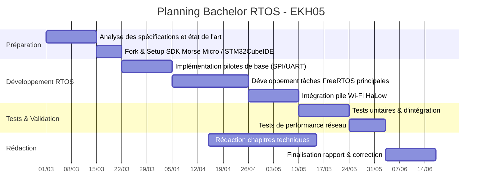

```mermaid
gantt
title Planning Bachelor RTOS - EKH05
dateFormat  YYYY-MM-DD
axisFormat %d/%m

section Préparation
Analyse des spécifications et état de l'art :a1, 2026-03-01, 14d
Fork & Setup SDK Morse Micro / STM32CubeIDE :a2, after a1, 7d

section Développement RTOS
Implémentation pilotes de base (SPI/UART) :a3, after a2, 14d
Développement tâches FreeRTOS principales :a4, after a3, 21d
Intégration pile Wi-Fi HaLow :a5, after a4, 14d

section Tests & Validation
Tests unitaires & d'intégration :a6, after a5, 14d
Tests de performance réseau :a7, after a6, 10d

section Rédaction
Rédaction chapitres techniques :a8, 2026-04-15, 30d
Finalisation rapport & correction :a9, after a7, 14d
```